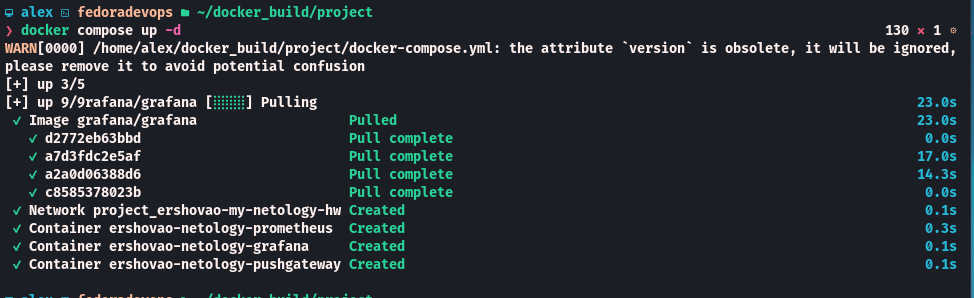

### Задание 2


**Выполните действия и приложите текст конфига на этом этапе.**

Создайте файл docker-compose.yml и внесите туда первичные настройки:

- version;
- services;
- volumes;
- networks.

При выполнении задания используйте подсеть 10.5.0.0/16. Ваша подсеть должна называться: <ваши фамилия и инициалы>-my-netology-hw. Все приложения из последующих заданий должны находиться в этой конфигурации.

---
Выполнение Задания 2

```d
version: '3.8'

services:
volumes:
networks:
  ershovao-my-netology-hw:
    driver: bridge
    ipam:
      config:
        - subnet: 10.5.0.0/16
          gateway: 10.5.0.1

```

---

### Задание 3

**Выполните действия:**

1. Создайте конфигурацию docker-compose для Prometheus с именем контейнера <ваши фамилия и инициалы>-netology-prometheus.
2. Добавьте необходимые тома с данными и конфигурацией (конфигурация лежит в репозитории в директории [6-04/prometheus](https://github.com/netology-code/sdvps-homeworks/tree/main/lecture_demos/6-04/prometheus) ).
3. Обеспечьте внешний доступ к порту 9090 c докер-сервера.

---
Выполнение Задания 3

Я в корень проекта скопировал папку prometheus
```d
version: '3.8'

services:
  prometheus:
    image: prom/prometheus:v2.47.2
    container_name: ershovao-netology-prometheus
    command: --web.enable-lifecycle --config.file=/etc/prometheus/prometheus.yml
    ports:
      - 9090:9090
    volumes:
      - ./prometheus:/etc/prometheus
      - prometheus-data:/prometheus
    networks:
      - ershovao-my-netology-hw


volumes:
  prometheus-data:


networks:
  ershovao-my-netology-hw:
    driver: bridge
    ipam:
      config:
        - subnet: 10.5.0.0/16
          gateway: 10.5.0.1

```

---

### Задание 4

**Выполните действия:**

1. Создайте конфигурацию docker-compose для Pushgateway с именем контейнера <ваши фамилия и инициалы>-netology-pushgateway.
2. Обеспечьте внешний доступ к порту 9091 c докер-сервера.

---
Выполнения Задания 4
Каталог pushgateway находится в корне проекта
```d
version: '3.8'
services:
 pushgateway:
    image: prom/pushgateway:v1.6.2
    container_name: ershovao-netology-pushgateway
    ports:
    - 9091:9091
    networks:
      - ershovao-my-netology-hw

networks:
  ershovao-my-netology-hw:
    driver: bridge
    ipam:
      config:
        - subnet: 10.5.0.0/16
          gateway: 10.5.0.1
```

---
### Задание 5

**Выполните действия:**

1. Создайте конфигурацию docker-compose для Grafana с именем контейнера <ваши фамилия и инициалы>-netology-grafana.
2. Добавьте необходимые тома с данными и конфигурацией (конфигурация лежит в репозитории в директории [6-04/grafana](https://github.com/netology-code/sdvps-homeworks/blob/main/lecture_demos/6-04/grafana/custom.ini).
3. Добавьте переменную окружения с путем до файла с кастомными настройками (должен быть в томе), в самом файле пропишите логин=<ваши фамилия и инициалы> пароль=netology.
4. Обеспечьте внешний доступ к порту 3000 c порта 80 докер-сервера.

---
Выполнение Задания 6

Каталог с grafana в корне проекта

```d
version: '3.8'
services:
  grafana:
    image: grafana/grafana
    container_name: ershovao-netology-grafana
    environment:
      GF_PATHS_CONFIG: /etc/grafana/custom.ini
    ports:
      - 80:3000
    volumes:
      - ./grafana:/etc/grafana
      - grafana-data:/var/lib/grafana
    networks:
      - ershovao-my-netology-hw

volumes:
  grafana-data:

networks:
  ershovao-my-netology-hw:
    driver: bridge
    ipam:
      config:
        - subnet: 10.5.0.0/16
          gateway: 10.5.0.1
```

Содержание  custom. ini

```custom.ini
[security]

admin_user = ershovao
admin_password = netology

```

---
### Задание 6
**Выполните действия.**

1. Настройте поочередность запуска контейнеров.
2. Настройте режимы перезапуска для контейнеров.
3. Настройте использование контейнерами одной сети.
4. Запустите сценарий в detached режиме.

---
Выполнение Задания 6

Общий docker-compose.yml
```docker-compose.yml
version: '3.8'
services:
  prometheus:
    image: prom/prometheus:v2.47.2
    container_name: ershovao-netology-prometheus
    command: --web.enable-lifecycle --config.file=/etc/prometheus/prometheus.yml
    ports:
      - 9090:9090
    volumes:
      - ./prometheus:/etc/prometheus
      - prometheus-data:/prometheus
    networks:
      - ershovao-my-netology-hw
    restart: always

  pushgateway:
    image: prom/pushgateway:v1.6.2
    container_name: ershovao-netology-pushgateway
    ports:
    - 9091:9091
    networks:
      - ershovao-my-netology-hw
    depends_on:
      - prometheus
    restart: unless-stopped

  grafana:
    image: grafana/grafana
    container_name: ershovao-netology-grafana
    environment:
      GF_PATHS_CONFIG: /etc/grafana/custom.ini
    ports:
      - 80:3000
    volumes:
      - ./grafana:/etc/grafana
      - grafana-data:/var/lib/grafana
    networks:
      - ershovao-my-netology-hw
    depends_on:
      - prometheus
    restart: unless-stopped

volumes:
  prometheus-data:
  grafana-data:

networks:
  ershovao-my-netology-hw:
    driver: bridge
    ipam:
      config:
        - subnet: 10.5.0.0/16
          gateway: 10.5.0.1

```

1. Настройте поочередность запуска контейнеров.
 Я добавил в сервис pushgateway и grafana, параметр depends_on:  - prometheus (будет ожидать в первую очередь запуск prometheus)
2. Настройте режимы перезапуска для контейнеров.
В сервис prometheus я добавил параметр restart: always (контейнер всегда перезапускается при падении или перезагрузке хоста)
В сервисы pushgateway и grafana добавил параметр restart: unless-stopped  Перезапускается при падении, но не после ручной остановки)
3. Настройте использование контейнерами одной сети.
В каждом сервисе присутствует параметр networks: - ershovao-my-netology-hw
4. Запустите сценарий в detached режиме

