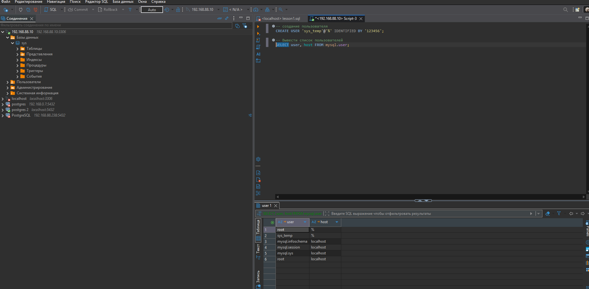
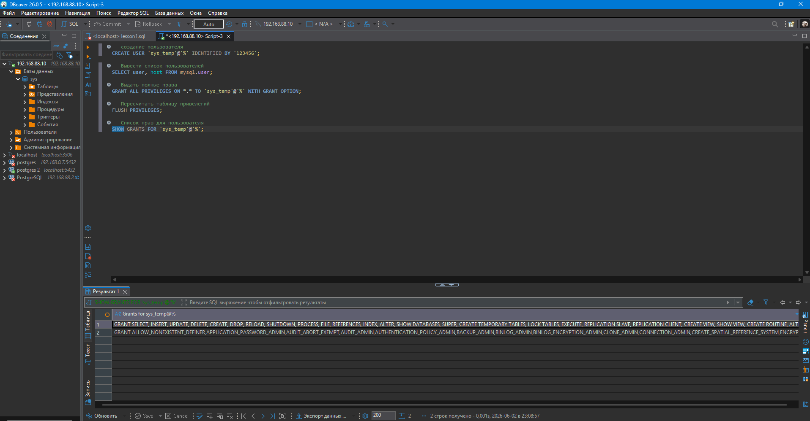
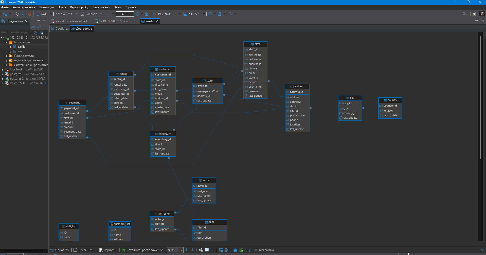
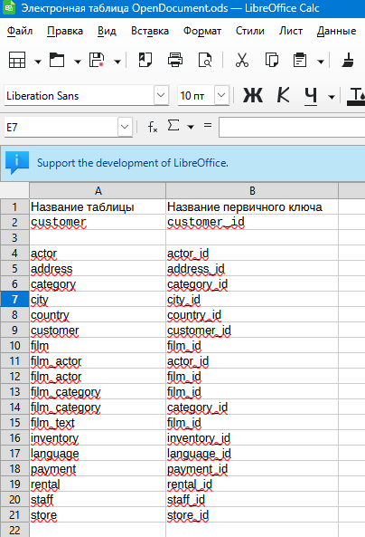

# Домашнее задание #2 к занятию Работа с данными (DDL/DML) Ершова А.О.


Задание можно выполнить как в любом IDE, так и в командной строке.

### Задание 1

[](https://github.com/netology-code/sdb-homeworks/blob/main/12-02.md#%D0%B7%D0%B0%D0%B4%D0%B0%D0%BD%D0%B8%D0%B5-1)

1.1. Поднимите чистый инстанс MySQL версии 8.0+. Можно использовать локальный сервер или контейнер Docker.

1.2. Создайте учётную запись sys_temp.

1.3. Выполните запрос на получение списка пользователей в базе данных. (скриншот)

1.4. Дайте все права для пользователя sys_temp.

1.5. Выполните запрос на получение списка прав для пользователя sys_temp. (скриншот)

1.6. Переподключитесь к базе данных от имени sys_temp.

Для смены типа аутентификации с sha2 используйте запрос:

```sql
ALTER USER 'sys_test'@'localhost' IDENTIFIED WITH mysql_native_password BY 'password';
```

1.6. По ссылке [https://downloads.mysql.com/docs/sakila-db.zip](https://downloads.mysql.com/docs/sakila-db.zip) скачайте дамп базы данных.

1.7. Восстановите дамп в базу данных.

1.8. При работе в IDE сформируйте ER-диаграмму получившейся базы данных. При работе в командной строке используйте команду для получения всех таблиц базы данных. (скриншот)

_Результатом работы должны быть скриншоты обозначенных заданий, а также простыня со всеми запросами._

---
### Решение 1
1.1 Воспользуюсь docker и подниму контейнер mysql:9.7.0-oraclelinux9
```bash
docker run --name mysql -p 3306:3306 -e MYSQL_ROOT_PASSWORD=123456 -d mysql:9.7.0-oraclelinux9
```

1.2 Создаю пользователя через запрос в dbeaver
```sql
-- создание пользователя
CREATE USER 'sys_temp'@'%' IDENTIFIED BY '123456';
```

1.3 Скриншот результата



1.4 Выдаю полные права пользователю
```sql
GRANT ALL PRIVILEGES ON *.* TO 'sys_temp'@'%' WITH GRANT OPTION;
```

1.5 Выполняю запрос на получение списка прав для пользователя sys_temp
```sql
SHOW GRANTS FOR 'sys_temp'@'%';
```



1.6  Скачиваю дамп базы 
```bash
wget https://downloads.mysql.com/docs/sakila-db.zip
# Расспаковываю и перехожу в папку
unzip sakila-db.zip
cd sakila-db
```

1.7. Восстановите дамп в базу данных. В Docker
```bash
docker exec -i mysql mysql -u root -p123456 < sakila-schema.sql
docker exec -i mysql mysql -u root -p123456 < sakila-data.sql
```

1.8 Скрин диаграммы




---

### Задание 2

[](https://github.com/netology-code/sdb-homeworks/blob/main/12-02.md#%D0%B7%D0%B0%D0%B4%D0%B0%D0%BD%D0%B8%D0%B5-2)

Составьте таблицу, используя любой текстовый редактор или Excel, в которой должно быть два столбца: в первом должны быть названия таблиц восстановленной базы, во втором названия первичных ключей этих таблиц. Пример: (скриншот/текст)

```
Название таблицы | Название первичного ключа
customer         | customer_id
```

---
### Решение 2

- Скрин результата. 




## Дополнительные задания (со звёздочкой*)

[](https://github.com/netology-code/sdb-homeworks/blob/main/12-02.md#%D0%B4%D0%BE%D0%BF%D0%BE%D0%BB%D0%BD%D0%B8%D1%82%D0%B5%D0%BB%D1%8C%D0%BD%D1%8B%D0%B5-%D0%B7%D0%B0%D0%B4%D0%B0%D0%BD%D0%B8%D1%8F-%D1%81%D0%BE-%D0%B7%D0%B2%D1%91%D0%B7%D0%B4%D0%BE%D1%87%D0%BA%D0%BE%D0%B9)

Эти задания дополнительные, то есть не обязательные к выполнению, и никак не повлияют на получение вами зачёта по этому домашнему заданию. Вы можете их выполнить, если хотите глубже шире разобраться в материале.

### Задание 3*

[](https://github.com/netology-code/sdb-homeworks/blob/main/12-02.md#%D0%B7%D0%B0%D0%B4%D0%B0%D0%BD%D0%B8%D0%B5-3)

3.1. Уберите у пользователя sys_temp права на внесение, изменение и удаление данных из базы sakila.

3.2. Выполните запрос на получение списка прав для пользователя sys_temp. (скриншот)

_Результатом работы должны быть скриншоты обозначенных заданий, а также простыня со всеми запросами._