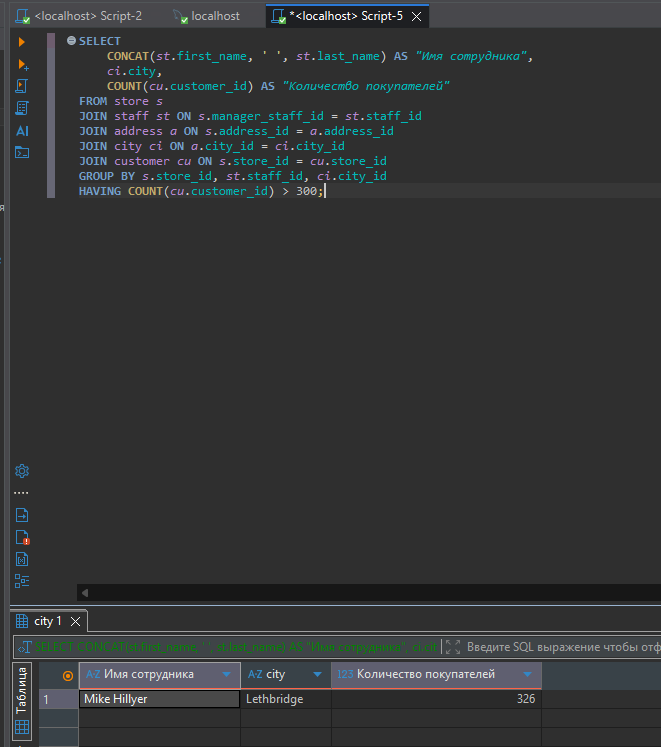
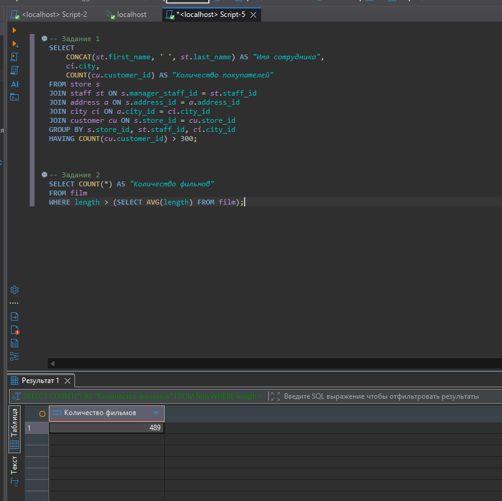
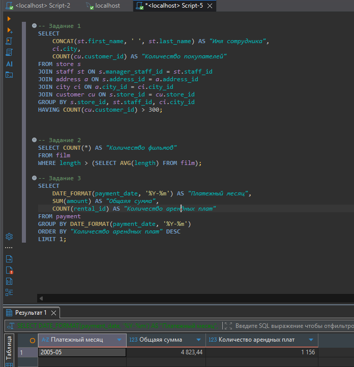

# Домашнее задание к занятию «SQL. Часть 2» Ершова А.О.


### Задание 1

Одним запросом получите информацию о магазине, в котором обслуживается более 300 покупателей, и выведите в результат следующую информацию:
- фамилия и имя сотрудника из этого магазина;
- город нахождения магазина;
- количество пользователей, закреплённых в этом магазине.

---
### Решение 1
- Запрос
```sql
SELECT
-- Так как фимилия и имя в разных столбцах, то мы их склеиваем и ставим между ними пробел
    CONCAT(st.first_name, ' ', st.last_name) AS "Имя сотрудника",
    ci.city,
-- Считаем количесво покупателей в каждом магазине
    COUNT(cu.customer_id) AS "Количество покупателей"
FROM store s
-- Подключаем таблицу сотрудников. Связываеи менеджера с его личным id в таблице сотрудников. Так мы узнаем имя сотрдуника магазина
JOIN staff st ON s.manager_staff_id = st.staff_id
-- У самого магазина нет адреса города, есть только ссылка на адрес. Подключаем таблицу адрессов
JOIN address a ON s.address_id = a.address_id
-- В таблице адресов тожде нет название города, там только id. Подключаем таблицк city по совпадению id
JOIN city ci ON a.city_id = ci.city_id
-- Привязываем таблицу покупателей. Каждый покуматель имеет колонку store_id указывющую, в каком магазине обслуживается
JOIN customer cu ON s.store_id = cu.store_id
-- указываем в каких полях пороизводить расчет
GROUP BY s.store_id, st.staff_id, ci.city_id
-- из полученного результата отсекаем магазины, где количество покупателей 300 и меньше.
HAVING COUNT(cu.customer_id) > 300;
```
- Результат




---


### Задание 2

Получите количество фильмов, продолжительность которых больше средней продолжительности всех фильмов.


---
### Решение 2
- Запрос
```sql
-- Подсчитываем общее количество строк, котрые прошли фильтр.
SELECT COUNT(*) AS "Количество фильмов"
FROM film
-- Используем запрос в скобках что бы он выполнился первым. Считаем среднюю длину всех фильмов. После выполнение действия в скобках, сервер фильтрует стоки оставляя только те фильмы,  у которых длительность больше полученого среднего значения
WHERE length > (SELECT AVG(length) FROM film);
```

- Результат



---

### Задание 3

Получите информацию, за какой месяц была получена наибольшая сумма платежей, и добавьте информацию по количеству аренд за этот месяц.

---

### Решение 3
- Запрос
```sql
SELECT
-- Нам не нужна полная информация о дате и времени, нам нужно только год и месяц, выводим год и месяц.
    DATE_FORMAT(payment_date, '%Y-%m') AS "Платежный месяц",
-- Складываем все платежи, которые были совершены внутри конкретного месяца
    SUM(amount) AS "Общаяя сумма",
-- Считаем количество платежей в текущем месяце
    COUNT(rental_id) AS "Количество арендных плат"
FROM payment
GROUP BY DATE_FORMAT(payment_date, '%Y-%m')
ORDER BY "Количество арендных плат" DESC
LIMIT 1;
```

- Результат



## Дополнительные задания (со звёздочкой*)
Эти задания дополнительные, то есть не обязательные к выполнению, и никак не повлияют на получение вами зачёта по этому домашнему заданию. Вы можете их выполнить, если хотите глубже шире разобраться в материале.

### Задание 4*

Посчитайте количество продаж, выполненных каждым продавцом. Добавьте вычисляемую колонку «Премия». Если количество продаж превышает 8000, то значение в колонке будет «Да», иначе должно быть значение «Нет».

### Задание 5*

Найдите фильмы, которые ни разу не брали в аренду.