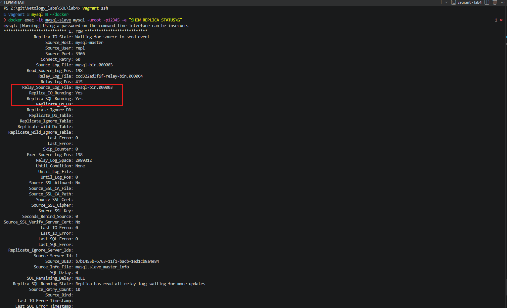

# Домашнее задание к занятию «Репликация и масштабирование. Часть 1 Ершов А.О.


### Задание 1

[](https://github.com/netology-code/sdb-homeworks/blob/main/12-06.md#%D0%B7%D0%B0%D0%B4%D0%B0%D0%BD%D0%B8%D0%B5-1)

На лекции рассматривались режимы репликации master-slave, master-master, опишите их различия.

_Ответить в свободной форме._

---

### Решение 1
- Master-slave репликация
  Создается один мастер Master сервер - это основная база в которую поступают все данные и из нее все данные читаются. Все изменения данных - добавление, обновление, удаление - Все происходит в этой базе.
  И к нему можно создать несколько Slave серверов - это полные копии master, они копируют все данные с master. Slave может отдавать только чтение данных пользователям, записывать данные пользователям в этот сервер нельзя.

- Master-master репликация
  Создаются два и более серверов типа Master, они работают синхронно, и сними можно работать как на запись так и на чтение данных. Эта репликация добавляет избыточность и повышает эффективность при обращении к данным.

---
### Задание 2

[](https://github.com/netology-code/sdb-homeworks/blob/main/12-06.md#%D0%B7%D0%B0%D0%B4%D0%B0%D0%BD%D0%B8%D0%B5-2)

Выполните конфигурацию master-slave репликации, примером можно пользоваться из лекции.

_Приложите скриншоты конфигурации, выполнения работы: состояния и режимы работы серверов._

---
### Решение 2
- Структура каталога
```powershell
PS Z:\git\Netology_labs\SQL\lab4> tree /A /F
Структура папок тома HDD-New
Серийный номер тома: 00000093 3059:3559
Z:.
|   docker-compose.yml
|   Vagrantfile
|
+---.scrin
|       1.png
|
+---mysql-master
|       Dockerfile
|       master.cnf
|       master.sql
|
\---mysql-slave
        Dockerfile
        slave.cnf
        slave.sql
```

- Master
- dockerfile
```yml
FROM mysql:8.4
COPY ./master.cnf /etc/mysql/conf.d/my.cnf
RUN chmod 644 /etc/mysql/conf.d/my.cnf
COPY ./master.sql /docker-entrypoint-initdb.d/start.sql
ENV MYSQL_ROOT_PASSWORD=12345
CMD ["mysqld"]
```

- master.cnf
```ini
[mysqld]
server-id = 1
log-bin = mysql-bin
gtid_mode = ON  # Режим глобального индентификатора транзакций
enforce_gtid_consistency = ON  # Обеспечивает согласованость режима gtid

```

- master.sql
```sql
CREATE USER 'repl'@'%' IDENTIFIED BY 'slavepass';
GRANT REPLICATION SLAVE ON *.* TO 'repl'@'%';
FLUSH PRIVILEGES;
```

- slave
- Dockerfile
```yml
FROM mysql:8.4
COPY ./slave.cnf /etc/mysql/conf.d/my.cnf
RUN chmod 644 /etc/mysql/conf.d/my.cnf
COPY ./slave.sql /docker-entrypoint-initdb.d/start.sql
ENV MYSQL_ROOT_PASSWORD=12345
CMD ["mysqld"]
```

- slave.cnf
```ini
[mysqld]
server-id = 2
read-only = 1
gtid_mode = ON
enforce_gtid_consistency = ON
```

- slave.sql
```sql
CHANGE REPLICATION SOURCE TO
SOURCE_HOST='mysql-master',
SOURCE_USER='repl',
SOURCE_PASSWORD='slavepass',
SOURCE_AUTO_POSITION = 1,
GET_SOURCE_PUBLIC_KEY = 1;
```

- docker-compose.yml
```yml
services:
  # mysql master-slave
  mysql-master:
    build: ./mysql-master
    container_name: mysql-master
    restart: unless-stopped
    volumes:
     - mysql-master-data:/var/lib/mysql
    ports:
      - "3306:3306"
    networks:
      - db-net


  mysql-slave:
    build: ./mysql-slave
    container_name: mysql-slave
    restart: unless-stopped
    volumes:
     - mysql-slave-data:/var/lib/mysql
    ports:
      - "3307:3306"
    networks:
      - db-net
    depends_on:
      - mysql-master


networks:
  db-net:
    driver: bridge

volumes:
  mysql-master-data:
  mysql-slave-data:
```


- vagrantfile
```ruby
Vagrant.configure("2") do |config|
  config.vm.box = "my-debian13"
  config.ssh.insert_key = false
  #config.ssh.password = "vagrant"
  config.vm.define "mysql" do |h1|
    h1.vm.hostname = "mysql"
    h1.vm.network "public_network", ip: "192.168.88.10",
                  bridge: "Realtek PCIe GbE Family Controller"

    # Зеркалирум текущий каталог на хосте в /home/vagrant/docker на гостевой машине, с правами доступа для пользователя vagrant.
    h1.vm.synced_folder ".", "/home/vagrant/docker", owner: "vagrant", group: "vagrant"
    h1.vm.provider "virtualbox" do |vb|
      vb.name   = "mysql"
      vb.memory = "12500"
      vb.cpus   = 6
    end
    # Provision внутри блока define, чтобы переменные разрешались на ВМ, а не на хосте.
    h1.vm.provision "shell", inline: <<-'SHELL'
      echo "1. Настройка официального репозитория Docker..."
      apt-get update
      apt-get install -y ca-certificates curl gnutls-bin openssl nano
      # Добавляем GPG ключ
      install -m 0755 -d /etc/apt/keyrings
      curl -fsSL https://download.docker.com/linux/debian/gpg -o /etc/apt/keyrings/docker.asc
      chmod a+r /etc/apt/keyrings/docker.asc
      # Формируем sources-файл (теперь переменные разрешатся на ВМ)
      echo "Types: deb
URIs: https://download.docker.com/linux/debian
Suites: $(. /etc/os-release && echo "$VERSION_CODENAME")
Components: stable
Architectures: $(dpkg --print-architecture)
Signed-By: /etc/apt/keyrings/docker.asc" > /etc/apt/sources.list.d/docker.sources
      echo "2. Установка Docker Engine и Compose Plugin..."
      apt-get update
      apt-get install -y docker-ce docker-ce-cli containerd.io docker-buildx-plugin docker-compose-plugin
      usermod -aG docker vagrant
    SHELL
  end
end
```

- Статус репликации

```bash
 docker exec -it mysql-slave mysql -uroot -p12345 -e "SHOW REPLICA STATUS\G"
mysql: [Warning] Using a password on the command line interface can be insecure.
*************************** 1. row ***************************
             Replica_IO_State: Waiting for source to send event
                  Source_Host: mysql-master
                  Source_User: repl
                  Source_Port: 3306
                Connect_Retry: 60
              Source_Log_File: mysql-bin.000003
          Read_Source_Log_Pos: 198
               Relay_Log_File: ccd322ad3f6f-relay-bin.000004
                Relay_Log_Pos: 415
        Relay_Source_Log_File: mysql-bin.000003
           Replica_IO_Running: Yes
          Replica_SQL_Running: Yes
              Replicate_Do_DB:
          Replicate_Ignore_DB:
           Replicate_Do_Table:
       Replicate_Ignore_Table:
      Replicate_Wild_Do_Table:
  Replicate_Wild_Ignore_Table:
                   Last_Errno: 0
                   Last_Error:
                 Skip_Counter: 0
          Exec_Source_Log_Pos: 198
              Relay_Log_Space: 2999312
              Until_Condition: None
               Until_Log_File:
                Until_Log_Pos: 0
           Source_SSL_Allowed: No
           Source_SSL_CA_File:
           Source_SSL_CA_Path:
              Source_SSL_Cert:
            Source_SSL_Cipher:
               Source_SSL_Key:
        Seconds_Behind_Source: 0
Source_SSL_Verify_Server_Cert: No
                Last_IO_Errno: 0
                Last_IO_Error:
               Last_SQL_Errno: 0
               Last_SQL_Error:
  Replicate_Ignore_Server_Ids:
             Source_Server_Id: 1
                  Source_UUID: b7b1455b-6763-11f1-bacb-1ed1cb9a4e84
             Source_Info_File: mysql.slave_master_info
                    SQL_Delay: 0
          SQL_Remaining_Delay: NULL
    Replica_SQL_Running_State: Replica has read all relay log; waiting for more updates
           Source_Retry_Count: 10
                  Source_Bind:
      Last_IO_Error_Timestamp:
     Last_SQL_Error_Timestamp:
               Source_SSL_Crl:
           Source_SSL_Crlpath:
           Retrieved_Gtid_Set: b7b1455b-6763-11f1-bacb-1ed1cb9a4e84:1-8
            Executed_Gtid_Set: b7b1455b-6763-11f1-bacb-1ed1cb9a4e84:1-8,
b7cb9822-6763-11f1-9f29-026c4afbcf14:1-5
                Auto_Position: 1
         Replicate_Rewrite_DB:
                 Channel_Name:
           Source_TLS_Version:
       Source_public_key_path:
        Get_Source_public_key: 1
            Network_Namespace:
```

- Скрин статуса

