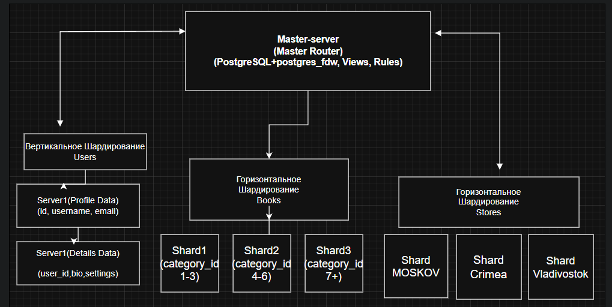

# Домашнее задание к занятию «Репликация и масштабирование. Часть 2» Ершова А.О.

### Задание 1

Опишите основные преимущества использования масштабирования методами:

- активный master-сервер и пассивный репликационный slave-сервер;
- master-сервер и несколько slave-серверов;

*Дайте ответ в свободной форме.*

---

### Решение 1
#### 1. Активный master-сервер и пассивный репликационный slave-сервер.

Этот подход ориентирован в первую очередь на высокую доступность и отказоустойчивость, а не на распределение текущей нагрузки.

- Минимальное время простоя: Главный плюс — готовность к авариям. Если master-сервер «падает» (проблемы с железом, сетью), пассивный slave максимально быстро перехватывает его функции и становится новым master. Для пользователей это проходит почти незаметно.

- Безопасное резервное копирование без деградации базы: Создание тяжелых бэкапов (dump, snapshot) можно полностью перенести на пассивный slave. Основной master при этом никак не нагружается, и пользователи не замечают просадок производительности.

- Простота архитектуры и разработки: Приложению не нужно разделять логику запросов. Все операции (и чтение, и запись) идут на один активный узел. Нет рисков столкнуться с задержкой репликации (когда данные записались на master, но еще не долетели до slave, а пользователь их уже запрашивает).

#### 2. Master-сервер и несколько slave-серверов.

Этот метод решает задачу горизонтального масштабирования и оптимизации производительности при высокой нагрузке.

- Масштабирование операций чтения: В большинстве систем операции чтения сильно больше чем запись. Данная схема позволяет распределять все запросы на чтение между несколькими слейвами, оставляя мастеру только задачи по изменению данных.

- Изоляция тяжелых и разнородных задач: Несколько слейвов позволяют гибко разделять контекст нагрузки. Например:

    - Slave 1 — обслуживает быстрые запросы от пользователей в веб-интерфейсе.

    - Slave 2 — используется аналитиками для тяжелых отчетов, которые могут выполняться минутами и сильно грузить таблицы.

    - Slave 3 — выделен под снятие ежедневных бэкапов.

- Повышенная живучесть пула чтения: Если один из slave-серверов выйдет из строя, система сохранит полную работоспособность. Нагрузка просто перераспределится между оставшимися слейвами.

- Географическое распределение: Слейвы можно физически разместить в разных дата-центрах или регионах ближе к конечным пользователям. Это позволяет отдавать данные на чтение с минимальной сетевой задержкой.

---
### Задание 2

Разработайте план для выполнения горизонтального и вертикального шаринга базы данных. База данных состоит из трёх таблиц:

- пользователи,
- книги,
- магазины (столбцы произвольно).

Опишите принципы построения системы и их разграничение или разбивку между базами данных.

*Пришлите блоксхему, где и что будет располагаться. Опишите, в каких режимах будут работать сервера.*

---
### Решение 2

Сначала придумаем произвольные столбцы для наших таблиц, что бы проще было обьяснить логику разбиения:

- Users (Пользователи): id, username, email, password_hash, bio (текст о себе), settings (какие нибудь настройки).
- Books (Книги): id, title, author, category_id, price, publish_year.
- Stores (Магазины): id, name, region, address, manager_id.

#### 1. План вертикального шаринга на таблице Пользователи (Users).

Таблица делится по столбцам. Это применяется, когда таблица становится слишком "широкой", и разные группы столбцов используются с разной частотой.

- Сервер 1 (Profile Data): Хранит часто запрашиваемые и легкие данные для авторизации и отображения списков.
Столбцы: id, username, email, password_hash, created_at.

- Сервер 2 (Details Data): Хранит редко запрашиваемые, но объемные данные (текстовые поля). Связан с первым сервером через user_id.
Столбцы: user_id, bio, settings.

Плюс этого метода в том что при авторизации пользователя, обращение идет к Серверу 1, не используя Сервер 2 без необходимости, что снижает нагрузку на базу.

#### 2. План горизонтального шардинга на таблицах Книги(Books) и Магазины(Stores)

Таблицы делятся по строкам на основе ключа шардирования. Это необходимо, когда количество записей исчисляется миллионами.

Для таблицы Книги(Books) ключ шардирования category_id:
- Shard 1: Хранит книги с category_id <= 3 (Художественная литература, Наука, История)

- Shard 2: Хранит книги с category_id > 3 AND category_id <= 6 (IT, Искусство, Образование).

- Shard 3: Хранит книги с category_id > 6 (Комиксы, Журналы и т.д.).

На каждом шарде создается ограничение CHECK на диапазон category_id и индекс по этому полю.

Для таблицы Магазины(Stores) ключ шардирования region:
- Shard MOSKOV: Хранит магазины с region = 'MOSKOV'.

- Shard Crimea: Хранит магазины с region = 'Crimea'.

- Shard Vladivostok: Хранит магазины с region = 'Vladivostok'.

Это позволяет обрабатывать региональные запросы локально, снижая задержки.

#### 3. Принцип построение системы
Система строится по принципу Master-Slave в контексте маршрутизации с использованием Docker Compose для оркестрации контейнеров.

1. Мастер-узел (Master Router): Это центральный сервер PostgreSQL. Он не хранит реальные данные. Его задача — маршрутизация запросов.

2. Узлы-шарды (Shard): Это независимые серверы PostgreSQL, на которых физически хранятся данные.

3. Связь через расширение postgres_fdw: На Мастер-узле включается расширение postgres_fdw. Оно позволяет Мастеру "видеть" таблицы на шардах как локальные.

4. Представления (Views): На Мастере создается общее представление (CREATE VIEW books AS SELECT * FROM shard_1 UNION ALL), к которому обращается приложение.

5. Правила маршрутизации (Rules): На Мастере создаются правила (CREATE RULE), которые перехватывают команды INSERT и автоматически перенаправляют данные в нужную таблицу на шарде в зависимости от ключа шардирования.

6. Ограничения (Constraints) и Индексы: На каждом узле-шарде создаются обычные таблицы с жестким ограничением CHECK (например, CHECK(category_id <= 3)), чтобы физически предотвратить попадание "чужих" данных. Также создаются индексы по ключу шардирования для ускорения поиска.

#### 4. Режимы работы серверов
- Мастер-сервер (Router/Proxy):

   -  Режим: Read/Write (Маршрутизация).
    Принимает все входящие запросы от приложения. При чтении (SELECT) он опрашивает View, который собирает данные со всех шардов. При записи (INSERT) срабатывают Rules, которые перенаправляют запись на нужный шард.

- Серверы-шарды (Data):

    - Режим: Read/Write (Хранение данных).
    Каждый шард работает как независимая база данных, но принимает запросы только к своему подмножеству данных. Благодаря CHECK ограничениям и индексам, операции чтения и записи внутри шарда происходят максимально быстро.

- Режим отказоустойчивости (Опционально):

    - Как упоминалось в лекции, для повышения отказоустойчивости к каждому узлу-шарду можно подключить Slave-сервер (репликация Master-Slave). В этом случае шард будет работать в режиме Master (принимать записи), а его Slave — в режиме Read-only (разгружая основной шард при чтении данных).

#### 5. Блок схема

## Дополнительные задания (со звёздочкой*)
Эти задания дополнительные, то есть не обязательные к выполнению, и никак не повлияют на получение вами зачёта по этому домашнему заданию. Вы можете их выполнить, если хотите глубже шире разобраться в материале.

---
### Задание 3*

Выполните настройку выбранных методов шардинга из задания 2.

*Пришлите конфиг Docker и SQL скрипт с командами для базы данных*.