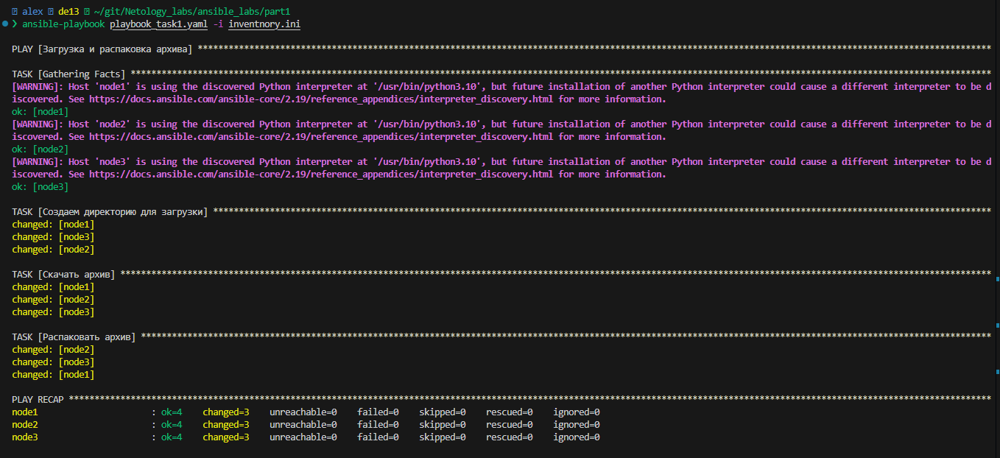
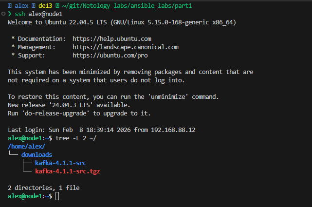
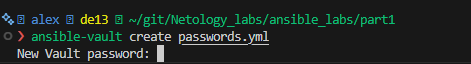
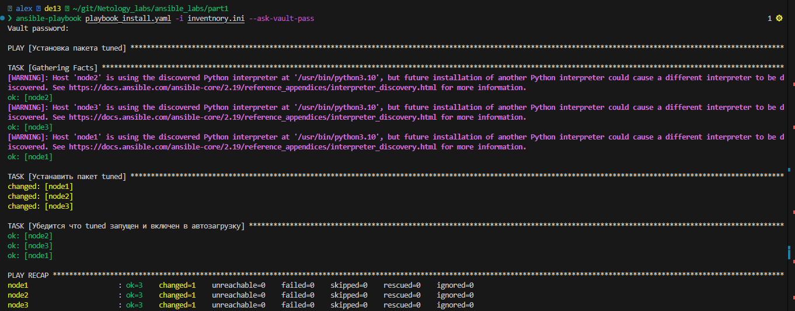
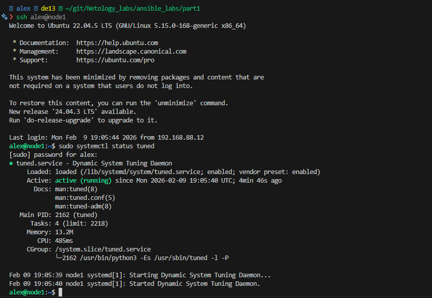
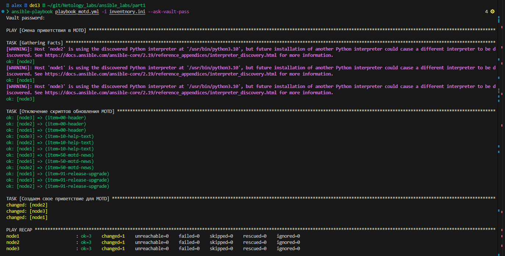
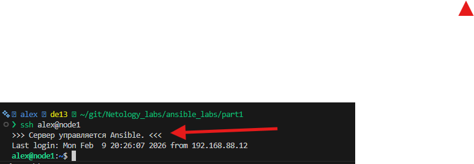
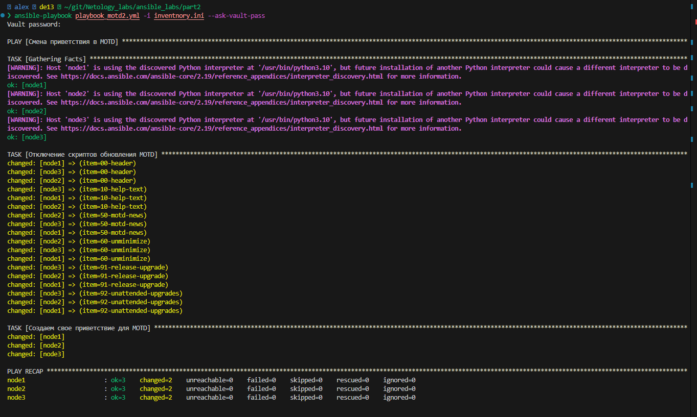
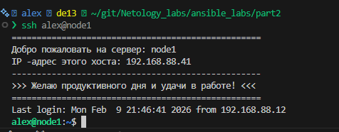

# Домашнее задание к занятию «Ansible.Часть 2»
### Задание 1

**Выполните действия, приложите файлы с плейбуками и вывод выполнения.**

Напишите три плейбука. При написании рекомендуем использовать текстовый редактор с подсветкой синтаксиса YAML.

Плейбуки должны:

1. Скачать какой-либо архив, создать папку для распаковки и распаковать скаченный архив. Например, можете использовать [официальный сайт](https://kafka.apache.org/downloads) и зеркало Apache Kafka. При этом можно скачать как исходный код, так и бинарные файлы, запакованные в архив — в нашем задании не принципиально.
2. Установить пакет tuned из стандартного репозитория вашей ОС. Запустить его, как демон — конфигурационный файл systemd появится автоматически при установке. Добавить tuned в автозагрузку.
3. Изменить приветствие системы (motd) при входе на любое другое. Пожалуйста, в этом задании используйте переменную для задания приветствия. Переменную можно задавать любым удобным способом.

---
### Решение 1
#### Подзадача 1
Вот playbook  загрузки и распаковки kafka [Посмотреть плейбук из задания 1/1](part1/playbook_task1.yaml)
```shell
---
- name: Загрузка и распаковка архива
  hosts: node
  become: no  # Не требуется повышение привелегий

  tasks:

    - name: Создаем директорию для загрузки
      ansible.builtin.file:  # Встроеный модуль для работы с файлами и директориями
        path: ~/downloads
        state: directory
        mode: "0755"

    - name: Скачать архив
      ansible.builtin.get_url: # Встроенный модуль для загрузки файлов по URL
        url: https://dlcdn.apache.org/kafka/4.1.1/kafka-4.1.1-src.tgz
        dest: ~/downloads/kafka-4.1.1-src.tgz
        mode: "0644"

    - name: Распаковать архив
      ansible.builtin.unarchive:  # Встроенный модуль для распаковки архивов
        src: ~/downloads/kafka-4.1.1-src.tgz
        dest: ~/downloads/
        remote_src: yes
        creates: ~/downloads/kafka-4.1.1-src # Проверка на существование распакованной директории, чтобы избежать повторной распаковки
```

Лог выполнения playbook


Скрин на стороне удаленного сервера


#### Подзадача 2
Вот playbook  установки пакета tuned [Посмотреть плейбук из задания 1/2](part 1/playbook_install.yaml)
```bash
---
- name: Установка пакета tuned
  hosts: node
  become: yes
  vars_files:
    -  passwords.yml  # файл с переменной для хранения пароля sudo
  vars:
    ansible_become_pass: "{{ sudo_pass }}" # Используем переменную из файла passwords.yml для пароля sudo

  tasks:
    - name: Устанавить пакет tuned
      ansible.builtin.apt:  # Встроенный модуль для управления пакетами apt
        name: tuned
        state: latest  # Устанавливаем последнюю версию пакета

    - name: Убедится что tuned запущен и включен в автозагрузку
      ansible.builtin.service: # Встроенный модуль для управления службами
        name: tuned
        state: started
        enabled: yes
```

Так как у меня нет пользователя root на сервере, я выполнял установку через повышение прав become. Я создал  зашифрованный  файл passwords. yml с переменной sudo_pass: "мой пароль"и указал его как переменную



Лог выполнения [playbook_install.yaml](part 1/playbook_install.yaml)


Скрин запущенной службы утилиты tuned


#### Подзадача 3
Так как у меня удаленный сервер на Ubuntu, то пришлось детально вникать как работает вообще привествие на данной ОС. Оказалось что там приветвие динамическое и выполняется при помощи скриптов. Мне пришлось отключить другие скрипты находящиеся в /etc/update-motd.d. Я просто убрал право на выполнения скрипта. Созадал там свой скрипт 99-ansible-motd и через переменную подставил приветствие.
[Посмотреть плейбук из задания 1/3](part1/playbook_motd.yml)
```bash
---
- name: Смена приветствия в MOTD
  hosts: node
  become: yes
  vars_files:
    - passwords.yml  # файл с переменной для хранения пароля sudo

  vars:
    new_motd: ">>> Сервер управляется Ansible. <<<"  # Новое приветствие для MOTD обьявленное через переменную
    ansible_become_pass: "{{ sudo_pass }}" # Используем переменную из файла passwords.yml для пароля sudo

  tasks:
    - name: Отключение скриптов обновления MOTD
      ansible.builtin.file:
        path: "/etc/update-motd.d/{{ item }}" # Указываем встроенную динамическую перменную item для интерации по списку скриптов
        mode: '0644'  # Устанавливаем права на файл, что бы он не был исполняемым
      loop:  # Используем цикл для итерации по списку скриптов, которые обновляют MOTD
        - 00-header
        - 10-help-text
        - 50-motd-news
        - 60-unminimize
        - 91-release-upgrade
        - 92-unattended-upgrades

    - name: Создаем свое приветствие для MOTD
      ansible.builtin.copy:
        dest: /etc/update-motd.d/99-ansible-motd
        mode: '0755' # Делаем его исполняемым, что бы он мог выводить приветствие при входе в систему
        content: |
          #!/bin/bash
          echo "{{ new_motd }}" # Используем переменную приветстврия для вывода в MOTD
```
Лог выполенения playbook_motd


Демонстрация на удаленном сервере


---

### [](https://raw.githubusercontent.com/netology-code/sdvps-homeworks/refs/heads/main/7-01.part_2.md#%D0%B7%D0%B0%D0%B4%D0%B0%D0%BD%D0%B8%D0%B5-2)Задание 2

**Выполните действия, приложите файлы с модифицированным плейбуком и вывод выполнения.**

Модифицируйте плейбук из пункта 3, задания 1. В качестве приветствия он должен установить IP-адрес и hostname управляемого хоста, пожелание хорошего дня системному администратору.


---
### Решение 2
Для решения этого задания я изучил переменные ansible_facts благодаря которым можно брать информацию о характеристиках удаленной машине
[Посмотреть плейбук из задания 2](part2/playbook_motd2.yml)
```bash
---
- name: Смена приветствия в MOTD
  hosts: node
  become: yes
  vars_files:
    - passwords.yml  # файл с переменной для хранения пароля sudo

  vars:
    good_day: ">>> Желаю продуктивного дня и удачи в работе! <<<"  # Новое приветствие для MOTD обьявленное через переменную
    ansible_become_pass: "{{ sudo_pass }}" # Используем переменную из файла passwords.yml для пароля sudo

  tasks:
    - name: Отключение скриптов обновления MOTD
      ansible.builtin.file:
        path: "/etc/update-motd.d/{{ item }}" # Указываем встроенную динамическую перменную item для интерации по списку скриптов
        mode: '0644'  # Устанавливаем права на файл, что бы он не был исполняемым
      loop:  # Используем цикл для итерации по списку скриптов, которые обновляют MOTD
        - 00-header
        - 10-help-text
        - 50-motd-news
        - 60-unminimize
        - 91-release-upgrade
        - 92-unattended-upgrades

    - name: Создаем свое приветствие для MOTD
      ansible.builtin.copy:
        dest: /etc/update-motd.d/99-ansible-motd
        mode: '0755' # Делаем его исполняемым, что бы он мог выводить приветствие при входе в систему
        content: |
          #!/bin/bash
          echo "=================================================="
          echo "Добро пожаловать на сервер: {{ ansible_hostname }}"
          echo "IP -адрес этого хоста: {{ ansible_default_ipv4.address }}"
          echo "--------------------------------------------------"
          echo "{{ good_day }}"
          echo "=================================================="
```
Лог выполенния playbook


Демонстрация на удаленной машине 


---
### [](https://raw.githubusercontent.com/netology-code/sdvps-homeworks/refs/heads/main/7-01.part_2.md#%D0%B7%D0%B0%D0%B4%D0%B0%D0%BD%D0%B8%D0%B5-3)Задание 3

**Выполните действия, приложите архив с ролью и вывод выполнения.**

Ознакомьтесь со статьёй [«Ansible - это вам не bash»](https://habr.com/ru/post/494738/), сделайте соответствующие выводы и не используйте модули **shell** или **command** при выполнении задания.

Создайте плейбук, который будет включать в себя одну, созданную вами роль. Роль должна:

1. Установить веб-сервер Apache на управляемые хосты.
2. Сконфигурировать файл index.html c выводом характеристик каждого компьютера как веб-страницу по умолчанию для Apache. Необходимо включить CPU, RAM, величину первого HDD, IP-адрес. Используйте [Ansible facts](https://docs.ansible.com/ansible/latest/playbook_guide/playbooks_vars_facts.html) и [jinja2-template](https://linuxways.net/centos/how-to-use-the-jinja2-template-in-ansible/). Необходимо реализовать handler: перезапуск Apache только в случае изменения файла конфигурации Apache.
3. Открыть порт 80, если необходимо, запустить сервер и добавить его в автозагрузку.
4. Сделать проверку доступности веб-сайта (ответ 200, модуль uri).

В качестве решения:

- предоставьте плейбук, использующий роль;
- разместите архив созданной роли у себя на Google диске и приложите ссылку на роль в своём решении;
- предоставьте скриншоты выполнения плейбука;
- предоставьте скриншот браузера, отображающего сконфигурированный index. html в качестве сайта.

---


---
