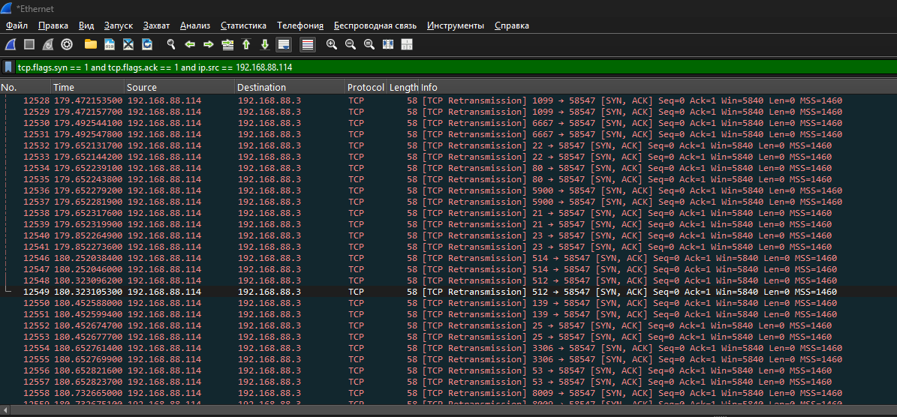
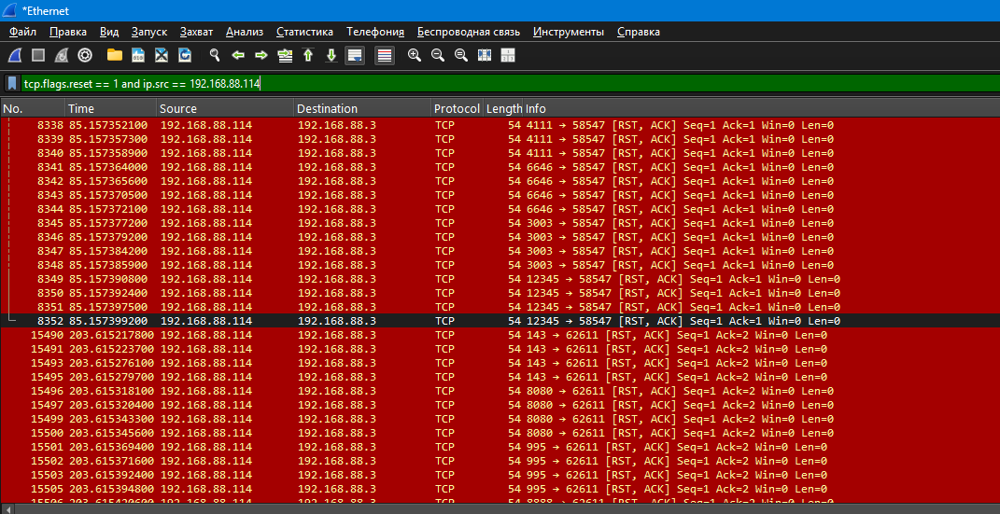
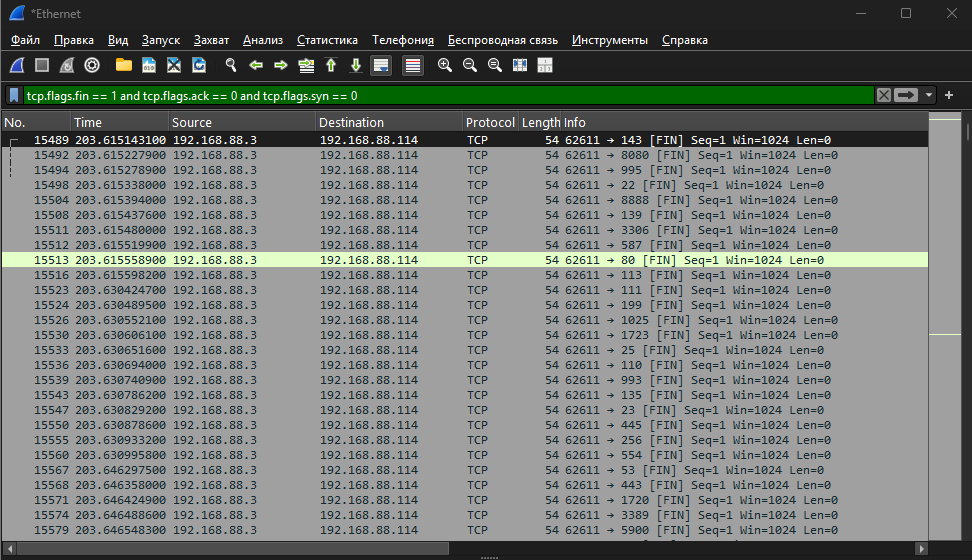
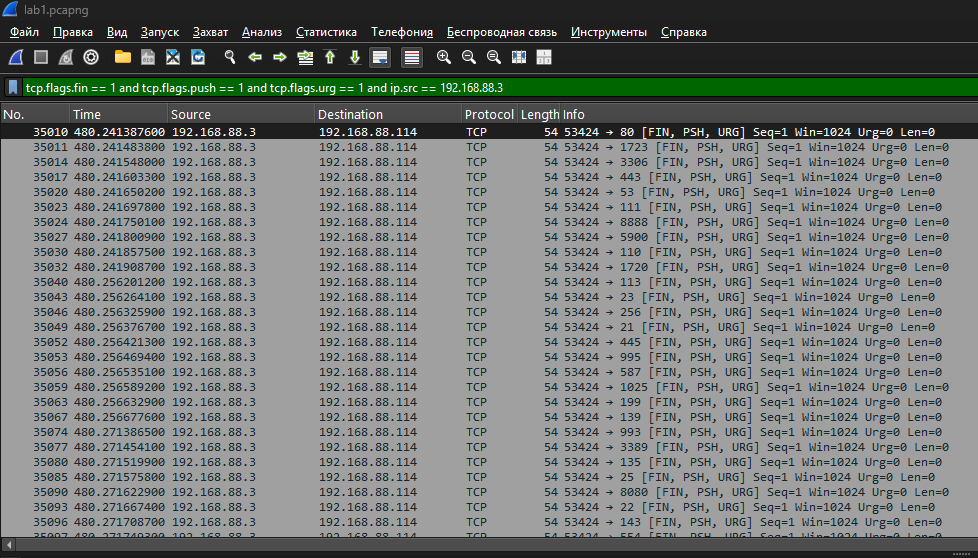

# Домашнее задание к занятию «Уязвимости и атаки на информационные системы» Ершова А.О.

---


### Задание 1

[](https://github.com/netology-code/sdb-homeworks/blob/main/13-01.md#%D0%B7%D0%B0%D0%B4%D0%B0%D0%BD%D0%B8%D0%B5-1)

Скачайте и установите виртуальную машину Metasploitable: [https://sourceforge.net/projects/metasploitable/](https://sourceforge.net/projects/metasploitable/).

Это типовая ОС для экспериментов в области информационной безопасности, с которой следует начать при анализе уязвимостей.

Просканируйте эту виртуальную машину, используя **nmap**.

Попробуйте найти уязвимости, которым подвержена эта виртуальная машина.

Сами уязвимости можно поискать на сайте [https://www.exploit-db.com/](https://www.exploit-db.com/).

Для этого нужно в поиске ввести название сетевой службы, обнаруженной на атакуемой машине, и выбрать подходящие по версии уязвимости.

Ответьте на следующие вопросы:

- Какие сетевые службы в ней разрешены?
- Какие уязвимости были вами обнаружены? (список со ссылками: достаточно трёх уязвимостей)

_Приведите ответ в свободной форме._

---
### Решение 1
1.1 Какие сетевые службы в ней разрешены?

```
21/tcp - FTP vsftpd 2.3.4, разрешён анонимный вход
22/tcp - SSH OpenSSH 4.7p1
23/tcp - Telnet Linux telnetd
25/tcp - SMTP Postfix smtpd
53/tcp - DNS ISC BIND 9.4.2
80/tcp - HTTP Apache httpd 2.2.8
111/tcp - rpcbind
139/tcp - NetBIOS-SSN Samba smbd 3.X-4.X
445/tcp - NetBIOS-SSN Samba smbd 3.0.20-Debian
512/tcp - exec
513/tcp - rlogin
514/tcp - tcpwrapped
1099/tcp - Java RMI GNU Classpath grmiregistry
1524/tcp - bindshell
2049/tcp - NFS(версии 2-4
2121/tcp - FTP ProFTPD 1.3.1
3306/tcp - MySQL 5.0.51a
5432/tcp - PostgreSQL 8.3.0–8.3.7
5900/tcp - VNC 3.3
6000/tcp - X11
6667/tcp - IRC (UnrealIRCd)
8009/tcp - AJP13 (Apache JServ, протокол v1.3)
8180/tcp - HTTP (Apache Tomcat/Coyote JSP engine 1.1)
```

1.2 Какие уязвимости были вами обнаружены? (список со ссылками: достаточно трёх уязвимостей)
Samba
 - https://www.exploit-db.com/exploits/42084
 - https://www.exploit-db.com/exploits/41740
 - https://www.exploit-db.com/exploits/42060

ftp         ProFTPD 1.3.1
- https://www.exploit-db.com/exploits/15449
mysql
- https://www.exploit-db.com/exploits/30020
- https://www.exploit-db.com/exploits/29724

---
### Задание 2

[](https://github.com/netology-code/sdb-homeworks/blob/main/13-01.md#%D0%B7%D0%B0%D0%B4%D0%B0%D0%BD%D0%B8%D0%B5-2)

Проведите сканирование Metasploitable в режимах SYN, FIN, Xmas, UDP.

Запишите сеансы сканирования в Wireshark.

Ответьте на следующие вопросы:

- Чем отличаются эти режимы сканирования с точки зрения сетевого трафика?
- Как отвечает сервер?

_Приведите ответ в свободной форме._

---
## Решение 2
Имеется 1 пк с  (192.168.88.114) и пк windows для с wireshark и nmap (192.168.88.3)

-  TCP SYN сканирование
Это  полуоткрытое сканирование, так как полноценное TCP- соединение не устанавливается до конца.
Мой пк (192.168.88.3)  отправляет на  Metasploitable пакеьт с флагом SYN - запрос на соединение.
Если порт открыт на Metasploitable, то сервер отвечает SYN, ACK (готов к соединению).
Если порт закрыт на Metasploitable, то сервере отвечает RST, ACK (сбрасывает соединение)

nmap -sS -v 192.168.88.114
Вывод nmap:
```
Starting Nmap 7.97 ( https://nmap.org ) at 2026-07-08 00:19 +0300
Initiating ARP Ping Scan at 00:19
Scanning 192.168.88.114 [1 port]
Completed ARP Ping Scan at 00:19, 2.13s elapsed (1 total hosts)
Initiating Parallel DNS resolution of 1 host. at 00:19
Completed Parallel DNS resolution of 1 host. at 00:19, 0.51s elapsed
Initiating SYN Stealth Scan at 00:19
Scanning 192.168.88.114 [1000 ports]
Discovered open port 23/tcp on 192.168.88.114
Discovered open port 3306/tcp on 192.168.88.114
Discovered open port 53/tcp on 192.168.88.114
Discovered open port 22/tcp on 192.168.88.114
Discovered open port 445/tcp on 192.168.88.114
Discovered open port 139/tcp on 192.168.88.114
Discovered open port 25/tcp on 192.168.88.114
Discovered open port 111/tcp on 192.168.88.114
Discovered open port 80/tcp on 192.168.88.114
Discovered open port 5900/tcp on 192.168.88.114
Discovered open port 21/tcp on 192.168.88.114
Discovered open port 514/tcp on 192.168.88.114
Discovered open port 2049/tcp on 192.168.88.114
Discovered open port 513/tcp on 192.168.88.114
Discovered open port 8180/tcp on 192.168.88.114
Discovered open port 1099/tcp on 192.168.88.114
Discovered open port 6000/tcp on 192.168.88.114
Discovered open port 1524/tcp on 192.168.88.114
Discovered open port 6667/tcp on 192.168.88.114
Discovered open port 5432/tcp on 192.168.88.114
Discovered open port 2121/tcp on 192.168.88.114
Discovered open port 512/tcp on 192.168.88.114
Discovered open port 8009/tcp on 192.168.88.114
Completed SYN Stealth Scan at 00:19, 0.10s elapsed (1000 total ports)
Nmap scan report for 192.168.88.114
Host is up (0.0017s latency).
Not shown: 977 closed tcp ports (reset)
PORT     STATE SERVICE
21/tcp   open  ftp
22/tcp   open  ssh
23/tcp   open  telnet
25/tcp   open  smtp
53/tcp   open  domain
80/tcp   open  http
111/tcp  open  rpcbind
139/tcp  open  netbios-ssn
445/tcp  open  microsoft-ds
512/tcp  open  exec
513/tcp  open  login
514/tcp  open  shell
1099/tcp open  rmiregistry
1524/tcp open  ingreslock
2049/tcp open  nfs
2121/tcp open  ccproxy-ftp
3306/tcp open  mysql
5432/tcp open  postgresql
5900/tcp open  vnc
6000/tcp open  X11
6667/tcp open  irc
8009/tcp open  ajp13
8180/tcp open  unknown
MAC Address: 00:0C:29:FA:DD:2A (VMware)
```

Отрытые порты



Закрытые порты




- TCP FIN сканирование
Это скрытное сканирование, которое использует особенности стандарта TCP (RFC 793), чтобы обойти некоторые простые файрволы.
Nmap отправляет пакет только с флагом FIN- с сигнал о завершении соединения, которого на самом деле не было.
Согласно стандарту, если порт **открыт**, сервер должен проигнорировать такой странный пакет и ничего не ответить.
Если порт **закрыт**, сервер обязан ответить пакетом RST - сброс.

nmap -sF -v 192.168.88.114
Вывод nmap:
```
Starting Nmap 7.97 ( https://nmap.org ) at 2026-07-08 00:21 +0300
Initiating ARP Ping Scan at 00:21
Scanning 192.168.88.114 [1 port]
Completed ARP Ping Scan at 00:21, 2.52s elapsed (1 total hosts)
Initiating Parallel DNS resolution of 1 host. at 00:21
Completed Parallel DNS resolution of 1 host. at 00:21, 0.51s elapsed
Initiating FIN Scan at 00:21
Scanning 192.168.88.114 [1000 ports]
Completed FIN Scan at 00:21, 1.56s elapsed (1000 total ports)
Nmap scan report for 192.168.88.114
Host is up (0.0025s latency).
Not shown: 977 closed tcp ports (reset)
PORT     STATE         SERVICE
21/tcp   open|filtered ftp
22/tcp   open|filtered ssh
23/tcp   open|filtered telnet
25/tcp   open|filtered smtp
53/tcp   open|filtered domain
80/tcp   open|filtered http
111/tcp  open|filtered rpcbind
139/tcp  open|filtered netbios-ssn
445/tcp  open|filtered microsoft-ds
512/tcp  open|filtered exec
513/tcp  open|filtered login
514/tcp  open|filtered shell
1099/tcp open|filtered rmiregistry
1524/tcp open|filtered ingreslock
2049/tcp open|filtered nfs
2121/tcp open|filtered ccproxy-ftp
3306/tcp open|filtered mysql
5432/tcp open|filtered postgresql
5900/tcp open|filtered vnc
6000/tcp open|filtered X11
6667/tcp open|filtered irc
8009/tcp open|filtered ajp13
8180/tcp open|filtered unknown
MAC Address: 00:0C:29:FA:DD:2A (VMware)
```

Так как открытые порты молчат то я могу продемонстрировать только пакеты FIN




- UDP Сканирование
UDP - Протокол без установки соединения, по этому сканирование работает иначе и часто занимает много времени
Nmap отправляет пустые или специфичные для сервиса UDP-датаграммы на целевые порты.
Если порт **открыт**, сервер обычно ничего не отвечает.
Если порт **закрыт**, операционная система сервера отправляет обратно специальное сообщение об ошибке.

nmap -sU -v 192.168.88.114
Вывод nmap:
```
Starting Nmap 7.97 ( https://nmap.org ) at 2026-07-08 00:22 +0300
Initiating ARP Ping Scan at 00:22
Scanning 192.168.88.114 [1 port]
Completed ARP Ping Scan at 00:22, 1.84s elapsed (1 total hosts)
Initiating Parallel DNS resolution of 1 host. at 00:22
Completed Parallel DNS resolution of 1 host. at 00:22, 0.51s elapsed
Initiating UDP Scan at 00:22
Scanning 192.168.88.114 [1000 ports]
Increasing send delay for 192.168.88.114 from 0 to 50 due to max_successful_tryno increase to 4
Increasing send delay for 192.168.88.114 from 50 to 100 due to max_successful_tryno increase to 5
Increasing send delay for 192.168.88.114 from 100 to 200 due to max_successful_tryno increase to 6
Increasing send delay for 192.168.88.114 from 200 to 400 due to max_successful_tryno increase to 7
Increasing send delay for 192.168.88.114 from 400 to 800 due to max_successful_tryno increase to 8
UDP Scan Timing: About 3.63% done; ETC: 00:36 (0:13:43 remaining)
UDP Scan Timing: About 6.50% done; ETC: 00:38 (0:14:37 remaining)
UDP Scan Timing: About 11.58% done; ETC: 00:39 (0:15:24 remaining)

```

Так как на udp открытые порты просто пропускают пакеты, я тут скрин продемонстрировать не могу, но могу показать Закрытые


- TCP Xmas сканирование
Nmap отправляет TCP-пакет, в котором одновременно установлены флаги FIN, PSH и URG. В нормальном трафике такая комбинация не встречается
Сервер отвечает точно также, как с FIN:
Если порт открыт, сервер игнорирует этот пакет.
Если закрыт, сервер отправляет RTS

nmap -sX -v 192.168.88.114
Вывод:
```
Starting Nmap 7.97 ( https://nmap.org ) at 2026-07-08 00:26 +0300
Initiating ARP Ping Scan at 00:26
Scanning 192.168.88.114 [1 port]
Completed ARP Ping Scan at 00:26, 2.61s elapsed (1 total hosts)
Initiating Parallel DNS resolution of 1 host. at 00:26
Completed Parallel DNS resolution of 1 host. at 00:26, 0.51s elapsed
Initiating XMAS Scan at 00:26
Scanning 192.168.88.114 [1000 ports]
Completed XMAS Scan at 00:26, 1.58s elapsed (1000 total ports)
Nmap scan report for 192.168.88.114
Host is up (0.0017s latency).
Not shown: 977 closed tcp ports (reset)
PORT     STATE         SERVICE
21/tcp   open|filtered ftp
22/tcp   open|filtered ssh
23/tcp   open|filtered telnet
25/tcp   open|filtered smtp
53/tcp   open|filtered domain
80/tcp   open|filtered http
111/tcp  open|filtered rpcbind
139/tcp  open|filtered netbios-ssn
445/tcp  open|filtered microsoft-ds
512/tcp  open|filtered exec
513/tcp  open|filtered login
514/tcp  open|filtered shell
1099/tcp open|filtered rmiregistry
1524/tcp open|filtered ingreslock
2049/tcp open|filtered nfs
2121/tcp open|filtered ccproxy-ftp
3306/tcp open|filtered mysql
5432/tcp open|filtered postgresql
5900/tcp open|filtered vnc
6000/tcp open|filtered X11
6667/tcp open|filtered irc
8009/tcp open|filtered ajp13
8180/tcp open|filtered unknown
MAC Address: 00:0C:29:FA:DD:2A (VMware)

Read data files from: C:\Program Files (x86)\Nmap
Nmap done: 1 IP address (1 host up) scanned in 5.06 seconds
```

Вот так выглядит отправка пакета TCP Xmas



---