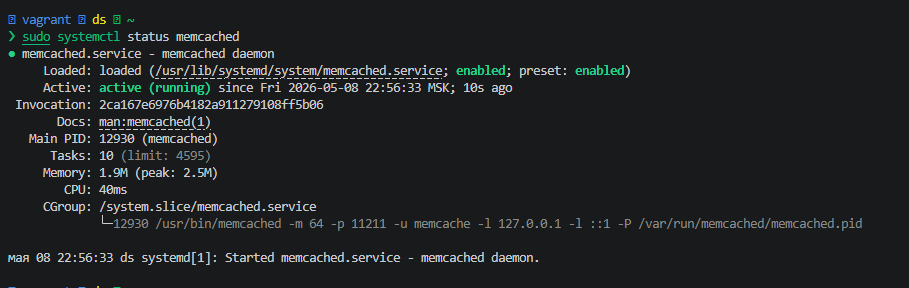
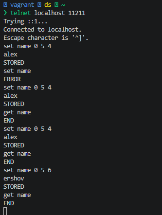
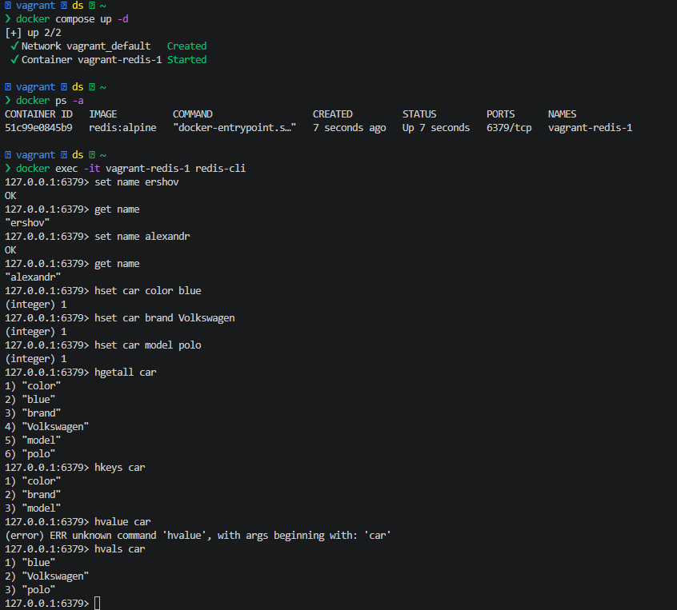

# Домашнее задание к занятию «Кеширование Redis/memcached» Ершова А.О

### Задание 1. Кеширование

Приведите примеры проблем, которые может решить кеширование.

_Приведите ответ в свободной форме._

---
### Решение 1
Пример проблем которые решает кеширование:
- Высокая задержка. Кэш хранится в оперативной памяти, а оперативная память быстрее чем любой ssd, по этому обращение к кэшу происходит быстрее
- Перегрузка баз данных и серверов. Уменьшает количество запросов на прямую к базе данных или к api.
- Медленная загрузка сайтов. Быстрая отдача статического контента значительно сокращает время отображения страницы пользователю
- Высокая стоимость вычислений.  Повторное использование уже обработанных результатов снижает необходимость постоянных сложных вычислений
- Проблема пропускной способности. Снижает объем данных, передаваемых по сети, что критично при медленном соединении
---
### Задание 2. Memcached

Установите и запустите memcached.

_Приведите скриншот systemctl status memcached, где будет видно, что memcached запущен._

---
### Решение 2
- Устанавливал я через стандартный репозиторий debian

---
### Задание 3. Удаление по TTL в Memcached

Запишите в memcached несколько ключей с любыми именами и значениями, для которых выставлен TTL 5.

_Приведите скриншот, на котором видно, что спустя 5 секунд ключи удалились из базы._

---
### Решение 3
- Результат работы memcached

---

### Задание 4. Запись данных в Redis

Запишите в Redis несколько ключей с любыми именами и значениями.

_Через redis-cli достаньте все записанные ключи и значения из базы, приведите скриншот этой операции._

---
### Решение 4
- Результат работы в redis

## Дополнительные задания (со звёздочкой*)

Эти задания дополнительные, то есть не обязательные к выполнению, и никак не повлияют на получение вами зачёта по этому домашнему заданию. Вы можете их выполнить, если хотите глубже разобраться в материале.

### Задание 5*. Работа с числами

Запишите в Redis ключ key5 со значением типа "int" равным числу 5. Увеличьте его на 5, чтобы в итоге в значении лежало число 10.

_Приведите скриншот, где будут проделаны все операции и будет видно, что значение key5 стало равно 10._