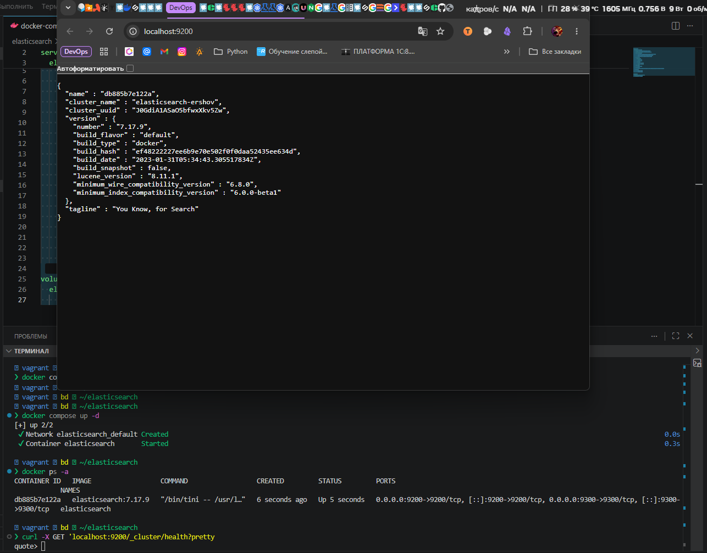
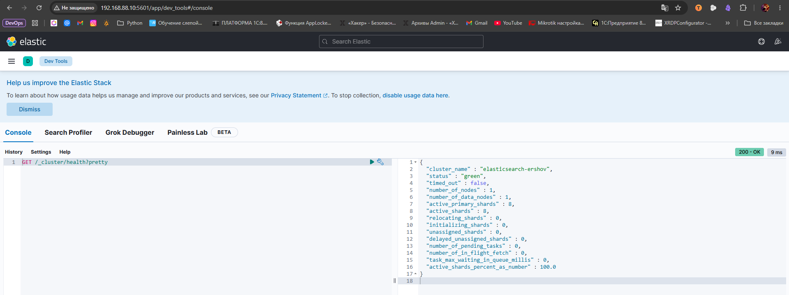
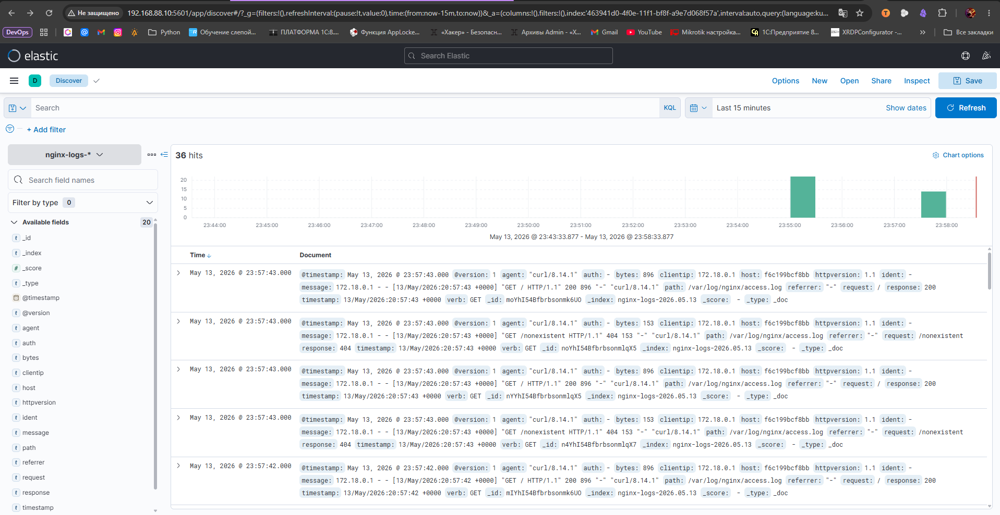
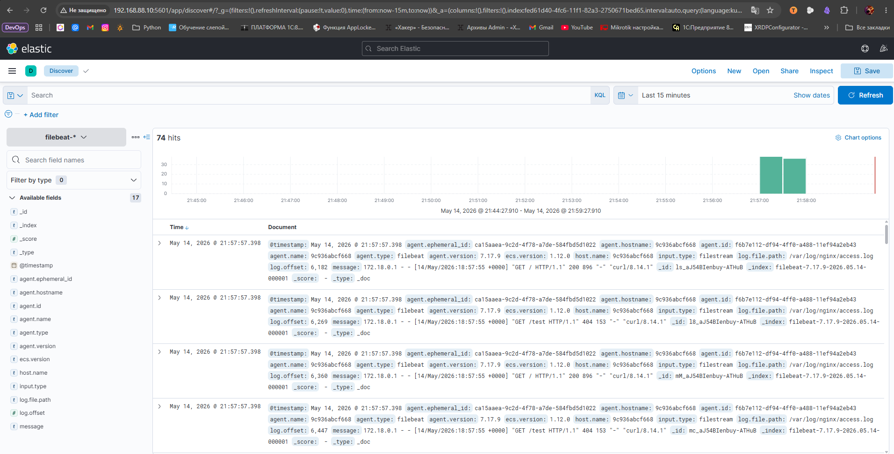

# Домашнее задание к занятию «ELK» Ершова А.О.


### Задание 1. Elasticsearch

[](https://github.com/netology-code/sdb-homeworks/blob/main/11-03.md#%D0%B7%D0%B0%D0%B4%D0%B0%D0%BD%D0%B8%D0%B5-1-elasticsearch)

Установите и запустите Elasticsearch, после чего поменяйте параметр cluster_name на случайный.

_Приведите скриншот команды 'curl -X GET 'localhost:9200/_cluster/health?pretty', сделанной на сервере с установленным Elasticsearch. Где будет виден нестандартный cluster_name_.

---
### Решение 1
- Поднял вм через vagrant
```ruby
Vagrant.configure("2") do |config|
  config.vm.box = "my-debian13"
  config.ssh.insert_key = false
  config.vm.define "bd" do |h1|
    h1.vm.hostname = "bd"
    h1.vm.network "public_network", ip: "192.168.88.10",
                   bridge: "Realtek PCIe GbE Family Controller"
    h1.vm.provider "virtualbox" do |vb|
      vb.name   = "bd"
      vb.memory = "8192"
      vb.cpus   = 4
    end

    # Provision внутри блока define, чтобы переменные разрешались на ВМ, а не на хосте.
    h1.vm.provision "shell", inline: <<-'SHELL'
      echo "1. Настройка официального репозитория Docker..."
      apt-get update
      apt-get install -y ca-certificates curl gnutls-bin openssl nano

      # Добавляем GPG ключ
      install -m 0755 -d /etc/apt/keyrings
      curl -fsSL https://download.docker.com/linux/debian/gpg -o /etc/apt/keyrings/docker.asc
      chmod a+r /etc/apt/keyrings/docker.asc

      # Формируем sources-файл (теперь переменные разрешатся на ВМ)
      echo "Types: deb
URIs: https://download.docker.com/linux/debian
Suites: $(. /etc/os-release && echo "$VERSION_CODENAME")
Components: stable
Architectures: $(dpkg --print-architecture)
Signed-By: /etc/apt/keyrings/docker.asc" > /etc/apt/sources.list.d/docker.sources
      echo "2. Установка Docker Engine и Compose Plugin..."
      apt-get update
      apt-get install -y docker-ce docker-ce-cli containerd.io docker-buildx-plugin docker-compose-plugin
      usermod -aG docker vagrant
    SHELL
  end
end
```

- Создал docker-compose.yaml
```yml
services:
  elasticsearch:
    image: elasticsearch:7.17.9
    container_name: elasticsearch
    environment:
      - cluster.name=elasticsearch-ershov  # Уникальное имя кластера
      - xpack.security.enabled=false
      - discovery.type=single-node
    ulimits:
      memlock:
        soft: -1
        hard: -1
      nofile:
        soft: 65536
        hard: 65536
    cap_add:
      - IPC_LOCK
    volumes:
      - elasticsearch-data:/usr/share/elasticsearch/data
    ports:
      - 9200:9200
      - 9300:9300

volumes:
  elasticsearch-data:
    driver: local
```

- Скрин результата




---
### Задание 2. Kibana

[](https://github.com/netology-code/sdb-homeworks/blob/main/11-03.md#%D0%B7%D0%B0%D0%B4%D0%B0%D0%BD%D0%B8%D0%B5-2-kibana)

Установите и запустите Kibana.

_Приведите скриншот интерфейса Kibana на странице http://<ip вашего сервера>:5601/app/dev_tools#/console, где будет выполнен запрос GET /_cluster/health?pretty_.

---
### Решение 2
- docker-compose.yaml
```yml
services:
  elasticsearch:
    image: elasticsearch:7.17.9
    container_name: elasticsearch
    environment:
      - cluster.name=elasticsearch-ershov
      - xpack.security.enabled=false
      - discovery.type=single-node
    ulimits:
      memlock:
        soft: -1
        hard: -1
      nofile:
        soft: 65536
        hard: 65536
    cap_add:
      - IPC_LOCK
    volumes:
      - elasticsearch-data:/usr/share/elasticsearch/data
    ports:
      - 9200:9200
      - 9300:9300


  kibana:
    container_name: kibana
    image: kibana:7.17.9
    environment:
      - ELASTICSEARCH_HOSTS=http://elasticsearch:9200
    ports:
      - 5601:5601
    depends_on:
      - elasticsearch
volumes:
  elasticsearch-data:

    driver: local
```

- Скрин результата




---
### Задание 3. Logstash

[](https://github.com/netology-code/sdb-homeworks/blob/main/11-03.md#%D0%B7%D0%B0%D0%B4%D0%B0%D0%BD%D0%B8%D0%B5-3-logstash)

Установите и запустите Logstash и Nginx. С помощью Logstash отправьте access-лог Nginx в Elasticsearch.

_Приведите скриншот интерфейса Kibana, на котором видны логи Nginx._

---
### Решение 3

- Структура каталога
```bash
❯ tree
.
├── docker-compose.yaml
├── logstash
│   └── pipeline
│       └── logstash.conf
└── nginx
    ├── conf
    │   └── default.conf
    └── logs
        ├── access.log
        └── error.log

6 directories, 5 files
```
- docker-compose.yaml
```yml
services:
  elasticsearch:
    image: elasticsearch:7.17.9
    container_name: elasticsearch
    environment:
      - cluster.name=elasticsearch-ershov
      - xpack.security.enabled=false
      - discovery.type=single-node
    ulimits:
      memlock:
        soft: -1
        hard: -1
      nofile:
        soft: 65536
        hard: 65536
    cap_add:
      - IPC_LOCK
    volumes:
      - elasticsearch-data:/usr/share/elasticsearch/data
    ports:
      - 9200:9200
      - 9300:9300

  kibana:
    image: kibana:7.17.9
    container_name: kibana
    environment:
      - ELASTICSEARCH_HOSTS=http://elasticsearch:9200
    ports:
      - 5601:5601
    depends_on:
      - elasticsearch

  nginx:
    image: nginx:latest
    container_name: nginx
    ports:
      - "80:80"
    volumes:
      - ./nginx/conf/default.conf:/etc/nginx/conf.d/default.conf:ro   # конфиг
      - ./nginx/logs:/var/log/nginx                                   # логи будут доступны logstash

    depends_on:
      - elasticsearch


  logstash:
    image: logstash:7.17.9
    container_name: logstash
    volumes:
      - ./logstash/pipeline/logstash.conf:/usr/share/logstash/pipeline/logstash.conf:ro
      - ./nginx/logs:/var/log/nginx:ro   # общий доступ к логам nginx

    depends_on:
      - elasticsearch
    environment:
      - XPACK_MONITORING_ENABLED=false   # убирает лишние проверки

volumes:
  elasticsearch-data:
    driver: local
```

- logstash.conf
```ini
input {
  file {
    path => "/var/log/nginx/access.log"
    start_position => "beginning"
    sincedb_path => "/dev/null"   # для теста читать файл каждый раз с начала
  }
}


filter {
  grok {
    match => { "message" => "%{COMBINEDAPACHELOG}" }
  }
  date {
    match => [ "timestamp", "dd/MMM/yyyy:HH:mm:ss Z" ]
  }
}


output {
  elasticsearch {
    hosts => ["http://elasticsearch:9200"]
    index => "nginx-logs-%{+YYYY.MM.dd}"
  }
  stdout { codec => rubydebug }   # для отладки, увижу логи в docker logs
}
```

- default.conf
```ini
server {
    listen 80;
    server_name localhost;
    #access_log с подробным форматом (combined)
    access_log /var/log/nginx/access.log combined;
    error_log  /var/log/nginx/error.log warn;

    location / {
        root /usr/share/nginx/html;
        index index.html;
    }
}
```

- Скрин результата




---
### Задание 4. Filebeat.

[](https://github.com/netology-code/sdb-homeworks/blob/main/11-03.md#%D0%B7%D0%B0%D0%B4%D0%B0%D0%BD%D0%B8%D0%B5-4-filebeat)

Установите и запустите Filebeat. Переключите поставку логов Nginx с Logstash на Filebeat.

_Приведите скриншот интерфейса Kibana, на котором видны логи Nginx, которые были отправлены через Filebeat._

---
- Структура каталога
```bash
❯ tree
.
├── docker-compose.yaml
├── filebeat.yml
├── logstash
│   └── pipeline
│       └── logstash.conf
└── nginx
    ├── conf
    │   └── default.conf
    └── logs
        ├── access.log
        └── error.log

6 directories, 6 files
```

- filebeat.yml
```yml
filebeat.inputs:
- type: filestream
  enabled: true
  paths:
    - /var/log/nginx/access.log


output.elasticsearch:
  hosts: ["http://elasticsearch:9200"]

logging.level: info
logging.to_files: false
logging.to_syslog: false
```

- docker-compose.yaml
```yml
services:
  elasticsearch:
    image: elasticsearch:7.17.9
    container_name: elasticsearch
    environment:
      - cluster.name=elasticsearch-ershov
      - xpack.security.enabled=false
      - discovery.type=single-node
    ulimits:
      memlock:
        soft: -1
        hard: -1
      nofile:
        soft: 65536
        hard: 65536
    cap_add:
      - IPC_LOCK
    volumes:
      - elasticsearch-data:/usr/share/elasticsearch/data
    ports:
      - 9200:9200
      - 9300:9300


  kibana:
    image: kibana:7.17.9
    container_name: kibana
    environment:
      - ELASTICSEARCH_HOSTS=http://elasticsearch:9200
    ports:
      - 5601:5601
    depends_on:
      - elasticsearch


  nginx:
    image: nginx:latest
    container_name: nginx
    ports:
      - "80:80"
    volumes:
      - ./nginx/conf/default.conf:/etc/nginx/conf.d/default.conf:ro
      - ./nginx/logs:/var/log/nginx
    depends_on:
      - elasticsearch


  filebeat:
    image: elastic/filebeat:7.17.9
    container_name: filebeat
    user: root
    command: filebeat -e -strict.perms=false
    restart: unless-stopped
    volumes:
      - ./filebeat.yml:/usr/share/filebeat/filebeat.yml:ro
      - ./nginx/logs:/var/log/nginx:ro   # доступ к логам nginx
    depends_on:
      - elasticsearch

volumes:
  elasticsearch-data:
    driver: local
```

- Скрин результата




---
## Дополнительные задания (со звёздочкой*)

[](https://github.com/netology-code/sdb-homeworks/blob/main/11-03.md#%D0%B4%D0%BE%D0%BF%D0%BE%D0%BB%D0%BD%D0%B8%D1%82%D0%B5%D0%BB%D1%8C%D0%BD%D1%8B%D0%B5-%D0%B7%D0%B0%D0%B4%D0%B0%D0%BD%D0%B8%D1%8F-%D1%81%D0%BE-%D0%B7%D0%B2%D1%91%D0%B7%D0%B4%D0%BE%D1%87%D0%BA%D0%BE%D0%B9)

Эти задания дополнительные, то есть не обязательные к выполнению, и никак не повлияют на получение вами зачёта по этому домашнему заданию. Вы можете их выполнить, если хотите глубже шире разобраться в материале.

### Задание 5*. Доставка данных

[](https://github.com/netology-code/sdb-homeworks/blob/main/11-03.md#%D0%B7%D0%B0%D0%B4%D0%B0%D0%BD%D0%B8%D0%B5-5-%D0%B4%D0%BE%D1%81%D1%82%D0%B0%D0%B2%D0%BA%D0%B0-%D0%B4%D0%B0%D0%BD%D0%BD%D1%8B%D1%85)

Настройте поставку лога в Elasticsearch через Logstash и Filebeat любого другого сервиса , но не Nginx. Для этого лог должен писаться на файловую систему, Logstash должен корректно его распарсить и разложить на поля.

_Приведите скриншот интерфейса Kibana, на котором будет виден этот лог и напишите лог какого приложения отправляется._