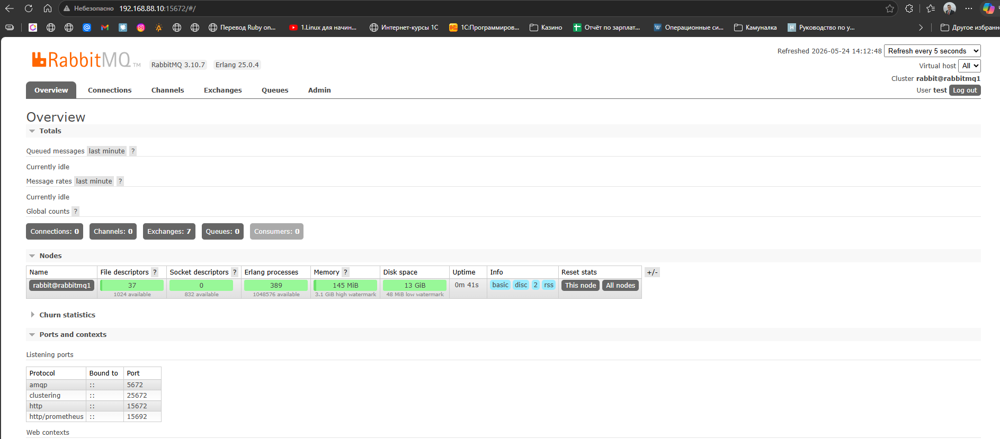
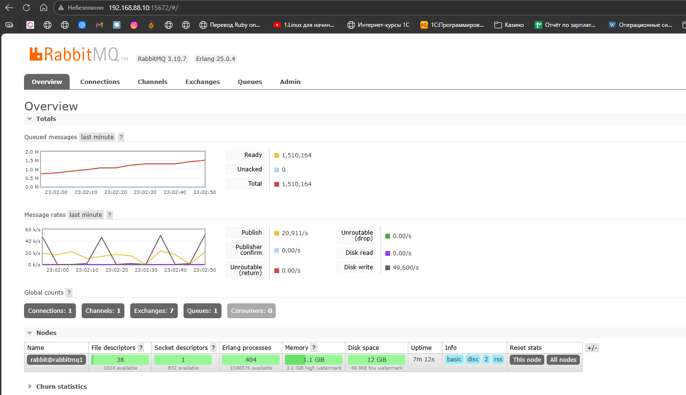
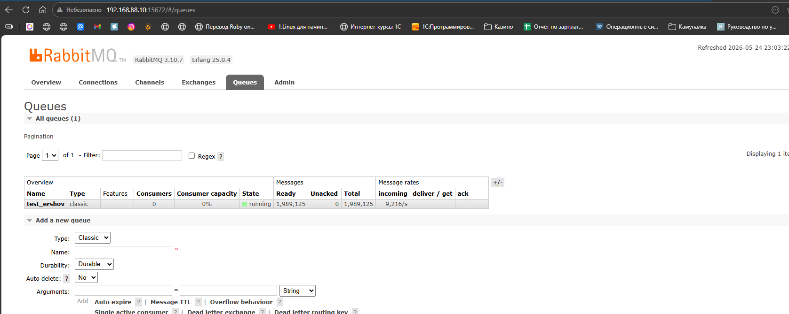
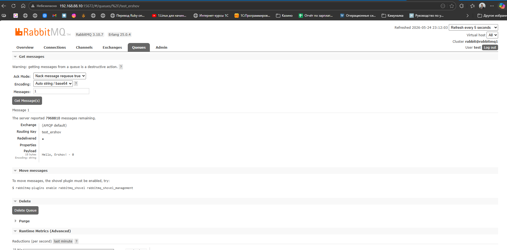
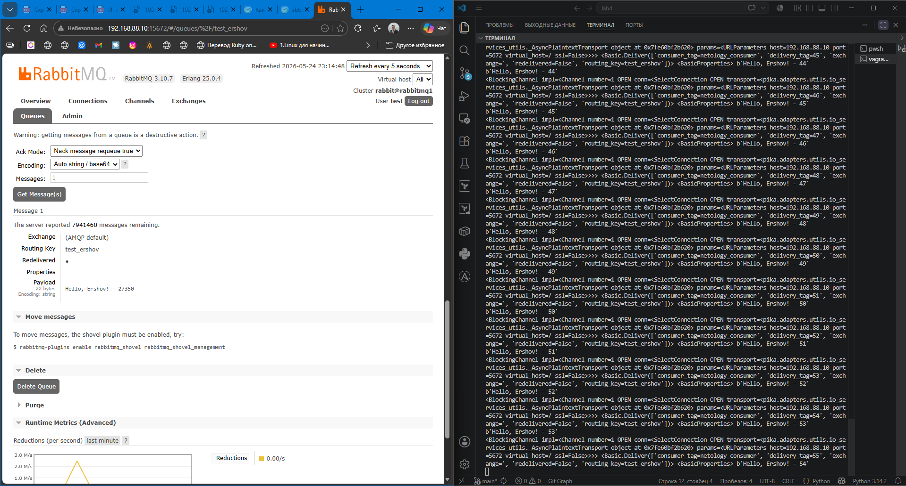
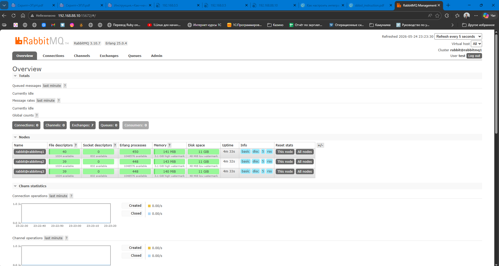
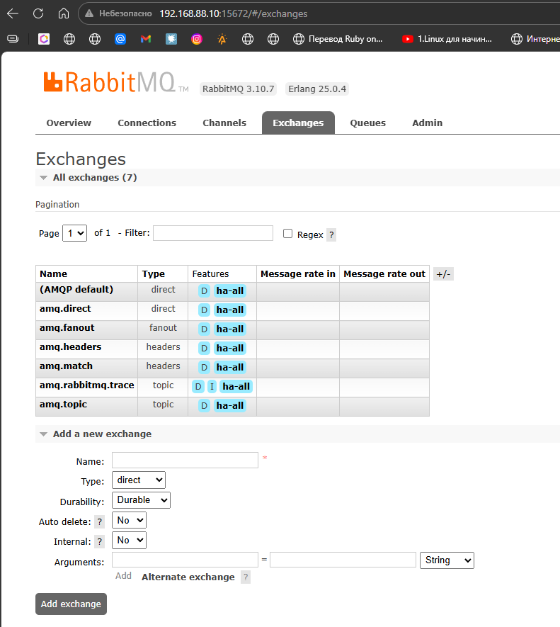
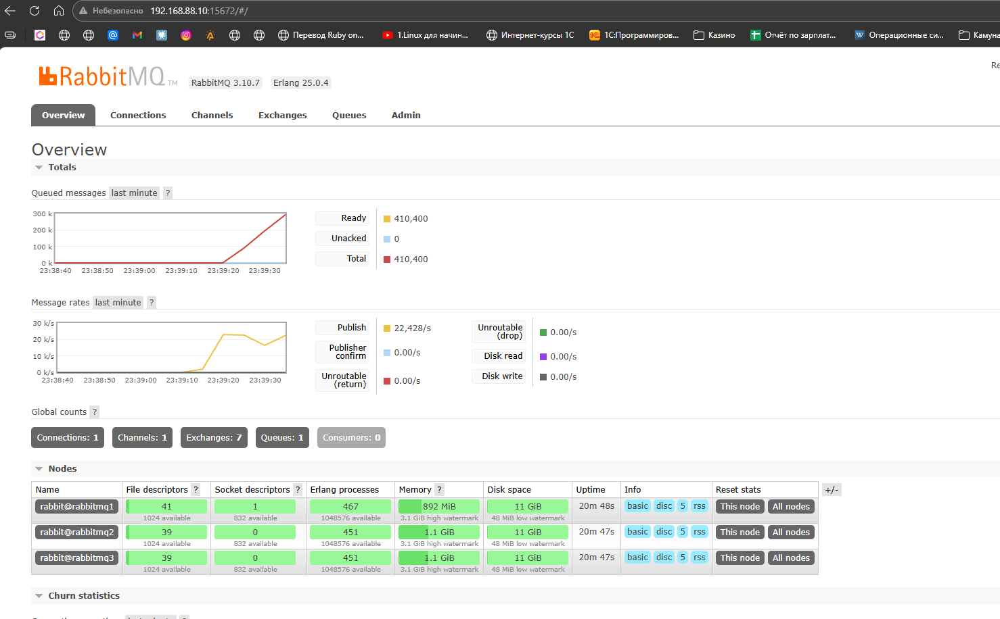
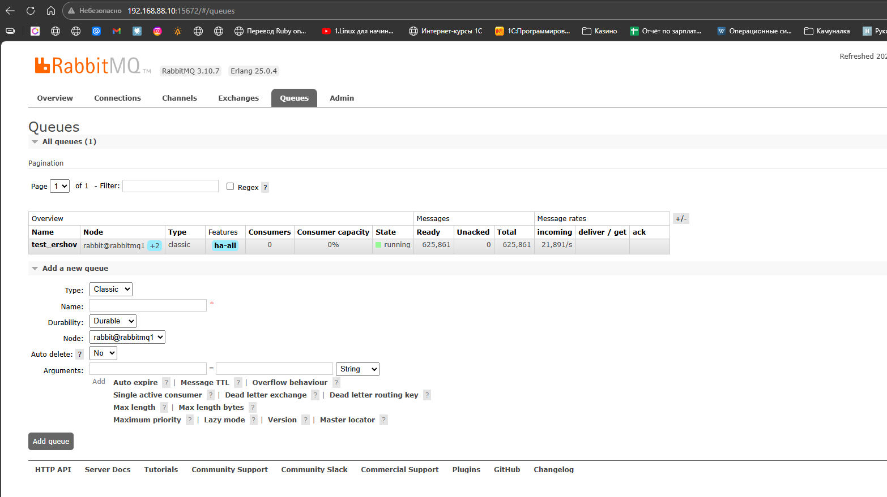

### Задание 1. Установка RabbitMQ

[](https://github.com/netology-code/sdb-homeworks/blob/main/11-04.md#%D0%B7%D0%B0%D0%B4%D0%B0%D0%BD%D0%B8%D0%B5-1-%D1%83%D1%81%D1%82%D0%B0%D0%BD%D0%BE%D0%B2%D0%BA%D0%B0-rabbitmq)

Используя Vagrant или VirtualBox, создайте виртуальную машину и установите RabbitMQ. Добавьте management plug-in и зайдите в веб-интерфейс.

_Итогом выполнения домашнего задания будет приложенный скриншот веб-интерфейса RabbitMQ._

---

### Решение 1
- Я поднял машину на через vagrant, установил [[docker]]
```ruby
Vagrant.configure("2") do |config|
  config.vm.box = "my-debian13"
  config.ssh.insert_key = false
 

  config.vm.define "RabbitMQ" do |h1|
    h1.vm.hostname = "RabbitMQ"
    h1.vm.network "public_network", ip: "192.168.88.10",
                  bridge: "Realtek PCIe GbE Family Controller"

    h1.vm.synced_folder ".", "/home/vagrant/lab4", owner: "vagrant", group: "vagrant"
    h1.vm.provider "virtualbox" do |vb|
      vb.name   = "RabbitMQ"
      vb.memory = "8192"
      vb.cpus   = 4
    end


    h1.vm.provision "shell", inline: <<-'SHELL'
      echo "1. Настройка официального репозитория Docker..."
      apt-get update
      apt-get install -y ca-certificates curl gnutls-bin openssl nano

      # Добавляем GPG ключ
      install -m 0755 -d /etc/apt/keyrings
      curl -fsSL https://download.docker.com/linux/debian/gpg -o /etc/apt/keyrings/docker.asc
      chmod a+r /etc/apt/keyrings/docker.asc

      # Формируем sources-файл (теперь переменные разрешатся на ВМ)
      echo "Types: deb
URIs: https://download.docker.com/linux/debian
Suites: $(. /etc/os-release && echo "$VERSION_CODENAME")
Components: stable
Architectures: $(dpkg --print-architecture)
Signed-By: /etc/apt/keyrings/docker.asc" > /etc/apt/sources.list.d/docker.sources
      echo "2. Установка Docker Engine и Compose Plugin..."
      apt-get update
      apt-get install -y docker-ce docker-ce-cli containerd.io docker-buildx-plugin docker-compose-plugin
      usermod -aG docker vagrant
    SHELL
  end
end
```

- Скрин веб интерфейса



---
### Задание 2. Отправка и получение сообщений

[](https://github.com/netology-code/sdb-homeworks/blob/main/11-04.md#%D0%B7%D0%B0%D0%B4%D0%B0%D0%BD%D0%B8%D0%B5-2-%D0%BE%D1%82%D0%BF%D1%80%D0%B0%D0%B2%D0%BA%D0%B0-%D0%B8-%D0%BF%D0%BE%D0%BB%D1%83%D1%87%D0%B5%D0%BD%D0%B8%D0%B5-%D1%81%D0%BE%D0%BE%D0%B1%D1%89%D0%B5%D0%BD%D0%B8%D0%B9)

Используя приложенные скрипты, проведите тестовую отправку и получение сообщения. Для отправки сообщений необходимо запустить скрипт producer.py.

Для работы скриптов вам необходимо установить Python версии 3 и библиотеку Pika. Также в скриптах нужно указать IP-адрес машины, на которой запущен RabbitMQ, заменив localhost на нужный IP.

```shell
$ pip install pika
```

Зайдите в веб-интерфейс, найдите очередь под названием hello и сделайте скриншот. После чего запустите второй скрипт consumer.py и сделайте скриншот результата выполнения скрипта

_В качестве решения домашнего задания приложите оба скриншота, сделанных на этапе выполнения._

Для закрепления материала можете попробовать модифицировать скрипты, чтобы поменять название очереди и отправляемое сообщение.

---
### Решение 2

- Скриншоты результата











---
### Задание 3. Подготовка HA кластера

[](https://github.com/netology-code/sdb-homeworks/blob/main/11-04.md#%D0%B7%D0%B0%D0%B4%D0%B0%D0%BD%D0%B8%D0%B5-3-%D0%BF%D0%BE%D0%B4%D0%B3%D0%BE%D1%82%D0%BE%D0%B2%D0%BA%D0%B0-ha-%D0%BA%D0%BB%D0%B0%D1%81%D1%82%D0%B5%D1%80%D0%B0)

Используя Vagrant или VirtualBox, создайте вторую виртуальную машину и установите RabbitMQ. Добавьте в файл hosts название и IP-адрес каждой машины, чтобы машины могли видеть друг друга по имени.

Пример содержимого hosts файла:

```shell
$ cat /etc/hosts
192.168.0.10 rmq01
192.168.0.11 rmq02
```

После этого ваши машины могут пинговаться по имени.

Затем объедините две машины в кластер и создайте политику ha-all на все очереди.

_В качестве решения домашнего задания приложите скриншоты из веб-интерфейса с информацией о доступных нодах в кластере и включённой политикой._

Также приложите вывод команды с двух нод:

```shell
$ rabbitmqctl cluster_status
```

Для закрепления материала снова запустите скрипт producer.py и приложите скриншот выполнения команды на каждой из нод:

```shell
$ rabbitmqadmin get queue='hello'
```

После чего попробуйте отключить одну из нод, желательно ту, к которой подключались из скрипта, затем поправьте параметры подключения в скрипте consumer.py на вторую ноду и запустите его.

_Приложите скриншот результата работы второго скрипта._

---
## Решение 3

- статус кластера с rabbitmq1
```bash
  root@rabbitmq1:/# rabbitmqctl cluster_status
RABBITMQ_ERLANG_COOKIE env variable support is deprecated and will be REMOVED in a future version. Use the $HOME/.erlang.cookie file or the --erlang-cookie switch instead.
Cluster status of node rabbit@rabbitmq1 ...
Basics

Cluster name: rabbit@rabbitmq1

Disk Nodes

rabbit@rabbitmq1
rabbit@rabbitmq2
rabbit@rabbitmq3

Running Nodes

rabbit@rabbitmq1
rabbit@rabbitmq2
rabbit@rabbitmq3

Versions

rabbit@rabbitmq1: RabbitMQ 3.10.7 on Erlang 25.0.4
rabbit@rabbitmq2: RabbitMQ 3.10.7 on Erlang 25.0.4
rabbit@rabbitmq3: RabbitMQ 3.10.7 on Erlang 25.0.4

Maintenance status

Node: rabbit@rabbitmq1, status: not under maintenance
Node: rabbit@rabbitmq2, status: not under maintenance
Node: rabbit@rabbitmq3, status: not under maintenance

Alarms

(none)

Network Partitions

(none)

Listeners

Node: rabbit@rabbitmq1, interface: [::], port: 15672, protocol: http, purpose: HTTP API
Node: rabbit@rabbitmq1, interface: [::], port: 61613, protocol: stomp, purpose: STOMP
Node: rabbit@rabbitmq1, interface: [::], port: 1883, protocol: mqtt, purpose: MQTT
Node: rabbit@rabbitmq1, interface: [::], port: 15692, protocol: http/prometheus, purpose: Prometheus exporter API over HTTP
Node: rabbit@rabbitmq1, interface: [::], port: 25672, protocol: clustering, purpose: inter-node and CLI tool communication
Node: rabbit@rabbitmq1, interface: [::], port: 5672, protocol: amqp, purpose: AMQP 0-9-1 and AMQP 1.0
Node: rabbit@rabbitmq2, interface: [::], port: 15672, protocol: http, purpose: HTTP API
Node: rabbit@rabbitmq2, interface: [::], port: 61613, protocol: stomp, purpose: STOMP
Node: rabbit@rabbitmq2, interface: [::], port: 1883, protocol: mqtt, purpose: MQTT
Node: rabbit@rabbitmq2, interface: [::], port: 15692, protocol: http/prometheus, purpose: Prometheus exporter API over HTTP
Node: rabbit@rabbitmq2, interface: [::], port: 25672, protocol: clustering, purpose: inter-node and CLI tool communication
Node: rabbit@rabbitmq2, interface: [::], port: 5672, protocol: amqp, purpose: AMQP 0-9-1 and AMQP 1.0
Node: rabbit@rabbitmq3, interface: [::], port: 15672, protocol: http, purpose: HTTP API
Node: rabbit@rabbitmq3, interface: [::], port: 61613, protocol: stomp, purpose: STOMP
Node: rabbit@rabbitmq3, interface: [::], port: 1883, protocol: mqtt, purpose: MQTT
Node: rabbit@rabbitmq3, interface: [::], port: 15692, protocol: http/prometheus, purpose: Prometheus exporter API over HTTP
Node: rabbit@rabbitmq3, interface: [::], port: 25672, protocol: clustering, purpose: inter-node and CLI tool communication
Node: rabbit@rabbitmq3, interface: [::], port: 5672, protocol: amqp, purpose: AMQP 0-9-1 and AMQP 1.0

Feature flags

Flag: classic_mirrored_queue_version, state: enabled
Flag: drop_unroutable_metric, state: enabled
Flag: empty_basic_get_metric, state: enabled
Flag: implicit_default_bindings, state: enabled
Flag: maintenance_mode_status, state: enabled
Flag: quorum_queue, state: enabled
Flag: stream_queue, state: enabled
Flag: user_limits, state: enabled
Flag: virtual_host_metadata, state: enabled
```

- вывод с rabbitmq2
```bash
root@rabbitmq2:/# rabbitmqctl cluster_status
RABBITMQ_ERLANG_COOKIE env variable support is deprecated and will be REMOVED in a future version. Use the $HOME/.erlang.cookie file or the --erlang-cookie switch instead.
Cluster status of node rabbit@rabbitmq2 ...
Basics

Cluster name: rabbit@rabbitmq2

Disk Nodes

rabbit@rabbitmq1
rabbit@rabbitmq2
rabbit@rabbitmq3

Running Nodes

rabbit@rabbitmq1
rabbit@rabbitmq2
rabbit@rabbitmq3

Versions

rabbit@rabbitmq1: RabbitMQ 3.10.7 on Erlang 25.0.4
rabbit@rabbitmq2: RabbitMQ 3.10.7 on Erlang 25.0.4
rabbit@rabbitmq3: RabbitMQ 3.10.7 on Erlang 25.0.4

Maintenance status

Node: rabbit@rabbitmq1, status: not under maintenance
Node: rabbit@rabbitmq2, status: not under maintenance
Node: rabbit@rabbitmq3, status: not under maintenance

Alarms

(none)

Network Partitions

(none)

Listeners

Node: rabbit@rabbitmq1, interface: [::], port: 15672, protocol: http, purpose: HTTP API
Node: rabbit@rabbitmq1, interface: [::], port: 61613, protocol: stomp, purpose: STOMP
Node: rabbit@rabbitmq1, interface: [::], port: 1883, protocol: mqtt, purpose: MQTT
Node: rabbit@rabbitmq1, interface: [::], port: 15692, protocol: http/prometheus, purpose: Prometheus exporter API over HTTP
Node: rabbit@rabbitmq1, interface: [::], port: 25672, protocol: clustering, purpose: inter-node and CLI tool communication
Node: rabbit@rabbitmq1, interface: [::], port: 5672, protocol: amqp, purpose: AMQP 0-9-1 and AMQP 1.0
Node: rabbit@rabbitmq2, interface: [::], port: 15672, protocol: http, purpose: HTTP API
Node: rabbit@rabbitmq2, interface: [::], port: 61613, protocol: stomp, purpose: STOMP
Node: rabbit@rabbitmq2, interface: [::], port: 1883, protocol: mqtt, purpose: MQTT
Node: rabbit@rabbitmq2, interface: [::], port: 15692, protocol: http/prometheus, purpose: Prometheus exporter API over HTTP
Node: rabbit@rabbitmq2, interface: [::], port: 25672, protocol: clustering, purpose: inter-node and CLI tool communication
Node: rabbit@rabbitmq2, interface: [::], port: 5672, protocol: amqp, purpose: AMQP 0-9-1 and AMQP 1.0
Node: rabbit@rabbitmq3, interface: [::], port: 15672, protocol: http, purpose: HTTP API
Node: rabbit@rabbitmq3, interface: [::], port: 61613, protocol: stomp, purpose: STOMP
Node: rabbit@rabbitmq3, interface: [::], port: 1883, protocol: mqtt, purpose: MQTT
Node: rabbit@rabbitmq3, interface: [::], port: 15692, protocol: http/prometheus, purpose: Prometheus exporter API over HTTP
Node: rabbit@rabbitmq3, interface: [::], port: 25672, protocol: clustering, purpose: inter-node and CLI tool communication
Node: rabbit@rabbitmq3, interface: [::], port: 5672, protocol: amqp, purpose: AMQP 0-9-1 and AMQP 1.0

Feature flags

Flag: classic_mirrored_queue_version, state: enabled
Flag: drop_unroutable_metric, state: enabled
Flag: empty_basic_get_metric, state: enabled
Flag: implicit_default_bindings, state: enabled
Flag: maintenance_mode_status, state: enabled
Flag: quorum_queue, state: enabled
Flag: stream_queue, state: enabled
Flag: user_limits, state: enabled
Flag: virtual_host_metadata,
```

- Скриншоты результат










