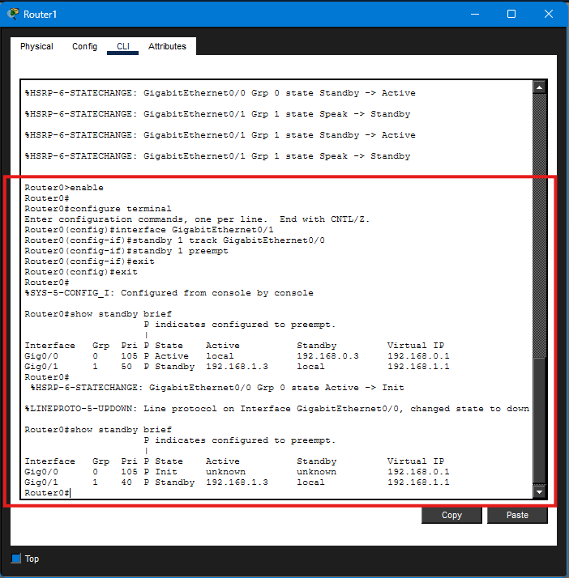
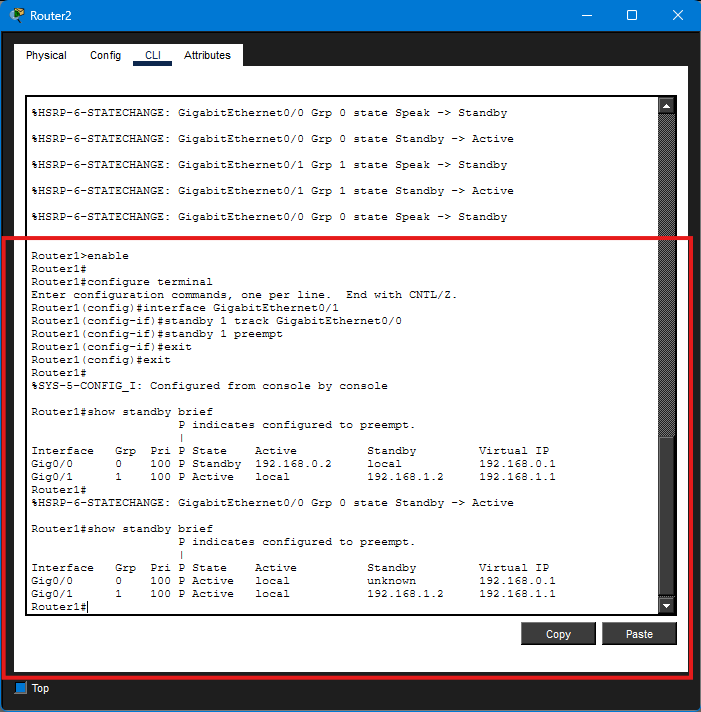
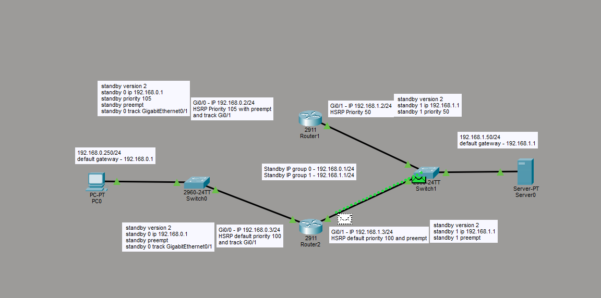
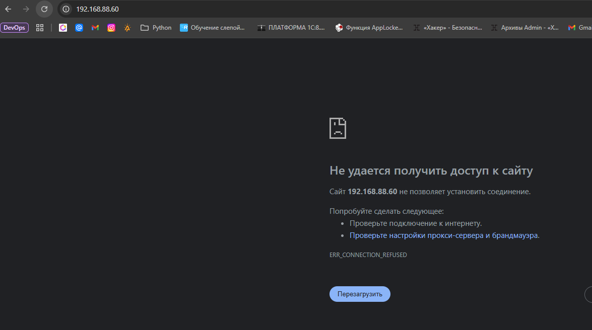
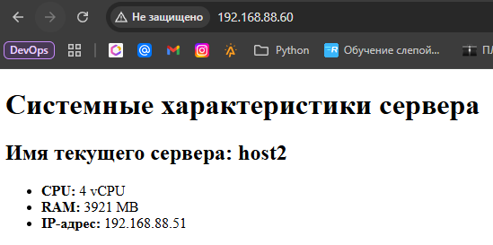
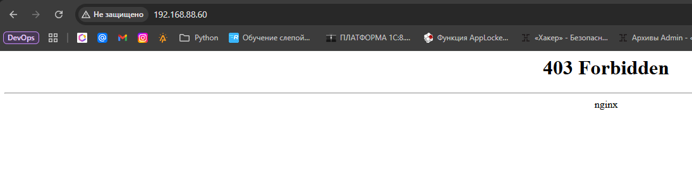

# Домашнее задание к занятию 1 «Disaster recovery и Keepalived» - Ершов А.О.

[](https://github.com/netology-code/sflt-homeworks/blob/main/1.md#%D0%B4%D0%BE%D0%BC%D0%B0%D1%88%D0%BD%D0%B5%D0%B5-%D0%B7%D0%B0%D0%B4%D0%B0%D0%BD%D0%B8%D0%B5-%D0%BA-%D0%B7%D0%B0%D0%BD%D1%8F%D1%82%D0%B8%D1%8E-1-disaster-recovery-%D0%B8-keepalived)

### Цель задания

[](https://github.com/netology-code/sflt-homeworks/blob/main/1.md#%D1%86%D0%B5%D0%BB%D1%8C-%D0%B7%D0%B0%D0%B4%D0%B0%D0%BD%D0%B8%D1%8F)

В результате выполнения этого задания вы научитесь:

1. Настраивать отслеживание интерфейса для протокола HSRP;
2. Настраивать сервис Keepalived для использования плавающего IP

---

### Чеклист готовности к домашнему заданию

[](https://github.com/netology-code/sflt-homeworks/blob/main/1.md#%D1%87%D0%B5%D0%BA%D0%BB%D0%B8%D1%81%D1%82-%D0%B3%D0%BE%D1%82%D0%BE%D0%B2%D0%BD%D0%BE%D1%81%D1%82%D0%B8-%D0%BA-%D0%B4%D0%BE%D0%BC%D0%B0%D1%88%D0%BD%D0%B5%D0%BC%D1%83-%D0%B7%D0%B0%D0%B4%D0%B0%D0%BD%D0%B8%D1%8E)

1. Установлена программа Cisco Packet Tracer
2. Установлена операционная система Ubuntu на виртуальную машину и имеется доступ к терминалу
3. Сделан клон этой виртуальной машины, они находятся в одной подсети и имеют разные IP адреса
4. Просмотрены конфигурационные файлы, рассматриваемые на лекции, которые находятся по [ссылке](https://github.com/netology-code/sflt-homeworks/blob/main/1)

---


### Инструкция по выполнению домашнего задания

[](https://github.com/netology-code/sflt-homeworks/blob/main/1.md#%D0%B8%D0%BD%D1%81%D1%82%D1%80%D1%83%D0%BA%D1%86%D0%B8%D1%8F-%D0%BF%D0%BE-%D0%B2%D1%8B%D0%BF%D0%BE%D0%BB%D0%BD%D0%B5%D0%BD%D0%B8%D1%8E-%D0%B4%D0%BE%D0%BC%D0%B0%D1%88%D0%BD%D0%B5%D0%B3%D0%BE-%D0%B7%D0%B0%D0%B4%D0%B0%D0%BD%D0%B8%D1%8F)

1. Сделайте fork [репозитория c шаблоном решения](https://github.com/netology-code/sys-pattern-homework) к себе в Github и переименуйте его по названию или номеру занятия, например, [https://github.com/имя-вашего-репозитория/gitlab-hw](https://github.com/%D0%B8%D0%BC%D1%8F-%D0%B2%D0%B0%D1%88%D0%B5%D0%B3%D0%BE-%D1%80%D0%B5%D0%BF%D0%BE%D0%B7%D0%B8%D1%82%D0%BE%D1%80%D0%B8%D1%8F/gitlab-hw) или [https://github.com/имя-вашего-репозитория/8-03-hw](https://github.com/%D0%B8%D0%BC%D1%8F-%D0%B2%D0%B0%D1%88%D0%B5%D0%B3%D0%BE-%D1%80%D0%B5%D0%BF%D0%BE%D0%B7%D0%B8%D1%82%D0%BE%D1%80%D0%B8%D1%8F/8-03-hw)).
2. Выполните клонирование этого репозитория к себе на ПК с помощью команды git clone.
3. Выполните домашнее задание и заполните у себя локально этот файл README.md:
    - впишите вверху название занятия и ваши фамилию и имя;
    - в каждом задании добавьте решение в требуемом виде: текст/код/скриншоты/ссылка;
    - для корректного добавления скриншотов воспользуйтесь инструкцией [«Как вставить скриншот в шаблон с решением»](https://github.com/netology-code/sys-pattern-homework/blob/main/screen-instruction.md);
    - при оформлении используйте возможности языка разметки md. Коротко об этом можно посмотреть в [инструкции по MarkDown](https://github.com/netology-code/sys-pattern-homework/blob/main/md-instruction.md).
4. После завершения работы над домашним заданием сделайте коммит (git commit -m "comment") и отправьте его на Github (git push origin).
5. Для проверки домашнего задания преподавателем в личном кабинете прикрепите и отправьте ссылку на решение в виде md-файла в вашем Github.
6. Любые вопросы задавайте в разделе «Вопросы по заданию» в личном кабинете.

---

### Задание 1

[](https://github.com/netology-code/sflt-homeworks/blob/main/1.md#%D0%B7%D0%B0%D0%B4%D0%B0%D0%BD%D0%B8%D0%B5-1)

- Дана [схема](https://github.com/netology-code/sflt-homeworks/blob/main/1/hsrp_advanced.pkt) для Cisco Packet Tracer, рассматриваемая в лекции.
- На данной схеме уже настроено отслеживание интерфейсов маршрутизаторов Gi0/1 (для нулевой группы)
- Необходимо аналогично настроить отслеживание состояния интерфейсов Gi0/0 (для первой группы).
- Для проверки корректности настройки, разорвите один из кабелей между одним из маршрутизаторов и Switch0 и запустите ping между PC0 и Server0.
- На проверку отправьте получившуюся схему в формате pkt и скриншот, где виден процесс настройки маршрутизатора.

---
### Решение 1
- Для аналогичной настройки отслеживания состояния интерфейсов  Gi0/0 (для первой группы), я настроил оба роутера:
   1. Я зашел на роутер 1 и 2 и выбрал интерфейс GigabitEthernet0/1
   2. Настроил отслеживание (track) интерфейса GigabitEthernet0/0
   3.  Так же включил preempt
- Скрин Роутера 1


- Скрин Роутера 2
 
 - Схема
 ![[.scrin/hsrp_advanced_ershov 1.pkt]]

### Задание 2

[](https://github.com/netology-code/sflt-homeworks/blob/main/1.md#%D0%B7%D0%B0%D0%B4%D0%B0%D0%BD%D0%B8%D0%B5-2)

- Запустите две виртуальные машины Linux, установите и настройте сервис Keepalived как в лекции, используя пример конфигурационного [файла](https://github.com/netology-code/sflt-homeworks/blob/main/1/keepalived-simple.conf).
- Настройте любой веб-сервер (например, nginx или simple python server) на двух виртуальных машинах
- Напишите Bash-скрипт, который будет проверять доступность порта данного веб-сервера и существование файла index.html в root-директории данного веб-сервера.
- Настройте Keepalived так, чтобы он запускал данный скрипт каждые 3 секунды и переносил виртуальный IP на другой сервер, если bash-скрипт завершался с кодом, отличным от нуля (то есть порт веб-сервера был недоступен или отсутствовал index.html). Используйте для этого секцию vrrp_script
- На проверку отправьте получившейся bash-скрипт и конфигурационный файл keepalived, а также скриншот с демонстрацией переезда плавающего ip на другой сервер в случае недоступности порта или файла index.html

---
### Решение 2
- Я для развертывания использовал vagrant (windows), а для установки и настройки ansible (wsl)
- Структура проекта
```bash
❯ tree -L 4 ~/git/Netology_labs/fault_tolerance/lab1
/home/alex/git/Netology_labs/fault_tolerance/lab1
├── Vagrantfile
├── ansible.cfg
├── ansible.log
├── host_vars
│   ├── host1.yml # Переменные для использования в шаблоне keepalived.conf.j2
│   └── host2.yml # Переменные для использования в шаблоне keepalived.conf.j2
├── inventory.ini
├── playbook.yml
└── roles
    ├── keepalived
    │   ├── files
    │   │   └── check.sh # Скрипт
    │   ├── handlers
    │   │   └── main.yml
    │   ├── tasks
    │   │   └── main.yml
    │   └── templates
    │       └── keepalived.conf.j2
    └── nginx
        ├── README.md
        ├── handlers
        │   └── main.yml
        ├── tasks
        │   └── main.yml
        ├── templates
        │   └── index.html.j2
        └── vars
            └── main.yml

12 directories, 16 files
```

- Vagrantfile
```yml
Vagrant.configure("2") do |config|
   # Образ виртуальной машины
  config.vm.box = "my-debian13"
  # если выставлен в false, то vagrant не будет автоматически создавать и использовать собственные SSH ключи
  config.ssh.insert_key = false
  # Настройка виртальной машина host1
  config.vm.define "host1" do |h1|
   h1.vm.hostname = "host1"
  # Настройка сети
  h1.vm.network "public_network", ip: "192.168.88.50", bridge: "Realtek PCIe GbE Family Controller"
  # Настройка провайлдера и параметров ВМ
  h1.vm.provider "virtualbox" do |vb|
    vb.name= "host1"
    vb.memory = "4096"
    vb.cpus = 4
  end
  end

  # Настройка виртальной машина host2
  config.vm.define "host2" do |h2|
   h2.vm.hostname = "host2"
  # Настройка сети
  h2.vm.network "public_network", ip: "192.168.88.51", bridge: "Realtek PCIe GbE Family Controller"
  # Настройка провайлдера и параметров ВМ
  h2.vm.provider "virtualbox" do |vb|
    vb.name= "host2"
    vb.memory = "4096"
    vb.cpus = 4
  end
  end
end

```

- Inventory.ini
```
[host_keepalived]
host1 ansible_host=192.168.88.50
host2 ansible_host=192.168.88.51

[host_keepalived:vars]
ansible_user=vagrant
```

- Основной playbook.yml
```yml
---
- name: Установка nginx
  hosts: host_keepalived
  become: yes

  roles:
    - nginx

- name: Установка keepalived
  hosts: host_keepalived
  become: yes
  roles:
    - keepalived
```

-  Роль keepalived
- tasks
```yml
---
- name: Установка сервиса Keepalived
  apt:
    name: keepalived
    state: present
    update_cache: yes

- name: Cкопировать конфигурационный файл keepalived
  template:
    src: keepalived.conf.j2
    dest: /etc/keepalived/keepalived.conf
    owner: root
    group: root
    mode: '0644'
  notify: Перезапустить keepalived

- name: Автозапуск keepalived
  ansible.builtin.service:
      name: keepalived
      state: started
      enabled: true

- name: Копируем скрипт check.sh
  copy:
    src: check.sh
    dest: /usr/local/bin/check.sh
    mode: '0755'
    owner: root
    group: root
```

- keepalived.conf.j2
```conf
global_defs {
    # Позволяет запускать скрипты от имени того пользователя, который владеет файлом
    enable_script_security
    script_user root
}

vrrp_script check_sh {
    script "/usr/local/bin/check.sh"
    # интервал 3 секунды
    interval 3
    # Если скрипт вернул 1, приоритет упадет на 100 единиц
    weight -100
}

vrrp_instance VI_1 {
    state {{ keepalived_state }}
    interface enp0s8
    virtual_router_id 60
    priority {{ keepalived_priority }}
    advert_int 1

    virtual_ipaddress {
        192.168.88.60/24
    }

    track_script {
        check_sh
    }
}
```
- Скрипт check.sh
```bash
#!/bin/bash
# Переменные
FILE=/var/www/html/index.html
HOST="localhost"
PORT=80
# Счетчик ошибок
ERRORS=0

# Проверка доступности порта
if nc -z -w3 "$HOST" "$PORT" 2>/dev/null; then
    echo "Порт открыт"
else
    echo "Порт закрыт"
    ((ERRORS++))
fi

# Проверка наличия файла index.html
if [ -f "$FILE" ]; then
    echo "Файл существует"
else
    echo "Файл не найден"
    ((ERRORS++))
fi

# Итог проверки
if [ $ERRORS -eq 0 ]; then
    echo "Все хорошо, без ошибок"
    exit 0
else
    echo "Обнаружены ошибки: $ERRORS ошибок"
    exit 1
fi
```

- Демонстрация работы
Nginx при подключении по виртуальному ip(192.168.88.60) подключается на мастер host1.yml


- Для проверки доступности порта 80 попробуем остановить nginx на host1.yml
```bash
❯ ansible host1 -b -a  "service nginx stop"
host1 | CHANGED | rc=0 >>
```
- Спустя 3 секунды браузер выдал ошибку "Не удалось получить доступ к сайту"

- И спустя долю секунды переключается на host2

- Если запустить повторно Nginx  то host1 возвращается


- Для проверки доступности файла попробуем удалить файл index.html на host1.yml
```bash
❯ ansible host1 -b -a "rm /var/www/html/index.html"
host1 | CHANGED | rc=0 >>
```

- После выполнения команды мгновенно сайт выдал ошибку 403

- Прошло 3 секунд и произошло переключение на host2

---
## Дополнительные задания со звёздочкой*

[](https://github.com/netology-code/sflt-homeworks/blob/main/1.md#%D0%B4%D0%BE%D0%BF%D0%BE%D0%BB%D0%BD%D0%B8%D1%82%D0%B5%D0%BB%D1%8C%D0%BD%D1%8B%D0%B5-%D0%B7%D0%B0%D0%B4%D0%B0%D0%BD%D0%B8%D1%8F-%D1%81%D0%BE-%D0%B7%D0%B2%D1%91%D0%B7%D0%B4%D0%BE%D1%87%D0%BA%D0%BE%D0%B9)

Эти задания дополнительные. Их можно не выполнять. На зачёт это не повлияет. Вы можете их выполнить, если хотите глубже разобраться в материале.

### Задание 3*

[](https://github.com/netology-code/sflt-homeworks/blob/main/1.md#%D0%B7%D0%B0%D0%B4%D0%B0%D0%BD%D0%B8%D0%B5-3)

- Изучите дополнительно возможность Keepalived, которая называется vrrp_track_file
- Напишите bash-скрипт, который будет менять приоритет внутри файла в зависимости от нагрузки на виртуальную машину (можно разместить данный скрипт в cron и запускать каждую минуту). Рассчитывать приоритет можно, например, на основании Load average.
- Настройте Keepalived на отслеживание данного файла.
- Нагрузите одну из виртуальных машин, которая находится в состоянии MASTER и имеет активный виртуальный IP и проверьте, чтобы через некоторое время она перешла в состояние SLAVE из-за высокой нагрузки и виртуальный IP переехал на другой, менее нагруженный сервер.
- Попробуйте выполнить настройку keepalived на третьем сервере и скорректировать при необходимости формулу так, чтобы плавающий ip адрес всегда был прикреплен к серверу, имеющему наименьшую нагрузку.
- На проверку отправьте получившийся bash-скрипт и конфигурационный файл keepalived, а также скриншоты логов keepalived с серверов при разных нагрузках

---

### Правила приема работы

[](https://github.com/netology-code/sflt-homeworks/blob/main/1.md#%D0%BF%D1%80%D0%B0%D0%B2%D0%B8%D0%BB%D0%B0-%D0%BF%D1%80%D0%B8%D0%B5%D0%BC%D0%B0-%D1%80%D0%B0%D0%B1%D0%BE%D1%82%D1%8B)

1. Необходимо следовать инструкции по выполнению домашнего задания, используя для оформления репозиторий Github
2. В ответе необходимо прикладывать требуемые материалы - скриншоты, конфигурационные файлы, скрипты. Необходимые материалы для получения зачета указаны в каждом задании.

---

### Критерии оценки

[](https://github.com/netology-code/sflt-homeworks/blob/main/1.md#%D0%BA%D1%80%D0%B8%D1%82%D0%B5%D1%80%D0%B8%D0%B8-%D0%BE%D1%86%D0%B5%D0%BD%D0%BA%D0%B8)

- Зачет - выполнены все задания, ответы даны в развернутой форме, приложены требуемые скриншоты, конфигурационные файлы, скрипты. В выполненных заданиях нет противоречий и нарушения логики
- На доработку - задание выполнено частично или не выполнено, в логике выполнения заданий есть противоречия, существенные недостатки, приложены не все требуемые материалы.