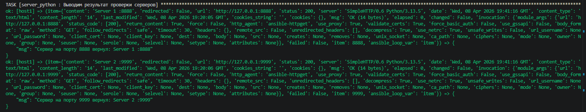
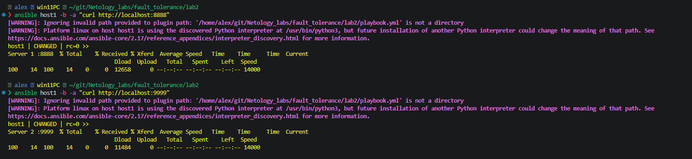
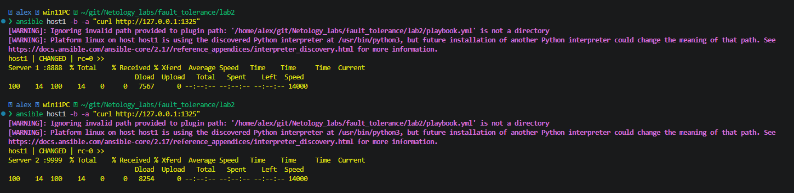
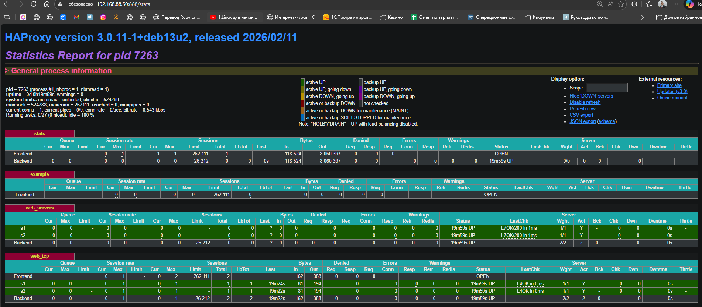
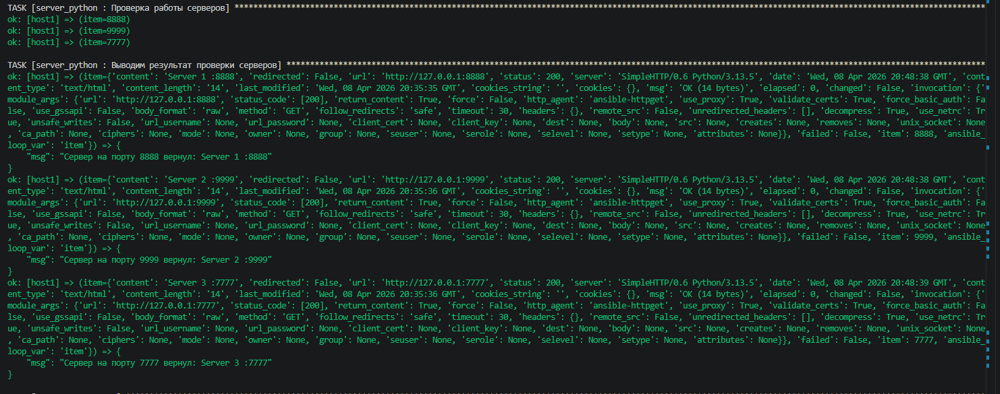
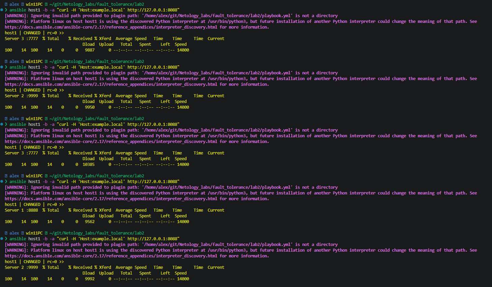
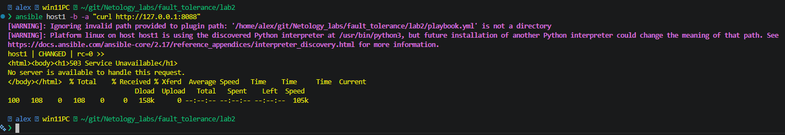
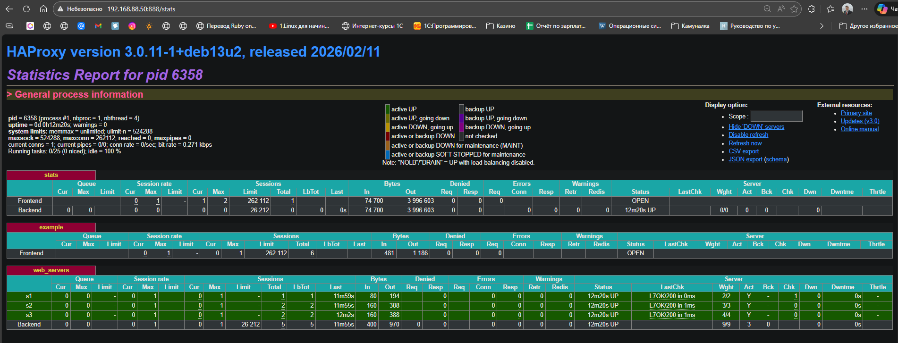

# Домашнее задание к занятию 2 «Кластеризация и балансировка нагрузки» Ершова А.О.

### Цель задания

[](https://github.com/netology-code/sflt-homeworks/blob/main/2.md#%D1%86%D0%B5%D0%BB%D1%8C-%D0%B7%D0%B0%D0%B4%D0%B0%D0%BD%D0%B8%D1%8F)

В результате выполнения этого задания вы научитесь:

1. Настраивать балансировку с помощью HAProxy
2. Настраивать связку HAProxy + Nginx

---

### Чеклист готовности к домашнему заданию

[](https://github.com/netology-code/sflt-homeworks/blob/main/2.md#%D1%87%D0%B5%D0%BA%D0%BB%D0%B8%D1%81%D1%82-%D0%B3%D0%BE%D1%82%D0%BE%D0%B2%D0%BD%D0%BE%D1%81%D1%82%D0%B8-%D0%BA-%D0%B4%D0%BE%D0%BC%D0%B0%D1%88%D0%BD%D0%B5%D0%BC%D1%83-%D0%B7%D0%B0%D0%B4%D0%B0%D0%BD%D0%B8%D1%8E)

1. Установлена операционная система Ubuntu на виртуальную машину и имеется доступ к терминалу
2. Просмотрены конфигурационные файлы, рассматриваемые на лекции, которые находятся по [ссылке](https://github.com/netology-code/sflt-homeworks/blob/main/2)


### Задание 1

[](https://github.com/netology-code/sflt-homeworks/blob/main/2.md#%D0%B7%D0%B0%D0%B4%D0%B0%D0%BD%D0%B8%D0%B5-1)

- Запустите два simple python сервера на своей виртуальной машине на разных портах
- Установите и настройте HAProxy, воспользуйтесь материалами к лекции по [ссылке](https://github.com/netology-code/sflt-homeworks/blob/main/2)
- Настройте балансировку Round-robin на 4 уровне.
- На проверку направьте конфигурационный файл haproxy, скриншоты, где видно перенаправление запросов на разные серверы при обращении к HAProxy.

---
### Решение 1
- Выполнял задание при помощи ansible(wsl) и vagrant(windows)
- Структура проекта
```bash
❯ tree -L 4 ~/git/Netology_labs/fault_tolerance/lab2
/home/alex/git/Netology_labs/fault_tolerance/lab2
├── README.md
├── Vagrantfile
├── ansible.cfg
├── ansible.log
├── inventory.ini
├── playbook.yml
└── roles
    ├── haproxy
    │   └── tasks
    │       └── main.yml
    ├── nginx
    │   ├── README.md
    │   ├── handlers
    │   │   └── main.yml
    │   ├── tasks
    │   │   └── main.yml
    │   └── templates
    │       ├── example-http.conf.j2
    │       ├── index.html.j2
    │       └── upstream.inc.j2
    └── server_python
        └── tasks
            └── main.yml

9 directories, 14 files
```

- Vagrantfile
```yml
Vagrant.configure("2") do |config|
   # Образ виртуальной машины
  config.vm.box = "my-debian13"
  # если выставлен в false, то vagrant не будет автоматически создавать и использовать собственные SSH ключи
  config.ssh.insert_key = false
  # Настройка виртальной машина host1
  config.vm.define "host1" do |h1|
   h1.vm.hostname = "host1"
  # Настройка сети
  h1.vm.network "public_network", ip: "192.168.88.50", bridge: "Realtek PCIe GbE Family Controller"
  # Настройка провайлдера и параметров ВМ
  h1.vm.provider "virtualbox" do |vb|
    vb.name= "host1"
    vb.memory = "4096"
    vb.cpus = 4
  end
  end
end
```

- Использую две роли haproxy и server_python
- tasks роли server_python
```yml
---
- name: Создаем директорию http1 и http2
  file:
    path: "/home/vagrant/{{ item }}"
    state: directory
  loop:
    - http1
    - http2

- name: Создаем файл index.html в директории http1
  copy:
    content: "Server 1 :8888"
    dest: /home/vagrant/http1/index.html

- name: Создаем файл index.html в директории http2
  copy:
    content: "Server 2 :9999"
    dest: /home/vagrant/http2/index.html

- name: Запускаем сервер на порту 8888
  shell: |
    nohup python3 -m http.server 8888 --directory /home/vagrant/http1/ --bind 0.0.0.0 > /tmp/server8888.log 2>&1 &
  args:
    executable: /bin/bash

- name: Запускаем сервер на порту 9999
  shell: |
    nohup python3 -m http.server 9999 --directory /home/vagrant/http2/ --bind 0.0.0.0 > /tmp/server9999.log 2>&1 &
  args:
    executable: /bin/bash

- name: Даем время на запуск серверов
  pause:
    seconds: 5

- name: Проверка работы серверов
  uri:
    url: "http://127.0.0.1:{{ item }}"
    status_code: 200
    return_content: yes
  loop:
    - 8888
    - 9999
  register: server_check

- name: Выводим результат проверки серверов
  debug:
    msg: "Сервер на порту {{ item.item }} вернул: {{ item.content }}"
  loop: "{{ server_check.results }}"
```

- Результат работы серверов python






- tasks роли haproxy
```yml
---
- name: Установка HAProxy
  apt:
    name: haproxy
    state: present
    update_cache: yes

- name: Автозапуск HAProxy
  service:
    name: haproxy
    state: started
    enabled: true

- name: Добавление в конфигурационный файл haproxy.cfg нашу конфигурацию в конец файла
  blockinfile:
    path: /etc/haproxy/haproxy.cfg
    insertbefore: EOF                   # Добавляет данные в конец файла
    block: |
      listen stats # веб-страница со статистикой
              bind :888
              mode http
              stats enable
              stats uri /stats
              stats refresh 5s
              stats realm Haproxy\ Statistics
             
      frontend example # секция фронтенд
              mode http
              bind :8088
              default_backend web_servers

      backend web_servers # секция бэкенд
              mode http
              balance roundrobin
              option httpchk
              http-check send meth GET uri /index.html
              server s1 127.0.0.1:8888 check
              server s2 127.0.0.1:9999 check

      # 4 уровень балансировщик
      listen web_tcp
              bind :1325
              server s1 127.0.0.1:8888 check inter 3s
              server s2 127.0.0.1:9999 check inter 3s
    marker: "# {mark} ANSIBLE MANAGED BLOCK MY Config"
    backup: yes

- name: Перезагрузка HAProxy
  service:
    name: haproxy
    state: reloaded
```

- Результат работы HAproxy на 4 уровне





---
### Задание 2

[](https://github.com/netology-code/sflt-homeworks/blob/main/2.md#%D0%B7%D0%B0%D0%B4%D0%B0%D0%BD%D0%B8%D0%B5-2)

- Запустите три simple python сервера на своей виртуальной машине на разных портах
- Настройте балансировку Weighted Round Robin на 7 уровне, чтобы первый сервер имел вес 2, второй - 3, а третий - 4
- HAproxy должен балансировать только тот http-трафик, который адресован домену example.local
- На проверку направьте конфигурационный файл haproxy, скриншоты, где видно перенаправление запросов на разные серверы при обращении к HAProxy c использованием домена example.local и без него.

---
### Решение 2
- Изменил код в ролях server_python и haproxy
- tasks роли server_python
```yml
---
- name: Создаем директорию http1 и http2 и http3
  file:
    path: "/home/vagrant/{{ item }}"
    state: directory
  loop:
    - http1
    - http2
    - http3

- name: Создаем файл index.html в директории http1
  copy:
    content: "Server 1 :8888"
    dest: /home/vagrant/http1/index.html

- name: Создаем файл index.html в директории http2
  copy:
    content: "Server 2 :9999"
    dest: /home/vagrant/http2/index.html

- name: Создаем файл index.html в директории http3
  copy:
    content: "Server 3 :7777"
    dest: /home/vagrant/http3/index.html

- name: Запускаем сервер на порту 8888
  shell: |
    nohup python3 -m http.server 8888 --directory /home/vagrant/http1/ --bind 0.0.0.0 > /tmp/server8888.log 2>&1 &
  args:
    executable: /bin/bash

- name: Запускаем сервер на порту 9999
  shell: |
    nohup python3 -m http.server 9999 --directory /home/vagrant/http2/ --bind 0.0.0.0 > /tmp/server9999.log 2>&1 &
  args:
    executable: /bin/bash

- name: Запускаем сервер на порту 7777
  shell: |
    nohup python3 -m http.server 7777 --directory /home/vagrant/http3/ --bind 0.0.0.0 > /tmp/server7777.log 2>&1 &
  args:
    executable: /bin/bash

- name: Даем время на запуск серверов
  pause:
    seconds: 5

- name: Проверка работы серверов
  uri:
    url: "http://127.0.0.1:{{ item }}"
    status_code: 200
    return_content: yes
  loop:
    - 8888
    - 9999
    - 7777

  register: server_check

- name: Выводим результат проверки серверов
  debug:
    msg: "Сервер на порту {{ item.item }} вернул: {{ item.content }}"
  loop: "{{ server_check.results }}"
```

- Результат выполнения роли server_python



- tasks роли haproxy
```yml
---
- name: Установка HAProxy
  apt:
    name: haproxy
    state: present
    update_cache: yes

- name: Автозапуск HAProxy
  service:
    name: haproxy
    state: started
    enabled: true

- name: Добавление в конфигурационный файл haproxy.cfg нашу конфигурацию в конец файла
  blockinfile:
    path: /etc/haproxy/haproxy.cfg
    insertbefore: EOF                   # Добавляет данные в конец файла
    block: |
      listen stats # веб-страница со статистикой
              bind :888
              mode http
              stats enable
              stats uri /stats
              stats refresh 5s
              stats realm Haproxy\ Statistics

      frontend example # секция фронтенд
              mode http
              bind :8088
              #default_backend web_servers
              acl ACL_example.local hdr(host) -i example.local
              use_backend web_servers if ACL_example.local
             
      backend web_servers # секция бэкенд
              mode http
              balance roundrobin
              option httpchk
              http-check send meth GET uri /index.html
              server s1 127.0.0.1:8888 weight 2 check
              server s2 127.0.0.1:9999 weight 3 check
              server s3 127.0.0.1:7777 weight 4 check

      # 4 уровень балансировщик
      # listen web_tcp
      #         bind :1325
      #         server s1 127.0.0.1:8888 check inter 3s
      #         server s2 127.0.0.1:9999 check inter 3s
    marker: "# {mark} ANSIBLE MANAGED BLOCK MY Config"
    backup: yes

- name: Перезагрузка HAProxy
  service:
    name: haproxy
    state: reloaded

```


- Результат выполнения роли haproxy по адресу example.local


- Результат выполнения без example.local

- Статистика

---
## Задания со звёздочкой*

[](https://github.com/netology-code/sflt-homeworks/blob/main/2.md#%D0%B7%D0%B0%D0%B4%D0%B0%D0%BD%D0%B8%D1%8F-%D1%81%D0%BE-%D0%B7%D0%B2%D1%91%D0%B7%D0%B4%D0%BE%D1%87%D0%BA%D0%BE%D0%B9)

Эти задания дополнительные. Их можно не выполнять. На зачёт это не повлияет. Вы можете их выполнить, если хотите глубже разобраться в материале.

---

### Задание 3*

[](https://github.com/netology-code/sflt-homeworks/blob/main/2.md#%D0%B7%D0%B0%D0%B4%D0%B0%D0%BD%D0%B8%D0%B5-3)

- Настройте связку HAProxy + Nginx как было показано на лекции.
- Настройте Nginx так, чтобы файлы .jpg выдавались самим Nginx (предварительно разместите несколько тестовых картинок в директории /var/www/), а остальные запросы переадресовывались на HAProxy, который в свою очередь переадресовывал их на два Simple Python server.
- На проверку направьте конфигурационные файлы nginx, HAProxy, скриншоты с запросами jpg картинок и других файлов на Simple Python Server, демонстрирующие корректную настройку.

---

### Задание 4*

[](https://github.com/netology-code/sflt-homeworks/blob/main/2.md#%D0%B7%D0%B0%D0%B4%D0%B0%D0%BD%D0%B8%D0%B5-4)

- Запустите 4 simple python сервера на разных портах.
- Первые два сервера будут выдавать страницу index.html вашего сайта example1.local (в файле index.html напишите example1.local)
- Вторые два сервера будут выдавать страницу index.html вашего сайта example2.local (в файле index.html напишите example2.local)
- Настройте два бэкенда HAProxy
- Настройте фронтенд HAProxy так, чтобы в зависимости от запрашиваемого сайта example1.local или example2.local запросы перенаправлялись на разные бэкенды HAProxy
- На проверку направьте конфигурационный файл HAProxy, скриншоты, демонстрирующие запросы к разным фронтендам и ответам от разных бэкендов.

---

### Правила приема работы

[](https://github.com/netology-code/sflt-homeworks/blob/main/2.md#%D0%BF%D1%80%D0%B0%D0%B2%D0%B8%D0%BB%D0%B0-%D0%BF%D1%80%D0%B8%D0%B5%D0%BC%D0%B0-%D1%80%D0%B0%D0%B1%D0%BE%D1%82%D1%8B)

1. Необходимо следовать инструкции по выполнению домашнего задания, используя для оформления репозиторий Github
2. В ответе необходимо прикладывать требуемые материалы - скриншоты, конфигурационные файлы, скрипты. Необходимые материалы для получения зачета указаны в каждом задании.

---

### Критерии оценки

[](https://github.com/netology-code/sflt-homeworks/blob/main/2.md#%D0%BA%D1%80%D0%B8%D1%82%D0%B5%D1%80%D0%B8%D0%B8-%D0%BE%D1%86%D0%B5%D0%BD%D0%BA%D0%B8)

- Зачет - выполнены все задания, ответы даны в развернутой форме, приложены требуемые скриншоты, конфигурационные файлы, скрипты. В выполненных заданиях нет противоречий и нарушения логики
- На доработку - задание выполнено частично или не выполнено, в логике выполнения заданий есть противоречия, существенные недостатки, приложены не все требуемые материалы.