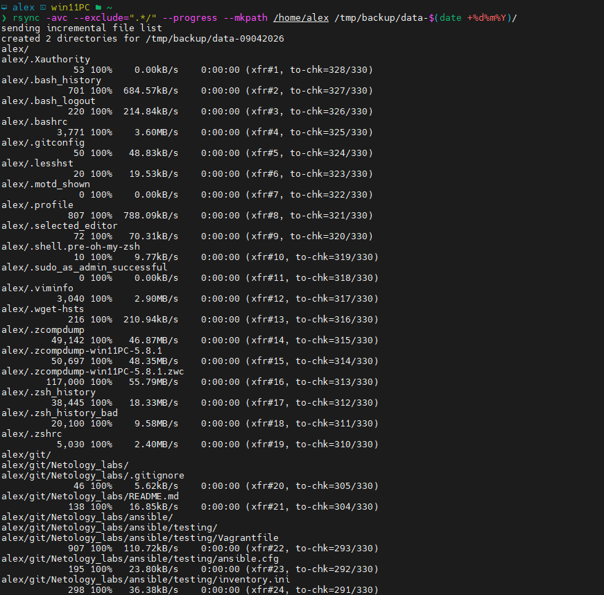
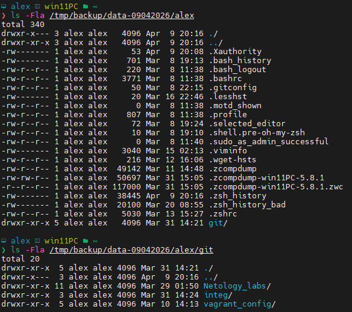

# Домашнее задание к занятию 3 «Резервное копирование» Ершова А.О.

[](https://github.com/netology-code/sflt-homeworks/blob/main/3.md#%D0%B4%D0%BE%D0%BC%D0%B0%D1%88%D0%BD%D0%B5%D0%B5-%D0%B7%D0%B0%D0%B4%D0%B0%D0%BD%D0%B8%D0%B5-%D0%BA-%D0%B7%D0%B0%D0%BD%D1%8F%D1%82%D0%B8%D1%8E-3-%D1%80%D0%B5%D0%B7%D0%B5%D1%80%D0%B2%D0%BD%D0%BE%D0%B5-%D0%BA%D0%BE%D0%BF%D0%B8%D1%80%D0%BE%D0%B2%D0%B0%D0%BD%D0%B8%D0%B5)

### Цель задания

[](https://github.com/netology-code/sflt-homeworks/blob/main/3.md#%D1%86%D0%B5%D0%BB%D1%8C-%D0%B7%D0%B0%D0%B4%D0%B0%D0%BD%D0%B8%D1%8F)

В результате выполнения этого задания вы научитесь:

1. Настраивать регулярные задачи на резервное копирование (полная зеркальная копия)
2. Настраивать инкрементное резервное копирование с помощью rsync

---

### Чеклист готовности к домашнему заданию

[](https://github.com/netology-code/sflt-homeworks/blob/main/3.md#%D1%87%D0%B5%D0%BA%D0%BB%D0%B8%D1%81%D1%82-%D0%B3%D0%BE%D1%82%D0%BE%D0%B2%D0%BD%D0%BE%D1%81%D1%82%D0%B8-%D0%BA-%D0%B4%D0%BE%D0%BC%D0%B0%D1%88%D0%BD%D0%B5%D0%BC%D1%83-%D0%B7%D0%B0%D0%B4%D0%B0%D0%BD%D0%B8%D1%8E)

1. Установлена операционная система Ubuntu на виртуальную машину и имеется доступ к терминалу
2. Сделан клон этой виртуальной машины с другим IP адресом

### Задание 1

[](https://github.com/netology-code/sflt-homeworks/blob/main/3.md#%D0%B7%D0%B0%D0%B4%D0%B0%D0%BD%D0%B8%D0%B5-1)

- Составьте команду rsync, которая позволяет создавать зеркальную копию домашней директории пользователя в директорию `/tmp/backup`
- Необходимо исключить из синхронизации все директории, начинающиеся с точки (скрытые)
- Необходимо сделать так, чтобы rsync подсчитывал хэш-суммы для всех файлов, даже если их время модификации и размер идентичны в источнике и приемнике.
- На проверку направить скриншот с командой и результатом ее выполнения

---
### Решение 1

*Команда для выполнения зеркальной копии домашней директории*
```bash
rsync -ac --exclude=".*/" --progress --mkpath /home/alex /tmp/backup/data-$(date +%d%m%Y)/
```

Опции которые используются:
`-a`  - Архивный режим
`-c`  -  checksum (контрольная сумма)
`--progress` - Показывает прогресс выполнения
`--mkpath` - Создает отсутствующие родительские каталоги  для конечного пути назначения
`/home/alex` - Источник, домашняя директория
`/tmp/backup/data-$(date +%d%m%Y)/` - Конкретный путь, куда производится синхронизация.
`$(date +%d%m%Y)` - Создается папка с текущей датой, удобно если требуется делать синхронизацию каждый день и хранить копии по датам

- Скриншоты
Запуск синхронизации


Результат выполнения



- Структура синхронизированной директории
```bash
❯ tree -l /tmp/backup/data-09042026/alex                                                                                                                                   2 ⨯
/tmp/backup/data-09042026/alex
└── git
    ├── Netology_labs
    │   ├── README.md
    │   ├── ansible
    │   │   └── testing
    │   │       ├── Vagrantfile
    │   │       ├── ansible.cfg
    │   │       └── inventory.ini
    │   ├── ansible_labs
    │   │   ├── README.md
    │   │   ├── part1
    │   │   │   ├── ansible.cfg
    │   │   │   ├── inventnory.ini
    │   │   │   ├── passwords.yml
    │   │   │   ├── playbook_install.yaml
    │   │   │   ├── playbook_motd.yml
    │   │   │   ├── playbook_motd_del.yml
    │   │   │   ├── playbook_motd_old_os.yml
    │   │   │   └── playbook_task1.yaml
    │   │   ├── part2
    │   │   │   ├── ansible.cfg
    │   │   │   ├── ansible.log
    │   │   │   ├── inventnory.ini
    │   │   │   ├── log_node
    │   │   │   ├── passwords.yml
    │   │   │   └── playbook_motd2.yml
    │   │   └── part3
    │   │       ├── ansible.cfg
    │   │       ├── ansible.log
    │   │       ├── apache_role.tar.gz
    │   │       ├── group_vars
    │   │       │   └── node
    │   │       │       └── vault.yml
    │   │       ├── inventory.ini
    │   │       ├── playbook_install_apache.yml
    │   │       └── roles
    │   │           └── apache
    │   │               ├── README.md
    │   │               ├── defaults
    │   │               │   └── main.yml
    │   │               ├── handlers
    │   │               │   └── main.yml
    │   │               ├── meta
    │   │               │   └── main.yml
    │   │               ├── tasks
    │   │               │   └── main.yml
    │   │               ├── templates
    │   │               │   └── index.html.j2
    │   │               ├── tests
    │   │               │   ├── inventory
    │   │               │   └── test.yml
    │   │               └── vars
    │   │                   └── main.yml
    │   ├── docker_2
    │   │   ├── README.md
    │   │   ├── docker-compose.yml
    │   │   ├── grafana
    │   │   │   └── custom.ini
    │   │   └── prometheus
    │   │       └── prometheus.yml
    │   ├── fault_tolerance
    │   │   ├── lab1
    │   │   │   ├── README.md
    │   │   │   ├── Vagrantfile
    │   │   │   ├── ansible.cfg
    │   │   │   ├── ansible.log
    │   │   │   ├── host_vars
    │   │   │   │   ├── host1.yml
    │   │   │   │   └── host2.yml
    │   │   │   ├── hsrp_advanced_ershov.pkt
    │   │   │   ├── inventory.ini
    │   │   │   ├── playbook.yml
    │   │   │   └── roles
    │   │   │       ├── keepalived
    │   │   │       │   ├── files
    │   │   │       │   │   └── check.sh
    │   │   │       │   ├── handlers
    │   │   │       │   │   └── main.yml
    │   │   │       │   ├── tasks
    │   │   │       │   │   └── main.yml
    │   │   │       │   └── templates
    │   │   │       │       └── keepalived.conf.j2
    │   │   │       └── nginx
    │   │   │           ├── README.md
    │   │   │           ├── handlers
    │   │   │           │   └── main.yml
    │   │   │           ├── tasks
    │   │   │           │   └── main.yml
    │   │   │           ├── templates
    │   │   │           │   └── index.html.j2
    │   │   │           └── vars
    │   │   │               └── main.yml
    │   │   ├── lab2
    │   │   │   ├── README.md
    │   │   │   ├── Vagrantfile
    │   │   │   ├── ansible.cfg
    │   │   │   ├── ansible.log
    │   │   │   ├── inventory.ini
    │   │   │   ├── playbook.yml
    │   │   │   └── roles
    │   │   │       ├── haproxy
    │   │   │       │   └── tasks
    │   │   │       │       └── main.yml
    │   │   │       ├── nginx
    │   │   │       │   ├── README.md
    │   │   │       │   ├── handlers
    │   │   │       │   │   └── main.yml
    │   │   │       │   ├── tasks
    │   │   │       │   │   └── main.yml
    │   │   │       │   └── templates
    │   │   │       │       ├── example-http.conf.j2
    │   │   │       │       ├── index.html.j2
    │   │   │       │       └── upstream.inc.j2
    │   │   │       └── server_python
    │   │   │           └── tasks
    │   │   │               └── main.yml
    │   │   └── lab3
    │   │       └── Vagrantfile
    │   ├── git
    │   │   └── git_lab
    │   │       └── README.md
    │   ├── gitlab
    │   │   └── ci-cd_labs1
    │   │       ├── CICD
    │   │       │   └── 8.2-hw.md
    │   │       ├── Dockerfile
    │   │       ├── README.md
    │   │       ├── Vagrantfile
    │   │       ├── gitlab
    │   │       │   ├── GITLAB.md
    │   │       │   ├── Vagrantfile
    │   │       │   └── docker-compose.yaml
    │   │       ├── go.mod
    │   │       ├── main.go
    │   │       └── main_test.go
    │   ├── kubernetes
    │   │   ├── Kubernetes_Part_1
    │   │   │   ├── README.md
    │   │   │   ├── ingress.yaml
    │   │   │   ├── nginx-config.yaml
    │   │   │   ├── nginx.yaml
    │   │   │   └── redis.yaml
    │   │   ├── Kubernetes_Part_2_local
    │   │   │   ├── 1
    │   │   │   ├── 50-cloud-init_node1.yaml
    │   │   │   ├── 50-cloud-init_node2.yaml
    │   │   │   └── 50-cloud-init_node3.yaml
    │   │   └── test
    │   │       ├── ingress.yaml
    │   │       ├── nginx-config.yaml
    │   │       ├── nginx-pvc.yaml
    │   │       └── nginx.yaml
    │   ├── monitoring
    │   │   ├── prometheus
    │   │   │   ├── lab1
    │   │   │   │   ├── README.md
    │   │   │   │   ├── Vagrantfile
    │   │   │   │   ├── ansible.cfg
    │   │   │   │   ├── ansible.log
    │   │   │   │   ├── inventory.ini
    │   │   │   │   ├── playbook.yml
    │   │   │   │   └── roles
    │   │   │   │       ├── alertmanager
    │   │   │   │       │   ├── handlers
    │   │   │   │       │   │   └── main.yml
    │   │   │   │       │   ├── tasks
    │   │   │   │       │   │   └── main.yml
    │   │   │   │       │   └── templates
    │   │   │   │       │       ├── alertmanager.yml.j2
    │   │   │   │       │       ├── netology-test.yml
    │   │   │   │       │       └── prometheus-alertmanager.service.j2
    │   │   │   │       ├── grafana
    │   │   │   │       │   └── tasks
    │   │   │   │       │       └── main.yml
    │   │   │   │       ├── node_exporter
    │   │   │   │       │   ├── handlers
    │   │   │   │       │   │   └── main.yml
    │   │   │   │       │   ├── tasks
    │   │   │   │       │   │   └── main.yml
    │   │   │   │       │   └── templates
    │   │   │   │       │       └── node-exporter.service.j2
    │   │   │   │       └── prometheus
    │   │   │   │           ├── handlers
    │   │   │   │           │   └── main.yml
    │   │   │   │           ├── tasks
    │   │   │   │           │   └── main.yml
    │   │   │   │           └── templates
    │   │   │   │               ├── prometheus.service.j2
    │   │   │   │               └── prometheus.yml.j2
    │   │   │   └── lab2
    │   │   │       ├── README.md
    │   │   │       ├── Vagrantfile
    │   │   │       ├── ansible.cfg
    │   │   │       ├── inventory.ini
    │   │   │       ├── playbook.yml
    │   │   │       └── roles
    │   │   │           ├── grafana
    │   │   │           │   └── tasks
    │   │   │           │       └── main.yml
    │   │   │           ├── node_exporter
    │   │   │           │   ├── handlers
    │   │   │           │   │   └── main.yml
    │   │   │           │   ├── tasks
    │   │   │           │   │   └── main.yml
    │   │   │           │   └── templates
    │   │   │           │       └── node-exporter.service.j2
    │   │   │           └── prometheus
    │   │   │               ├── handlers
    │   │   │               │   └── main.yml
    │   │   │               ├── tasks
    │   │   │               │   └── main.yml
    │   │   │               └── templates
    │   │   │                   ├── prometheus.service.j2
    │   │   │                   └── prometheus.yml.j2
    │   │   ├── yc_monitoring
    │   │   │   └── README.md
    │   │   └── zabbix
    │   │       ├── lab1
    │   │       │   ├── README.md
    │   │       │   ├── Vagrantfile
    │   │       │   ├── ansible.cfg
    │   │       │   ├── inventory.ini
    │   │       │   ├── playbook.yml
    │   │       │   └── roles
    │   │       │       ├── postgresql
    │   │       │       │   ├── tasks
    │   │       │       │   │   └── main.yml
    │   │       │       │   └── vars
    │   │       │       │       └── main.yml
    │   │       │       ├── zabbix_agent
    │   │       │       │   ├── handlers
    │   │       │       │   │   └── main.yml
    │   │       │       │   └── tasks
    │   │       │       │       └── main.yml
    │   │       │       └── zabbix_server
    │   │       │           ├── handlers
    │   │       │           │   └── main.yml
    │   │       │           ├── tasks
    │   │       │           │   └── main.yml
    │   │       │           └── vars
    │   │       │               └── pgsl_db.yml
    │   │       └── lab2
    │   │           └── README.md
    │   └── terraform
    │       ├── lab1
    │       │   ├── README.md
    │       │   ├── main.tf
    │       │   ├── providers.tf
    │       │   └── variables.tf
    │       ├── lab1_test
    │       │   ├── README.md
    │       │   ├── main.tf
    │       │   ├── providers.tf
    │       │   └── variables.tf
    │       └── lab2
    │           ├── README.md
    │           ├── ansible.cfg
    │           ├── ansible.log
    │           ├── cloud-init.yml
    │           ├── network.tf
    │           ├── nginx.yml
    │           ├── providers.tf
    │           ├── roles
    │           │   └── nginx
    │           │       ├── README.md
    │           │       ├── defaults
    │           │       │   └── main.yml
    │           │       ├── handlers
    │           │       │   └── main.yml
    │           │       ├── meta
    │           │       │   └── main.yml
    │           │       ├── tasks
    │           │       │   └── main.yml
    │           │       ├── templates
    │           │       │   └── index.html.j2
    │           │       ├── tests
    │           │       │   ├── inventory
    │           │       │   └── test.yml
    │           │       └── vars
    │           │           └── main.yml
    │           ├── ssh_connect.txt
    │           ├── variables.tf
    │           └── vms.tf
    ├── integ
    │   ├── README.md
    │   └── vpn
    │       ├── ansible.cfg
    │       ├── ansible.log
    │       ├── inventory.ini
    │       ├── playbook.yml
    │       └── roles
    │           └── docker
    │               ├── handlers
    │               │   └── main.yml
    │               └── tasks
    │                   └── main.yml
    └── vagrant_config
        ├── README.md
        ├── ansible
        │   └── Vagrantfile
        ├── lab1
        │   └── Vagrantfile
        └── test_debian
            └── Vagrantfile

125 directories, 179 files


```
### Задание 2

[](https://github.com/netology-code/sflt-homeworks/blob/main/3.md#%D0%B7%D0%B0%D0%B4%D0%B0%D0%BD%D0%B8%D0%B5-2)

- Написать скрипт и настроить задачу на регулярное резервное копирование домашней директории пользователя с помощью rsync и cron.
- Резервная копия должна быть полностью зеркальной
- Резервная копия должна создаваться раз в день, в системном логе должна появляться запись об успешном или неуспешном выполнении операции
- Резервная копия размещается локально, в директории `/tmp/backup`
- На проверку направить файл crontab и скриншот с результатом работы утилиты.

---

## Задания со звёздочкой*

[](https://github.com/netology-code/sflt-homeworks/blob/main/3.md#%D0%B7%D0%B0%D0%B4%D0%B0%D0%BD%D0%B8%D1%8F-%D1%81%D0%BE-%D0%B7%D0%B2%D1%91%D0%B7%D0%B4%D0%BE%D1%87%D0%BA%D0%BE%D0%B9)

Эти задания дополнительные. Их можно не выполнять. На зачёт это не повлияет. Вы можете их выполнить, если хотите глубже разобраться в материале.

---

### Задание 3*

[](https://github.com/netology-code/sflt-homeworks/blob/main/3.md#%D0%B7%D0%B0%D0%B4%D0%B0%D0%BD%D0%B8%D0%B5-3)

- Настройте ограничение на используемую пропускную способность rsync до 1 Мбит/c
- Проверьте настройку, синхронизируя большой файл между двумя серверами
- На проверку направьте команду и результат ее выполнения в виде скриншота

### Задание 4*

[](https://github.com/netology-code/sflt-homeworks/blob/main/3.md#%D0%B7%D0%B0%D0%B4%D0%B0%D0%BD%D0%B8%D0%B5-4)

- Напишите скрипт, который будет производить инкрементное резервное копирование домашней директории пользователя с помощью rsync на другой сервер
- Скрипт должен удалять старые резервные копии (сохранять только последние 5 штук)
- Напишите скрипт управления резервными копиями, в нем можно выбрать резервную копию и данные восстановятся к состоянию на момент создания данной резервной копии.
- На проверку направьте скрипт и скриншоты, демонстрирующие его работу в различных сценариях.

---

### Правила приема работы

[](https://github.com/netology-code/sflt-homeworks/blob/main/3.md#%D0%BF%D1%80%D0%B0%D0%B2%D0%B8%D0%BB%D0%B0-%D0%BF%D1%80%D0%B8%D0%B5%D0%BC%D0%B0-%D1%80%D0%B0%D0%B1%D0%BE%D1%82%D1%8B)

1. Необходимо следовать инструкции по выполнению домашнего задания, используя для оформления репозиторий Github
2. В ответе необходимо прикладывать требуемые материалы - скриншоты, конфигурационные файлы, скрипты. Необходимые материалы для получения зачета указаны в каждом задании.

---

### Критерии оценки

[](https://github.com/netology-code/sflt-homeworks/blob/main/3.md#%D0%BA%D1%80%D0%B8%D1%82%D0%B5%D1%80%D0%B8%D0%B8-%D0%BE%D1%86%D0%B5%D0%BD%D0%BA%D0%B8)

- Зачет - выполнены все задания, ответы даны в развернутой форме, приложены требуемые скриншоты, конфигурационные файлы, скрипты. В выполненных заданиях нет противоречий и нарушения логики
- На доработку - задание выполнено частично или не выполнено, в логике выполнения заданий есть противоречия, существенные недостатки, приложены не все требуемые материалы.