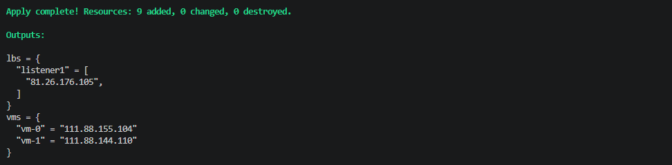
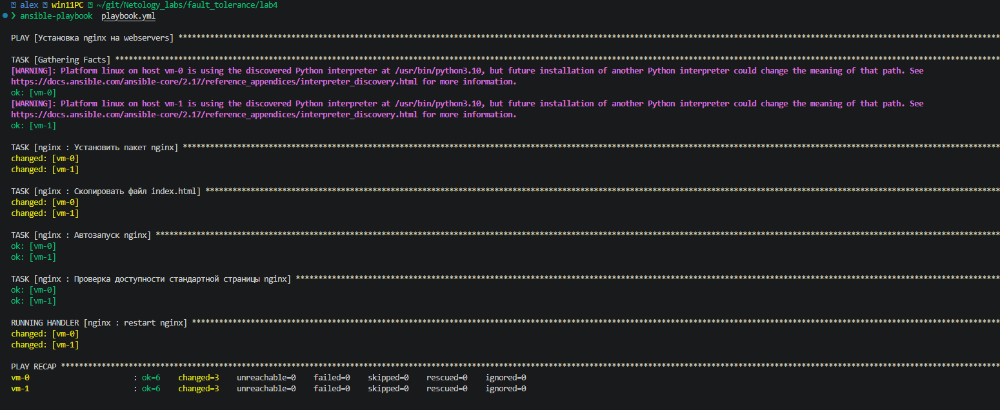
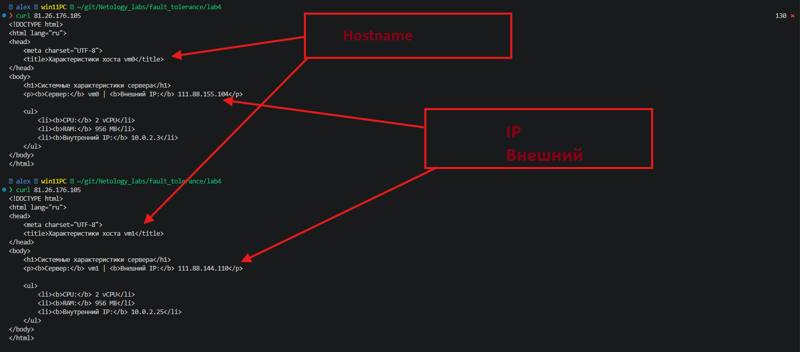
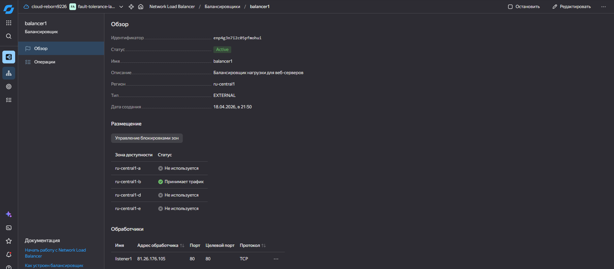
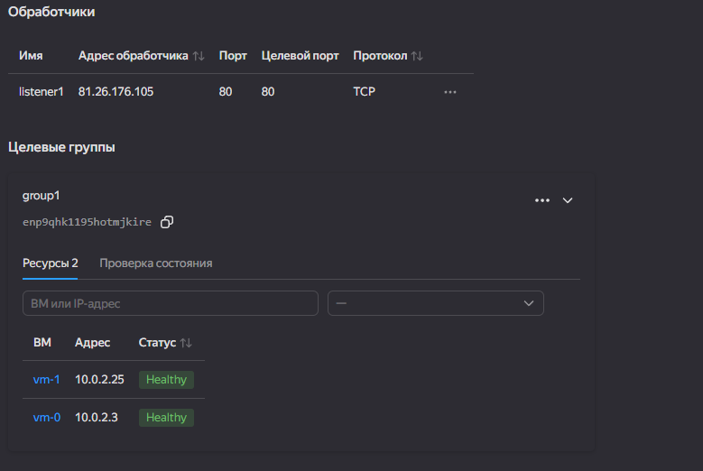

# Домашнее задание к занятию «Отказоустойчивость в облаке» Ершова А.О.

[](https://github.com/netology-code/sflt-homeworks/blob/main/4.md#%D0%B4%D0%BE%D0%BC%D0%B0%D1%88%D0%BD%D0%B5%D0%B5-%D0%B7%D0%B0%D0%B4%D0%B0%D0%BD%D0%B8%D0%B5-%D0%BA-%D0%B7%D0%B0%D0%BD%D1%8F%D1%82%D0%B8%D1%8E-%D0%BE%D1%82%D0%BA%D0%B0%D0%B7%D0%BE%D1%83%D1%81%D1%82%D0%BE%D0%B9%D1%87%D0%B8%D0%B2%D0%BE%D1%81%D1%82%D1%8C-%D0%B2-%D0%BE%D0%B1%D0%BB%D0%B0%D0%BA%D0%B5)

### Цель задания

[](https://github.com/netology-code/sflt-homeworks/blob/main/4.md#%D1%86%D0%B5%D0%BB%D1%8C-%D0%B7%D0%B0%D0%B4%D0%B0%D0%BD%D0%B8%D1%8F)

В результате выполнения этого задания вы научитесь:

1. Конфигурировать отказоустойчивый кластер в облаке с использованием различных функций отказоустойчивости.
2. Устанавливать сервисы из конфигурации инфраструктуры.

---

### Чеклист готовности к домашнему заданию

[](https://github.com/netology-code/sflt-homeworks/blob/main/4.md#%D1%87%D0%B5%D0%BA%D0%BB%D0%B8%D1%81%D1%82-%D0%B3%D0%BE%D1%82%D0%BE%D0%B2%D0%BD%D0%BE%D1%81%D1%82%D0%B8-%D0%BA-%D0%B4%D0%BE%D0%BC%D0%B0%D1%88%D0%BD%D0%B5%D0%BC%D1%83-%D0%B7%D0%B0%D0%B4%D0%B0%D0%BD%D0%B8%D1%8E)

1. Создан аккаунт на YandexCloud.
2. Создан новый OAuth-токен.
3. Установлено программное обеспечение  Terraform.


### Инструменты и дополнительные материалы, которые пригодятся для выполнения задания

[](https://github.com/netology-code/sflt-homeworks/blob/main/4.md#%D0%B8%D0%BD%D1%81%D1%82%D1%80%D1%83%D0%BC%D0%B5%D0%BD%D1%82%D1%8B-%D0%B8-%D0%B4%D0%BE%D0%BF%D0%BE%D0%BB%D0%BD%D0%B8%D1%82%D0%B5%D0%BB%D1%8C%D0%BD%D1%8B%D0%B5-%D0%BC%D0%B0%D1%82%D0%B5%D1%80%D0%B8%D0%B0%D0%BB%D1%8B-%D0%BA%D0%BE%D1%82%D0%BE%D1%80%D1%8B%D0%B5-%D0%BF%D1%80%D0%B8%D0%B3%D0%BE%D0%B4%D1%8F%D1%82%D1%81%D1%8F-%D0%B4%D0%BB%D1%8F-%D0%B2%D1%8B%D0%BF%D0%BE%D0%BB%D0%BD%D0%B5%D0%BD%D0%B8%D1%8F-%D0%B7%D0%B0%D0%B4%D0%B0%D0%BD%D0%B8%D1%8F)

1. [Документация сетевого балансировщика нагрузки](https://cloud.yandex.ru/docs/network-load-balancer/quickstart)

---

## Задание 1

[](https://github.com/netology-code/sflt-homeworks/blob/main/4.md#%D0%B7%D0%B0%D0%B4%D0%B0%D0%BD%D0%B8%D0%B5-1)

Возьмите за основу [решение к заданию 1 из занятия «Подъём инфраструктуры в Яндекс Облаке»](https://github.com/netology-code/sdvps-homeworks/blob/main/7-03.md#%D0%B7%D0%B0%D0%B4%D0%B0%D0%BD%D0%B8%D0%B5-1).

1. Теперь вместо одной виртуальной машины сделайте terraform playbook, который:

- создаст 2 идентичные виртуальные машины. Используйте аргумент [count](https://www.terraform.io/docs/language/meta-arguments/count.html) для создания таких ресурсов;
- создаст [таргет-группу](https://registry.terraform.io/providers/yandex-cloud/yandex/latest/docs/resources/lb_target_group). Поместите в неё созданные на шаге 1 виртуальные машины;
- создаст [сетевой балансировщик нагрузки](https://registry.terraform.io/providers/yandex-cloud/yandex/latest/docs/resources/lb_network_load_balancer), который слушает на порту 80, отправляет трафик на порт 80 виртуальных машин и http healthcheck на порт 80 виртуальных машин.

Рекомендуем изучить [документацию сетевого балансировщика нагрузки](https://cloud.yandex.ru/docs/network-load-balancer/quickstart) для того, чтобы было понятно, что вы сделали.

2. Установите на созданные виртуальные машины пакет Nginx любым удобным способом и запустите Nginx веб-сервер на порту 80.

3. Перейдите в веб-консоль Yandex Cloud и убедитесь, что:


- созданный балансировщик находится в статусе Active,
- обе виртуальные машины в целевой группе находятся в состоянии healthy.

4. Сделайте запрос на 80 порт на внешний IP-адрес балансировщика и убедитесь, что вы получаете ответ в виде дефолтной страницы Nginx.

_В качестве результата пришлите:_

_1. Terraform Playbook._

_2. Скриншот статуса балансировщика и целевой группы._

_3. Скриншот страницы, которая открылась при запросе IP-адреса балансировщика._

---

### Решение 1

- Структура проекта
```bash
 alex  win11PC  ~/git/Netology_labs/fault_tolerance/lab4
❯ tree -l /home/alex/git/Netology_labs/fault_tolerance/lab4
/home/alex/git/Netology_labs/fault_tolerance/lab4
├── ansible.cfg
├── ansible.log
├── cloud-init.yml # Конфигурация cloud-init для настройки виртуальных машин в Yandex Cloud, включая создание пользователя с правами sudo и добавление SSH-ключа для доступа
├── hosts.ini # Динамический инвентарь созданный Terraform
├── network.tf # Создание облачной сети VPC и NAT
├── output.tf  # Выходные данные балансировщика и ВМ после выполнение terraform apply
├── playbook.yml # Основной playbook с установкой роли nginx
├── providers.tf # Провайдеры yandex и конфигурация провайдера для Yandex Cloud, использующая переменные для идентификаторов облака и папки, а также файл с ключом доступа
├── roles        # Роль установки nginx
│   └── nginx
│       ├── README.md
│       ├── defaults
│       │   └── main.yml
│       ├── handlers
│       │   └── main.yml
│       ├── meta
│       │   └── main.yml
│       ├── tasks
│       │   └── main.yml
│       ├── templates
│       │   └── index.html.j2
│       ├── tests
│       │   ├── inventory
│       │   └── test.yml
│       └── vars
│           └── main.yml
├── terraform.tfstate # файл, в котором Terraform хранит актуальную информацию о состоянии управляемой им инфраструктуры
├── variables.tf # Переменные для идентификаторов облака и папки, используемые в конфигурации Terraform cloud-init.yml и других ресурсах
└── vms.tf          # Основаня конфигурация с созданием ВМ, группы, и балансировщик нагрузки

9 directories, 20 files
```

#### Файлы конфигурации Terraform
- Для своего удобства я разбил конфигурацию на несколько файлов

- providers.tf
```tf
terraform {
  required_providers {
    yandex = {
      source  = "yandex-cloud/yandex"
      version = "0.129.0"
    }
  }

  required_version = ">=1.8.4"
}

# Конфигурация провайдера для Yandex Cloud, использующая переменные для идентификаторов облака и папки, а также файл с ключом доступа. Сами переменные заданы в файле variables.tf
provider "yandex" {
  # token                    = "do not use!!!"
  cloud_id                 = var.cloud_id
  folder_id                = var.folder_id
  service_account_key_file = file("~/.authorized_key.json")

}
```

- variables.tf
```tf
# Переменные для идентификаторов облака и папки, используемые в конфигурации Terraform cloud-init.yml и других ресурсах
variable "cloud_id" {
  type    = string
  default = "b1gm7qsimlei7epdroq3"
}

variable "folder_id" {
  type    = string
  default = "b1grqpc7c3ih7tqlb5vf"
}
```


- network.tf
```tf
# Создаём облачную сеть
resource "yandex_vpc_network" "develop" {
  name = "develop-fops"
}

# Создаём подсеть в зоне B
resource "yandex_vpc_subnet" "develop" {
  name           = "develop-fops-ru-central1-b"
  zone           = "ru-central1-b"
  network_id     = yandex_vpc_network.develop.id
  v4_cidr_blocks = ["10.0.2.0/24"]  # добавлена точка в CIDR
  route_table_id = yandex_vpc_route_table.rt.id

  # Явная зависимость от сети
  depends_on = [yandex_vpc_network.develop]
}

# Создаём NAT для выхода в интернет
resource "yandex_vpc_gateway" "nat_gateway" {
  name = "fops-gateway"
  shared_egress_gateway {}
}

# Создаём сетевой маршрут для выхода в интернет через NAT
resource "yandex_vpc_route_table" "rt" {
  name       = "fops-route-table"
  network_id = yandex_vpc_network.develop.id
# Добавляем статический маршрут для всего трафика, направляемого на NAT-шлюз
  static_route {
    destination_prefix = "0.0.0.0/0"
    gateway_id        = yandex_vpc_gateway.nat_gateway.id
  }

  # Явные зависимости от сети и шлюза
  depends_on = [yandex_vpc_network.develop, yandex_vpc_gateway.nat_gateway]
}
```

- vms.tf
```tf
# Считываем данные об образе ОС
data "yandex_compute_image" "ubuntu_2204_lts" {
  family = "ubuntu-2204-lts"
}

# Создание виртуальных машин
resource "yandex_compute_instance" "vm" {
  count        = 2 # количество ВМ
  name        = "vm-${count.index}" # Добавляет номер к имени ВМ
  hostname    = "vm${count.index}"  # Добавляет номер к имени хоста
  platform_id = "standard-v3"
  zone        = "ru-central1-b"

  resources {
    cores         = 2
    memory        = 1
    core_fraction = 20
  }


  boot_disk {
    initialize_params {
      image_id = data.yandex_compute_image.ubuntu_2204_lts.image_id
      type     = "network-hdd"
      size     = 10
    }
  }


# Указываем данные авторизации и настройки
  metadata = {
    user-data          = file("./cloud-init.yml")
    serial-port-enable = 1
  }

  scheduling_policy {
    preemptible = true
  }

  network_interface {
    subnet_id = yandex_vpc_subnet.develop.id
    nat       = true
  }
}

# Создание группы для балансировщика нагрузки и добавление в нее ВМ
resource "yandex_lb_target_group" "group1" {
  name        = "group1"
  description = "Группа для балансировщика нагрузки"
 
# Указываем зависимость от создания ВМ, чтобы гарантировать, что ВМ будут созданы до добавления в группу
  depends_on = [yandex_compute_instance.vm]
 
# Динамически добавляем все ВМ в группу балансировщика нагрузки
  dynamic "target" {
    for_each = [for vm in yandex_compute_instance.vm : vm.id]
    content {
      subnet_id = yandex_vpc_subnet.develop.id
      address = yandex_compute_instance.vm[target.key].network_interface[0].ip_address
    }
  }
}


# Создание балансировщика нагрузки и привязка к группе ВМ

resource "yandex_lb_network_load_balancer" "balancer1" {
  name                = "balancer1"
  description         = "Балансировщик нагрузки для веб-серверов"
  deletion_protection = false

  listener {
    name = "listener1"
    port = 80
    external_address_spec {
      ip_version = "ipv4"
    }
  }

# Привязываем группу ВМ к балансировщику нагрузки и настраиваем проверку здоровья
  attached_target_group {
    target_group_id = yandex_lb_target_group.group1.id

    healthcheck {
      name = "http"
      http_options {
        port = 80
        path = "/"
      }
    }
  }
}


# Динамический инвентарь для Ansible
resource "local_file" "inventory" {
  content = <<-EOT
[webservers]
%{ for vm in yandex_compute_instance.vm ~} # Динамически добавляем все ВМ в группу webservers
${vm.name} ansible_host=${vm.network_interface[0].nat_ip_address} # Указываем имя ВМ и ее публичный ip-адрес для Ansible

%{ endfor ~}
[webservers:vars]
ansible_user=user
EOT
  filename = "./hosts.ini" # Путь к файлу инвентаря для Ansible.
}
```

- cloud-init.yml
```yml
#cloud-config
#Конфигурация cloud-init для настройки виртуальных машин в Yandex Cloud, включая создание пользователя с правами sudo и добавление SSH-ключа для доступа
users:
  - name: user
    groups: sudo
    shell: /bin/bash
    sudo: ["ALL=(ALL) NOPASSWD:ALL"]
    ssh_authorized_keys:
      - ssh-ed25519 AAAAC3NzaC1lZDI1NTE5AAAAINP3OcMvfvgG6wuG4Frm+GPm7NAavzCH+98K44iNARL2 alex@wls
```

#### Скриншоты результата выполнения домашнего задания

- Вывод output.tf


- Вывод playbook.yml


- Вывод страницы, которая открылась при запросе IP-адреса балансировщика


- Скриншот статуса балансировщика и целевой группы




## Задания со звёздочкой*

[](https://github.com/netology-code/sflt-homeworks/blob/main/4.md#%D0%B7%D0%B0%D0%B4%D0%B0%D0%BD%D0%B8%D1%8F-%D1%81%D0%BE-%D0%B7%D0%B2%D1%91%D0%B7%D0%B4%D0%BE%D1%87%D0%BA%D0%BE%D0%B9)

Эти задания дополнительные. Выполнять их не обязательно. На зачёт это не повлияет. Вы можете их выполнить, если хотите глубже разобраться в материале.

---

## Задание 2*

[](https://github.com/netology-code/sflt-homeworks/blob/main/4.md#%D0%B7%D0%B0%D0%B4%D0%B0%D0%BD%D0%B8%D0%B5-2)

1. Теперь вместо создания виртуальных машин создайте [группу виртуальных машин с балансировщиком нагрузки](https://cloud.yandex.ru/docs/compute/operations/instance-groups/create-with-balancer).

2. Nginx нужно будет поставить тоже автоматизированно. Для этого вам нужно будет подложить файл установки Nginx в user-data-ключ [метадаты](https://cloud.yandex.ru/docs/compute/concepts/vm-metadata) виртуальной машины.


- [Пример файла установки Nginx](https://github.com/nar3k/yc-public-tasks/blob/master/terraform/metadata.yaml).
- [Как подставлять файл в метадату виртуальной машины.](https://github.com/nar3k/yc-public-tasks/blob/a6c50a5e1d82f27e6d7f3897972adb872299f14a/terraform/main.tf#L38)

3. Перейдите в веб-консоль Yandex Cloud и убедитесь, что:

- созданный балансировщик находится в статусе Active,
- обе виртуальные машины в целевой группе находятся в состоянии healthy.

4. Сделайте запрос на 80 порт на внешний IP-адрес балансировщика и убедитесь, что вы получаете ответ в виде дефолтной страницы Nginx.

_В качестве результата пришлите_

_1. Terraform Playbook._

_2. Скриншот статуса балансировщика и целевой группы._

_3. Скриншот страницы, которая открылась при запросе IP-адреса балансировщика._