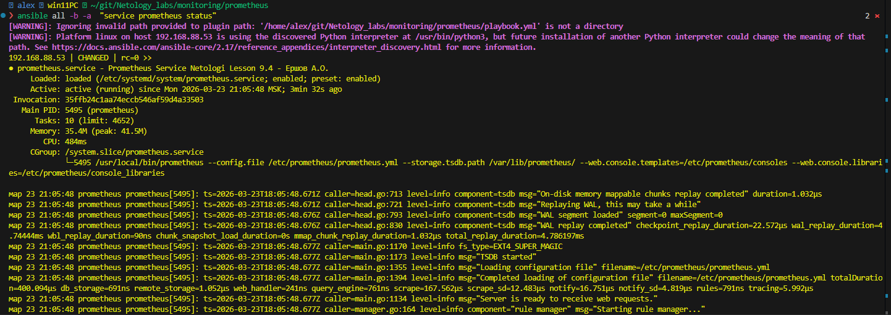
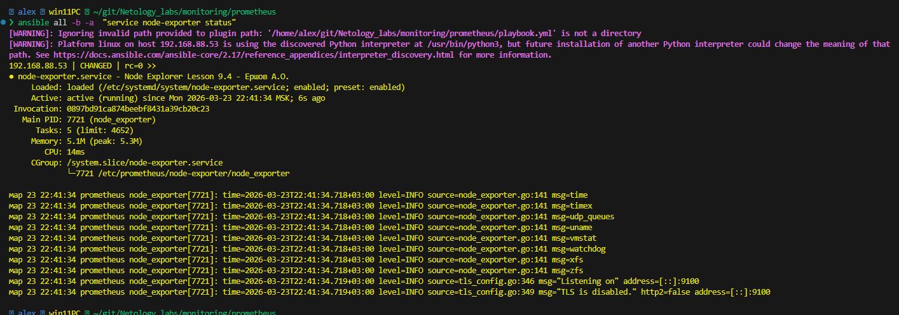
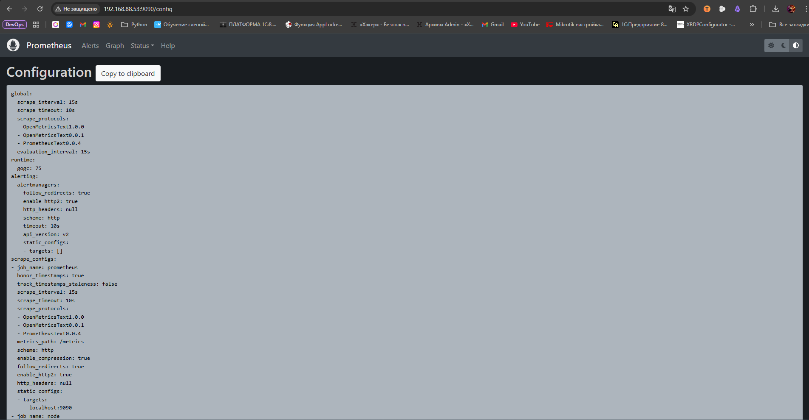
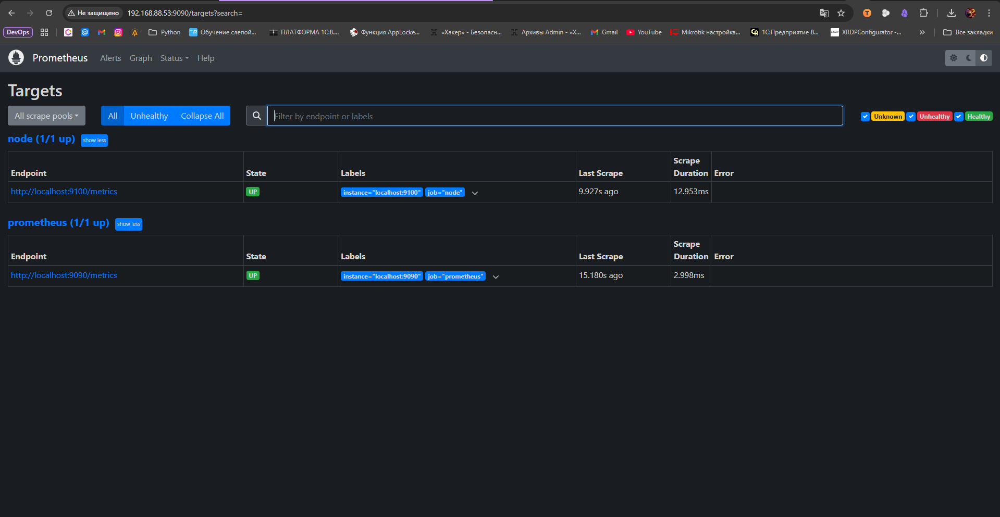
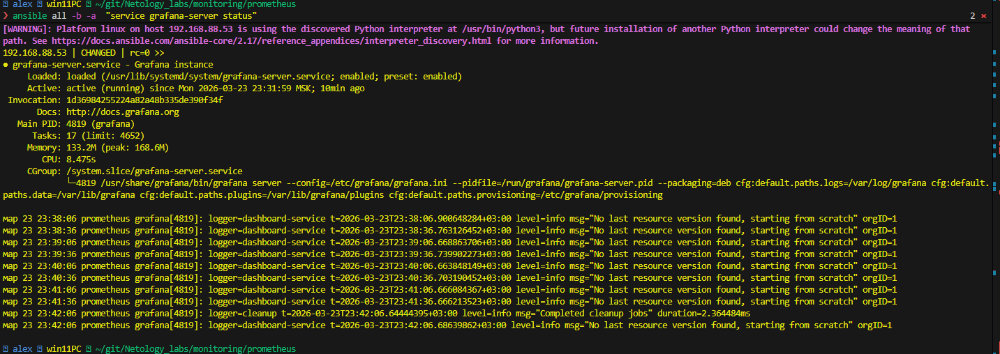
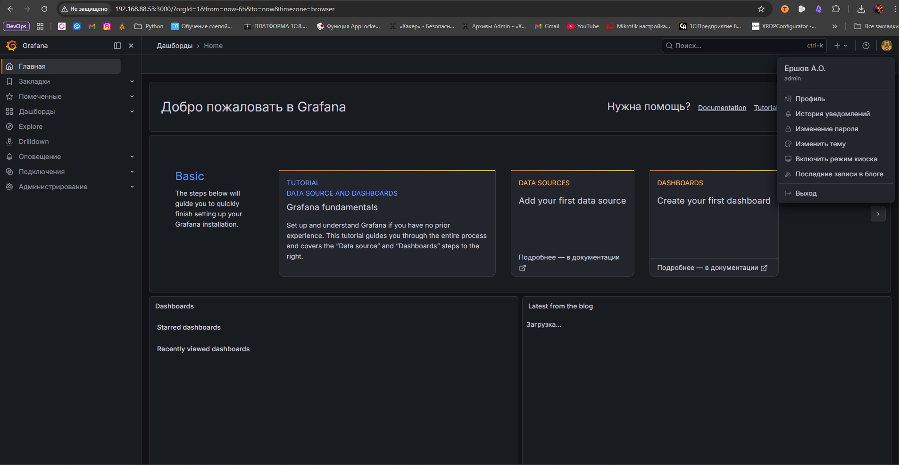
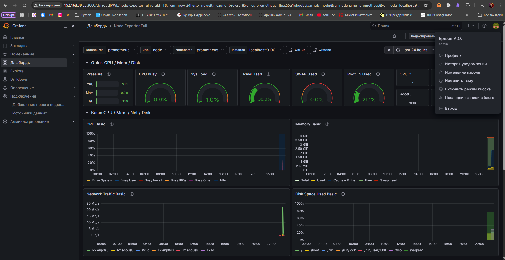

# Домашнее задание к занятию «Система мониторинга Prometheus» - Ершова А.О.

[](https://github.com/netology-code/smon-homeworks/blob/main/hw-04.md#%D0%B4%D0%BE%D0%BC%D0%B0%D1%88%D0%BD%D0%B5%D0%B5-%D0%B7%D0%B0%D0%B4%D0%B0%D0%BD%D0%B8%D0%B5-%D0%BA-%D0%B7%D0%B0%D0%BD%D1%8F%D1%82%D0%B8%D1%8E-%D1%81%D0%B8%D1%81%D1%82%D0%B5%D0%BC%D0%B0-%D0%BC%D0%BE%D0%BD%D0%B8%D1%82%D0%BE%D1%80%D0%B8%D0%BD%D0%B3%D0%B0-prometheus)

Это задание для самостоятельной отработки навыков и не предполагает обратной связи от преподавателя. Его выполнение не влияет на завершение модуля. Но мы рекомендуем его выполнить, чтобы закрепить полученные знания.

### Цели задания

[](https://github.com/netology-code/smon-homeworks/blob/main/hw-04.md#%D1%86%D0%B5%D0%BB%D0%B8-%D0%B7%D0%B0%D0%B4%D0%B0%D0%BD%D0%B8%D1%8F)

1. Научиться устанавливать Prometheus
2. Научиться устанавливать Node Exporter
3. Научиться подключать Node Exporter к серверу Prometheus
4. Научиться устанавливать Grafana и интегрировать с Prometheus

### Чеклист готовности к домашнему заданию

[](https://github.com/netology-code/smon-homeworks/blob/main/hw-04.md#%D1%87%D0%B5%D0%BA%D0%BB%D0%B8%D1%81%D1%82-%D0%B3%D0%BE%D1%82%D0%BE%D0%B2%D0%BD%D0%BE%D1%81%D1%82%D0%B8-%D0%BA-%D0%B4%D0%BE%D0%BC%D0%B0%D1%88%D0%BD%D0%B5%D0%BC%D1%83-%D0%B7%D0%B0%D0%B4%D0%B0%D0%BD%D0%B8%D1%8E)

- [ ]  Просмотрите в личном кабинете занятие "Система мониторинга Prometheus"

### Инструкция по выполнению домашнего задания

[](https://github.com/netology-code/smon-homeworks/blob/main/hw-04.md#%D0%B8%D0%BD%D1%81%D1%82%D1%80%D1%83%D0%BA%D1%86%D0%B8%D1%8F-%D0%BF%D0%BE-%D0%B2%D1%8B%D0%BF%D0%BE%D0%BB%D0%BD%D0%B5%D0%BD%D0%B8%D1%8E-%D0%B4%D0%BE%D0%BC%D0%B0%D1%88%D0%BD%D0%B5%D0%B3%D0%BE-%D0%B7%D0%B0%D0%B4%D0%B0%D0%BD%D0%B8%D1%8F)

1. Сделайте fork [репозитория c шаблоном решения](https://github.com/netology-code/sys-pattern-homework) к себе в Github и переименуйте его по названию или номеру занятия, например, [https://github.com/имя-вашего-репозитория/gitlab-hw](https://github.com/%D0%B8%D0%BC%D1%8F-%D0%B2%D0%B0%D1%88%D0%B5%D0%B3%D0%BE-%D1%80%D0%B5%D0%BF%D0%BE%D0%B7%D0%B8%D1%82%D0%BE%D1%80%D0%B8%D1%8F/gitlab-hw) или [https://github.com/имя-вашего-репозитория/8-03-hw](https://github.com/%D0%B8%D0%BC%D1%8F-%D0%B2%D0%B0%D1%88%D0%B5%D0%B3%D0%BE-%D1%80%D0%B5%D0%BF%D0%BE%D0%B7%D0%B8%D1%82%D0%BE%D1%80%D0%B8%D1%8F/8-03-hw)).
2. Выполните клонирование этого репозитория к себе на ПК с помощью команды `git clone`.
3. Выполните домашнее задание и заполните у себя локально этот файл README.md:
    - впишите вверху название занятия и ваши фамилию и имя;
    - в каждом задании добавьте решение в требуемом виде: текст/код/скриншоты/ссылка;
    - для корректного добавления скриншотов воспользуйтесь инструкцией [«Как вставить скриншот в шаблон с решением»](https://github.com/netology-code/sys-pattern-homework/blob/main/screen-instruction.md);
    - при оформлении используйте возможности языка разметки md. Коротко об этом можно посмотреть в [инструкции по MarkDown](https://github.com/netology-code/sys-pattern-homework/blob/main/md-instruction.md).
4. После завершения работы над домашним заданием сделайте коммит (`git commit -m "comment"`) и отправьте его на Github (`git push origin`).
5. В личном кабинете прикрепите ссылку на решение в виде md-файла в вашем Github.
6. Любые вопросы задавайте в разделе «Вопросы по заданию» в личном кабинете.

---

### Задание 1

[](https://github.com/netology-code/smon-homeworks/blob/main/hw-04.md#%D0%B7%D0%B0%D0%B4%D0%B0%D0%BD%D0%B8%D0%B5-1)

Установите Prometheus.

#### Процесс выполнения

[](https://github.com/netology-code/smon-homeworks/blob/main/hw-04.md#%D0%BF%D1%80%D0%BE%D1%86%D0%B5%D1%81%D1%81-%D0%B2%D1%8B%D0%BF%D0%BE%D0%BB%D0%BD%D0%B5%D0%BD%D0%B8%D1%8F)

1. Выполняя задание, сверяйтесь с процессом, отражённым в записи лекции
2. Создайте пользователя prometheus
3. Скачайте prometheus и в соответствии с лекцией разместите файлы в целевые директории
4. Создайте сервис как показано на уроке
5. Проверьте что prometheus запускается, останавливается, перезапускается и отображает статус с помощью systemctl

#### Требования к результату

[](https://github.com/netology-code/smon-homeworks/blob/main/hw-04.md#%D1%82%D1%80%D0%B5%D0%B1%D0%BE%D0%B2%D0%B0%D0%BD%D0%B8%D1%8F-%D0%BA-%D1%80%D0%B5%D0%B7%D1%83%D0%BB%D1%8C%D1%82%D0%B0%D1%82%D1%83)

- [ ]  Прикрепите к файлу README.md скриншот systemctl status prometheus, где будет написано: prometheus.service — Prometheus Service Netology Lesson 9.4 — [Ваши ФИО]

---
#### Решение 1
- Домашнее задание по установке выполнял при помощи vagrant (windows) и ansible(wsl).
- Структура каталога:
```bash
❯ tree -L 4 ~/git/Netology_labs/monitoring/prometheus/lab1                                          /home/alex/git/Netology_labs/monitoring/prometheus/lab1
├── Vagrantfile
├── ansible.cfg
├── inventory.ini
├── playbook.yml
└── roles
    ├── grafana
    │   └── tasks
    │       └── main.yml
    ├── node_exporter
    │   ├── handlers
    │   │   └── main.yml
    │   ├── tasks
    │   │   └── main.yml
    │   └── templates
    │       └── node-exporter.service.j2
    └── prometheus
        ├── handlers
        │   └── main.yml
        ├── tasks
        │   └── main.yml
        └── templates
            ├── prometheus.service.j2
            └── prometheus.yml.j2

11 directories, 12 files
```

- Создал роль prometheus
- Содержание tasks
```yml
---
- name: Создаем группу prometheus
  group:
    name: prometheus
    state: present
    system: yes


- name: Создаем пользователя prometheus
  user:
    name: prometheus
    group: prometheus
    system: yes
    shell: /usr/sbin/nologin
    create_home: no
    state: present


- name: Создаем папку для загрузки Prometheus
  file:
    path: /tmp/install/
    state: directory

- name: Скачиваем репозиторий
  get_url:
    url: https://github.com/prometheus/prometheus/releases/download/v2.53.5/prometheus-2.53.5.linux-amd64.tar.gz
    dest: /tmp/install/
    force: no # Повторно не скачивать если есть

- name: Распаковка Prometheus
  unarchive:
    src: /tmp/install/prometheus-2.53.5.linux-amd64.tar.gz
    dest: /tmp/install/
    remote_src: yes
    list_files: yes
  register: archive_result

- name: Показать распакованные файлы
  debug:
    var: archive_result

- name: Копируем бинарные файлы prometheus и promtool
  copy:
    src: "/tmp/install/prometheus-2.53.5.linux-amd64/{{ item }}"
    dest: "/usr/local/bin/{{ item }}"
    owner: prometheus
    group: prometheus
    mode: '0755'
    remote_src: yes
  loop:
    - prometheus
    - promtool

- name: Создаем папку /etc/prometheus
  file:
    path: /etc/prometheus
    state: directory
    owner: prometheus
    group: prometheus
    mode: '0755'

- name: Создаем папку /var/lib/prometheus
  file:
    path: /var/lib/prometheus
    state: directory
    owner: prometheus
    group: prometheus
    mode: '0755'

- name: Копируем бинарные папки consoles и  console_libraries и файл prometheus.yml
  copy:
    src: "/tmp/install/prometheus-2.53.5.linux-amd64/{{ item }}"
    dest: /etc/prometheus/
    owner: prometheus
    group: prometheus
    remote_src: yes
  loop:
    - consoles
    - console_libraries
    - prometheus.yml
  register: etc_prometheus

- name: Посмотреть содержимое каталога с правами через ls
  shell: ls -Fla /etc/prometheus
  register: ls_output

- name: Вывести результат
  debug:
    var: ls_output


- name: Создаем сервис prometheus.service
  template:
    src: templates/prometheus.service.j2
    dest: /etc/systemd/system/prometheus.service
    mode: '0644'
    owner: root
    group: root
  notify: reload systemd

- name: Включить и запусить службу prometheus.service
  systemd:
    name : prometheus.service
    enabled: yes
    state: started
    daemon_reload: yes

- name: Добавляем прослушку Node Exporter
  template:
    src: templates/prometheus.yml.j2
    dest: /etc/prometheus/prometheus.yml
    mode: '0644'
    owner: prometheus
    group: prometheus
  notify: reload systemd

```

- Шаблон primetheus.service.j2
```bash
[Unit]
Description=Prometheus Service Netologi Lesson 9.4 - Ершов А.О.
After=network.target

[Service]
User=prometheus
Group=prometheus
Type=simple
ExecStart=/usr/local/bin/prometheus \
--config.file /etc/prometheus/prometheus.yml \
--storage.tsdb.path /var/lib/prometheus/ \
--web.console.templates=/etc/prometheus/consoles \
--web.console.libraries=/etc/prometheus/console_libraries
ExecReload=/bin/kill -HUP $MAINPID
Restart=on-failure

[Install]
WantedBy=multi-user.target

```

- Скрин работы службы



---

### Задание 2

[](https://github.com/netology-code/smon-homeworks/blob/main/hw-04.md#%D0%B7%D0%B0%D0%B4%D0%B0%D0%BD%D0%B8%D0%B5-2)

Установите Node Exporter.

#### Процесс выполнения

[](https://github.com/netology-code/smon-homeworks/blob/main/hw-04.md#%D0%BF%D1%80%D0%BE%D1%86%D0%B5%D1%81%D1%81-%D0%B2%D1%8B%D0%BF%D0%BE%D0%BB%D0%BD%D0%B5%D0%BD%D0%B8%D1%8F-1)

1. Выполняя ДЗ сверяйтесь с процессом отражённым в записи лекции.
2. Скачайте node exporter приведённый в презентации и в соответствии с лекцией разместите файлы в целевые директории
3. Создайте сервис для как показано на уроке
4. Проверьте что node exporter запускается, останавливается, перезапускается и отображает статус с помощью systemctl

#### Требования к результату

[](https://github.com/netology-code/smon-homeworks/blob/main/hw-04.md#%D1%82%D1%80%D0%B5%D0%B1%D0%BE%D0%B2%D0%B0%D0%BD%D0%B8%D1%8F-%D0%BA-%D1%80%D0%B5%D0%B7%D1%83%D0%BB%D1%8C%D1%82%D0%B0%D1%82%D1%83-1)

- [ ]  Прикрепите к файлу README.md скриншот systemctl status node-exporter, где будет написано: node-exporter.service — Node Exporter Netology Lesson 9.4 — [Ваши ФИО]

---
### Решение 2
- Роль node_exporter
```
---
- name: Создаем папку для загрузки Node Exporter
  file:
    path: /tmp/install/
    state: directory


- name: Скачиваем репозиторий
  get_url:
    url: https://github.com/prometheus/node_exporter/releases/download/v1.10.2/node_exporter-1.10.2.linux-amd64.tar.gz
    dest: /tmp/install/
    force: no

- name: Распаковка Prometheus
  unarchive:
    src: /tmp/install/node_exporter-1.10.2.linux-amd64.tar.gz
    dest: /tmp/install/
    remote_src: yes
    list_files: yes
  register: archive_result


- name: Показать распакованные файлы
  debug:
    var: archive_result

- name: Создаем папку для Node Exporter
  file:
    path: /etc/prometheus/node-exporter/
    state: directory
    owner: prometheus
    group: prometheus
    mode: '0755'

- name: Копируем бинарный файл node-exporter
  copy:
    src: /tmp/install/node_exporter-1.10.2.linux-amd64/node_exporter
    dest: /etc/prometheus/node-exporter/
    owner: prometheus
    group: prometheus
    mode: '0755'
    remote_src: yes
  register: etc_prometheus

- name: Посмотреть содержимое каталога с правами через ls
  shell: ls -Fla /etc/prometheus/node-exporter/
  register: ls_output

- name: Создаем сервис node-exporter.service
  template:
    src: templates/node-exporter.service.j2
    dest: /etc/systemd/system/node-exporter.service
    mode: '0644'
    owner: root
    group: root
  notify: reload systemd

- name: Включить и запусить службу node-exporter.service
  systemd:
    name : node-exporter.service
    enabled: yes
    state: started
    daemon_reload: yes
```

- Шаблон node-exporter.service.j2
```bash
[Unit]
Description=Node Explorer Lesson 9.4 - Ершов А.О.
After=network.target

[Service]
User=prometheus
Group=prometheus
Type=simple
ExecStart=/etc/prometheus/node-exporter/node_exporter

[Install]
WantedBy=multi-user.target

```

- Шаблон prometheus.yml.j2
```
# my global config
global:
  scrape_interval: 15s
  evaluation_interval: 15s

# Alertmanager configuration
alerting:
  alertmanagers:
    - static_configs:
        - targets: []
          # - alertmanager:9093

# Load rules once and periodically evaluate them
rule_files:
  # - "first_rules.yml"
  # - "second_rules.yml"

# A scrape configuration containing exactly one endpoint to scrape:
scrape_configs:
  # Prometheus itself
  - job_name: "prometheus"
    static_configs:
      - targets: ["localhost:9090"]

  # Node Exporter
  - job_name: "node"
    static_configs:
      - targets: ["localhost:9100"]
```

- Скрин службы


### Задание 3

[](https://github.com/netology-code/smon-homeworks/blob/main/hw-04.md#%D0%B7%D0%B0%D0%B4%D0%B0%D0%BD%D0%B8%D0%B5-3)

Подключите Node Exporter к серверу Prometheus.

#### Процесс выполнения

[](https://github.com/netology-code/smon-homeworks/blob/main/hw-04.md#%D0%BF%D1%80%D0%BE%D1%86%D0%B5%D1%81%D1%81-%D0%B2%D1%8B%D0%BF%D0%BE%D0%BB%D0%BD%D0%B5%D0%BD%D0%B8%D1%8F-2)

1. Выполняя ДЗ сверяйтесь с процессом отражённым в записи лекции.
2. Отредактируйте prometheus.yaml, добавив в массив таргетов установленный в задании 2 node exporter
3. Перезапустите prometheus
4. Проверьте что он запустился

#### Требования к результату

[](https://github.com/netology-code/smon-homeworks/blob/main/hw-04.md#%D1%82%D1%80%D0%B5%D0%B1%D0%BE%D0%B2%D0%B0%D0%BD%D0%B8%D1%8F-%D0%BA-%D1%80%D0%B5%D0%B7%D1%83%D0%BB%D1%8C%D1%82%D0%B0%D1%82%D1%83-2)

- [ ]  Прикрепите к файлу README.md скриншот конфигурации из интерфейса Prometheus вкладки Status > Configuration
- [ ]  Прикрепите к файлу README.md скриншот из интерфейса Prometheus вкладки Status > Targets, чтобы было видно минимум два эндпоинта

---
### Решение 3
-  скриншот конфигурации из интерфейса Prometheus вкладки Status > Configuration


- скриншот из интерфейса Prometheus вкладки Status > Targets

## Дополнительные задания со звёздочкой*

[](https://github.com/netology-code/smon-homeworks/blob/main/hw-04.md#%D0%B4%D0%BE%D0%BF%D0%BE%D0%BB%D0%BD%D0%B8%D1%82%D0%B5%D0%BB%D1%8C%D0%BD%D1%8B%D0%B5-%D0%B7%D0%B0%D0%B4%D0%B0%D0%BD%D0%B8%D1%8F-%D1%81%D0%BE-%D0%B7%D0%B2%D1%91%D0%B7%D0%B4%D0%BE%D1%87%D0%BA%D0%BE%D0%B9)

Эти задания дополнительные. Их можно не выполнять. Это не повлияет на зачёт. Вы можете их выполнить, если хотите глубже разобраться в материале.

---

### Задание 4*

[](https://github.com/netology-code/smon-homeworks/blob/main/hw-04.md#%D0%B7%D0%B0%D0%B4%D0%B0%D0%BD%D0%B8%D0%B5-4)

Установите Grafana.

#### Требования к результату

[](https://github.com/netology-code/smon-homeworks/blob/main/hw-04.md#%D1%82%D1%80%D0%B5%D0%B1%D0%BE%D0%B2%D0%B0%D0%BD%D0%B8%D1%8F-%D0%BA-%D1%80%D0%B5%D0%B7%D1%83%D0%BB%D1%8C%D1%82%D0%B0%D1%82%D1%83-3)

- [ ]  Прикрепите к файлу README.md скриншот левого нижнего угла интерфейса, чтобы при наведении на иконку пользователя были видны ваши ФИО

---
### Решение 4
- Создал роль Grafana
- tasks
```yml
---
- name: Установка пакетов
  apt:
    name:
    - adduser
    - libfontconfig1
    - musl
    state: present
    update_cache: yes

- name: Создаем директорию install
  file:
    path: /tmp/install/
    state: directory

- name: Скачиваем репозиторий с zabbix 7.4
  get_url:
    url: https://dl.grafana.com/grafana/release/12.4.1/grafana_12.4.1_22846628243_linux_amd64.deb
    dest: /tmp/install/
    force: no

- name: Установка репозитория
  apt:
    deb: /tmp/install/grafana_12.4.1_22846628243_linux_amd64.deb

- name: Запуск службы Grafana
  systemd:
    name: grafana-server.service
    enabled: yes
    state: started
```

- Скрин службы grafana


- Скрин профиля grafana

---
### Задание 5*

[](https://github.com/netology-code/smon-homeworks/blob/main/hw-04.md#%D0%B7%D0%B0%D0%B4%D0%B0%D0%BD%D0%B8%D0%B5-5)

Интегрируйте Grafana и Prometheus.


---
### Решение 5
- Grafana dashboard

