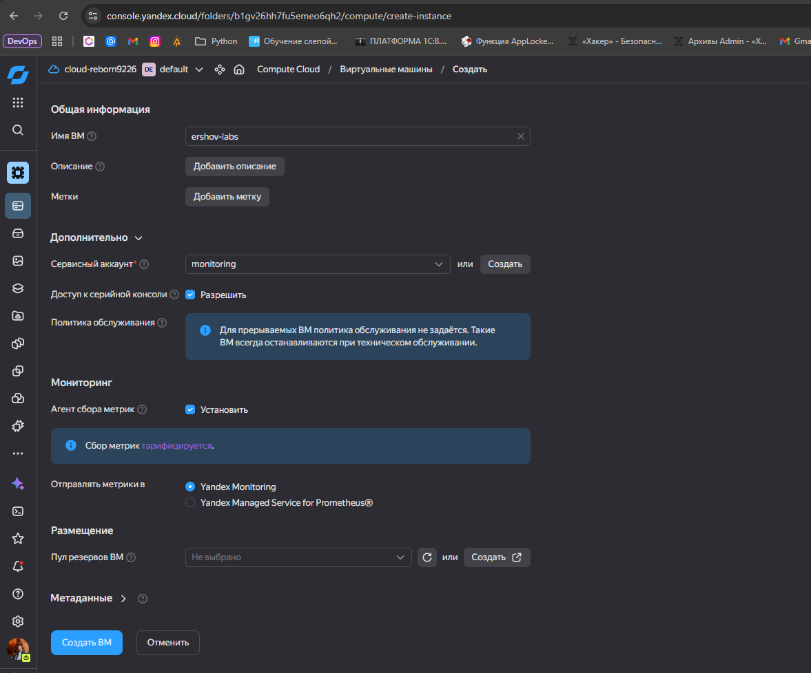
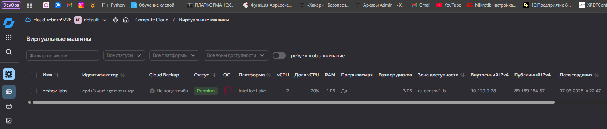
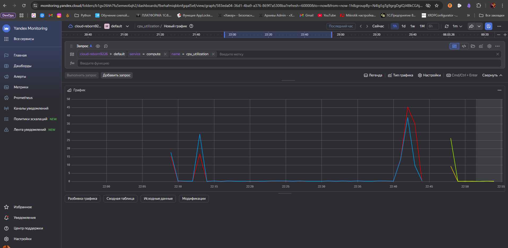
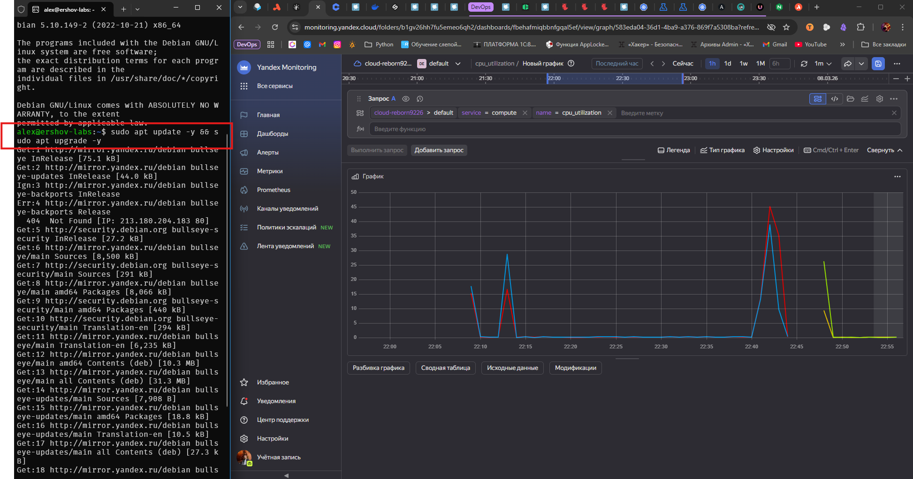
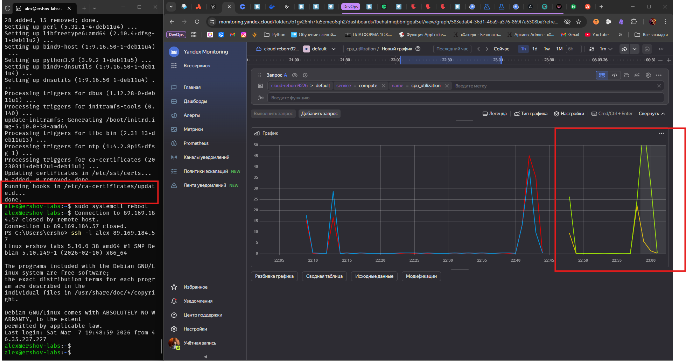
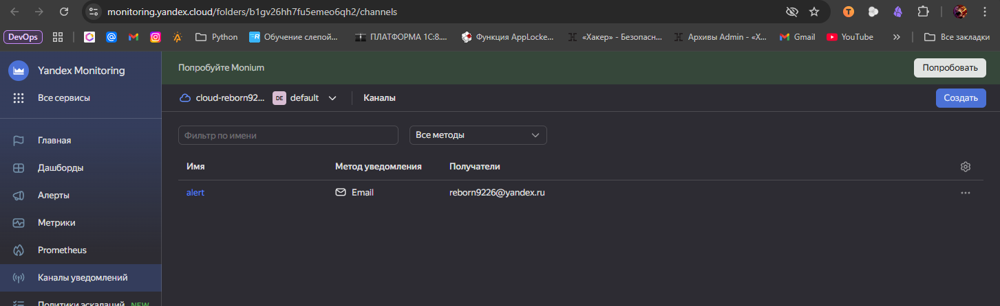
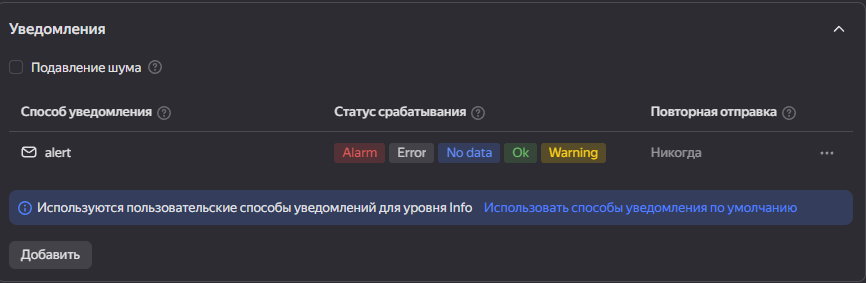
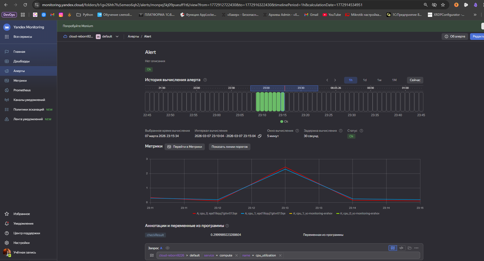

# Домашняя работа Ершова А.О.  *Обзор систем IT-мониторинга*
### Цели задания

1. Научиться запускать мониторинг ИТ-системы через Yandex Monitoring
2. Научиться настраивать уведомления о событиях в процессе мониторинга через e-mail

### Чеклист готовности к домашнему заданию

- [ ]  Просмотрите в личном кабинете занятие "Обзор систем ИТ-мониторинга"

---

### Задание 1

Создайте виртуальную машину в Yandex Compute Cloud и с помощью Yandex Monitoring создайте дашборд, на котором будет видно загрузку процессора.

#### Процесс выполнения

1. В окне браузера откройте облачную платформу Yandex Cloud
2. Перейдите в раздел "Все сервисы" > "Инфраструктура и сеть" > "Compute Cloud"
3. Нажмите на синюю кнопку "Создать ВМ" в правом верхнем углу окна браузера
4. Задайте имя виртуальной машины. Используйте английские буквы и цифры.
5. Выберите операционную систему Debian 11
6. Установите объём HDD равный 3ГБ
7. Выберите платформу Intel Ice Lake
8. Установите количество vCPU равное 2
9. Установите гарантированную долю vCPU равную 20%
10. Задайте количество RAM равное 1ГБ
11. Поставьте галочку "Прерываемая"
12. В разделе "Доступ" выберите сервисный аккаунт с ролью monitoring.editor. Если такого аккаунта нет, нажмите на кнопку "Создать новый". Задайте имя аккаунта английскими буквами, напротив надписи "Роли в каталоге" нажмите на знак "плюс". Прокручивая колесо мыши на себя, найдите роль monitoring.editor и нажмите на неё левой кнопкой мыши. Теперь вы сможете найти только что созданную роль в выпадающем списке аккаунтов.
13. Задайте логин учётной записи вашей виртуальной машины
14. Вставьте публичный SHH-ключ в поле SSH-ключ. Если этого ключа у вас нет, создайте его с помощью утилиты PuTTYgen
15. Поставьте галочку "Установить" в пункте "Агент сбора метрик"
16. Нажмите на синюю кнопку "Создать ВМ"
17. Перейдите в раздел "Все сервисы" > "Инфраструктура и сеть" > "Monitoring"
18. Нажмите на кнопку "Создать дашборд", расположенную в разделе "Возможности сервиса" > "Дашборды"
19. В открывшемся окне в разделе "Добавить виджет" нажмите на "График"
20. Пред вами предстанет конструктор запросов, выберите "Запрос А"
21. В параметре service конструктора запросов выберите Compute Cloud
22. В появившемся параметре name конструктора запросов выберите cpu_utilization
23. Поправьте диапазон времени отрисовки графика, нажав на кнопку "Сейчас" в верху экрана, левее кнопок 3m, 1h, 1d, 1w, "Отменить".
24. Нажмите на кнопку "Сохранить" в правом верхнем углу экрана
25. Задайте имя дашборда, если появится окно ввода имени дашборда
---

### Решение 1
- Создаю машину с сервисным агентом и Агентом сбора метрик

- Создал виртуальную машину

- Создал дашборд

- Дал нагрузку при помощи обновление системы

- Закончилось обновление

---
### Задание 2

С помощью Yandex Monitoring сделайте 2 алерта на загрузку процессора: WARN и ALARM. Создайте уведомление по e-mail.

---
### Решение 2
- Настроил оповещения на почту в алерте

- Настройка оповещения в самом алерте

- Настроен и запущен алерт

---