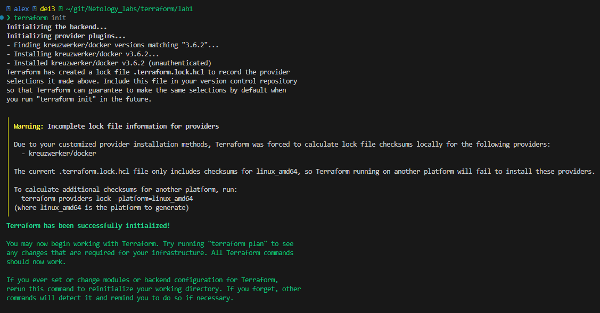
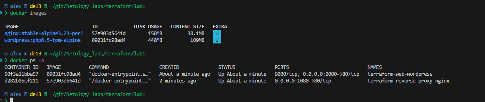

# Домашняя работа № 1  Terraform Ершова А.О

С начало загружаем Terraform с зеркала Яндекс https://hashicorp-releases.yandexcloud.net/terraform/, распаковываем в текущую папку
```
wget https://hashicorp-releases.yandexcloud.net/terraform/1.14.5/terraform_1.14.5_linux_amd64.zip
unzip terraform_1.14.5_linux_amd64.zip
```
Копируем бинарник к другим пользовательским и назначаем ему права на выполнение
```bash
cp terraform /usr/bin/terraform
sudo chmod +x /usr/bin/terraform
```

Создаем в корне пользователя файл . terraformrc с следующим содержимым
```bash
provider_installation {
  network_mirror {
    url = "https://terraform-mirror.yandexcloud.net/"
    include = ["registry.terraform.io/*/*"]
  }
  direct {
    exclude = ["registry.terraform.io/*/*"]
  }
}
```

Заходим в каталог проектом и в нем создадим файл . gitignore для того что бы не комитить секреты
```git
**/.terraform/*
.terraform*
!.terraformrc
*.tfstate
*.tfstate.*
terraform.tfvars
```

Создаем файл variables. tf с  нашими переменными которые будем использовать в основной конфигурации. Так же  в переменных передаем данные об образах докер и их портах
```bash
variable "string" {
    type=string
    default="какая-то строка"
}
variable "number" {
    type=number
    default="1"
}
variable "list_of_strings" {
    type=list(string)
    default=["a","b","c"]
}
variable "list_of_numbers" {
    type=list(number)
    default=[1,2,3]
}
variable "map" {
    type=map(string)
    default={
        name="Alexandr"
        surname="Ershov"
    }
}
variable "bool" {
    type = bool
    default = true
}
variable "containers" {
    type = map(object({
      name = string
      image = string
      ports = object ({
        external = number
        internal = number
      })
    }))
    default = {
        nginx ={
            name = "reverse-proxy-nginx"
            image = "nginx:stable-alpine3.23-perl"
            ports = {
                internal = 80
                external = 1080

            }
        wordpress = {
            name = "web-wordpress"
            image = "wordpress:php8.5-fpm-alpine"
            ports = {
                internal = 80
                external = 2080
            }
        }
        }
    }
}
```

Создаем файл providers. tf в котором будет указан наш провайдер для управления docker. В качестве хоста указали локальную машину
```bash
terraform {
    required_version = ">=1.8.4"

    required_providers {
        docker = {
          source = "kreuzwerker/docker"
          version = "3.6.2"
        }
    }
}

provider "docker" {
  host = "unix:///var/run/docker.sock"
}
```

Создаем основной файл main. tf в нем будет содержатся основной код проекта
```bash
resource "docker_image" "nginx" {
  name = var.containers.nginx.image
  keep_locally = true
}
resource "docker_image" "wordpress" {
  name = var.containers.wordpress.image
  keep_locally = true
}

resource "docker_container" "nginx" {
  image = docker_image.nginx.image_id
  name = "terraform-${var.containers.nginx.name}"
  ports {
    internal = var.containers.nginx.ports.internal
    external = var.containers.nginx.ports.external
  }
}

resource "docker_container" "wordpress" {
  image = docker_image.wordpress.image_id
  name = "terraform-${var.containers.wordpress.name}"
  ports {
    internal = var.containers.wordpress.ports.internal
    external = var.containers.wordpress.ports.external
  }
}
```
Инициализируем Terraform
```bash
 alex  de13  ~/git/Netology_labs/terraform/lab1
❯ terraform init
Initializing the backend...
Initializing provider plugins...
- Finding kreuzwerker/docker versions matching "3.6.2"...
- Installing kreuzwerker/docker v3.6.2...
- Installed kreuzwerker/docker v3.6.2 (unauthenticated)
Terraform has created a lock file .terraform.lock.hcl to record the provider
selections it made above. Include this file in your version control repository
so that Terraform can guarantee to make the same selections by default when
you run "terraform init" in the future.

Terraform has been successfully initialized!

You may now begin working with Terraform. Try running "terraform plan" to see
any changes that are required for your infrastructure. All Terraform commands
should now work.

If you ever set or change modules or backend configuration for Terraform,
rerun this command to reinitialize your working directory. If you forget, other
commands will detect it and remind you to do so if necessary.
```


Запускаем terraform plan что бы убедится что у нас все идет как нам нужно.
```bash
 alex  de13  ~/git/Netology_labs/terraform/lab1
❯ terraform plan                                                                                                                                                                                      1 ⨯

Terraform used the selected providers to generate the following execution plan. Resource actions are indicated with the following symbols:
  + create

Terraform will perform the following actions:

  # docker_container.nginx will be created
  + resource "docker_container" "nginx" {
      + attach                                      = false
      + bridge                                      = (known after apply)
      + command                                     = (known after apply)
      + container_logs                              = (known after apply)
      + container_read_refresh_timeout_milliseconds = 15000
      + entrypoint                                  = (known after apply)
      + env                                         = (known after apply)
      + exit_code                                   = (known after apply)
      + hostname                                    = (known after apply)
      + id                                          = (known after apply)
      + image                                       = (known after apply)
      + init                                        = (known after apply)
      + ipc_mode                                    = (known after apply)
      + log_driver                                  = (known after apply)
      + logs                                        = false
      + must_run                                    = true
      + name                                        = "terraform-reverse-proxy-nginx"
      + network_data                                = (known after apply)
      + network_mode                                = "bridge"
      + read_only                                   = false
      + remove_volumes                              = true
      + restart                                     = "no"
      + rm                                          = false
      + runtime                                     = (known after apply)
      + security_opts                               = (known after apply)
      + shm_size                                    = (known after apply)
      + start                                       = true
      + stdin_open                                  = false
      + stop_signal                                 = (known after apply)
      + stop_timeout                                = (known after apply)
      + tty                                         = false
      + wait                                        = false
      + wait_timeout                                = 60

      + healthcheck (known after apply)

      + labels (known after apply)

      + ports {
          + external = 1080
          + internal = 80
          + ip       = "0.0.0.0"
          + protocol = "tcp"
        }
    }

  # docker_container.wordpress will be created
  + resource "docker_container" "wordpress" {
      + attach                                      = false
      + bridge                                      = (known after apply)
      + command                                     = (known after apply)
      + container_logs                              = (known after apply)
      + container_read_refresh_timeout_milliseconds = 15000
      + entrypoint                                  = (known after apply)
      + env                                         = (known after apply)
      + exit_code                                   = (known after apply)
      + hostname                                    = (known after apply)
      + id                                          = (known after apply)
      + image                                       = (known after apply)
      + init                                        = (known after apply)
      + ipc_mode                                    = (known after apply)
      + log_driver                                  = (known after apply)
      + logs                                        = false
      + must_run                                    = true
      + name                                        = "terraform-web-wordpress"
      + network_data                                = (known after apply)
      + network_mode                                = "bridge"
      + read_only                                   = false
      + remove_volumes                              = true
      + restart                                     = "no"
      + rm                                          = false
      + runtime                                     = (known after apply)
      + security_opts                               = (known after apply)
      + shm_size                                    = (known after apply)
      + start                                       = true
      + stdin_open                                  = false
      + stop_signal                                 = (known after apply)
      + stop_timeout                                = (known after apply)
      + tty                                         = false
      + wait                                        = false
      + wait_timeout                                = 60

      + healthcheck (known after apply)

      + labels (known after apply)

      + ports {
          + external = 2080
          + internal = 80
          + ip       = "0.0.0.0"
          + protocol = "tcp"
        }
    }

  # docker_image.nginx will be created
  + resource "docker_image" "nginx" {
      + id           = (known after apply)
      + image_id     = (known after apply)
      + keep_locally = true
      + name         = "nginx:stable-alpine3.23-perl"
      + repo_digest  = (known after apply)
    }

  # docker_image.wordpress will be created
  + resource "docker_image" "wordpress" {
      + id           = (known after apply)
      + image_id     = (known after apply)
      + keep_locally = true
      + name         = "wordpress:php8.5-fpm-alpine"
      + repo_digest  = (known after apply)
    }

Plan: 4 to add, 0 to change, 0 to destroy.

─────────────────────────────────────────────────────────────────────────────────────────────────────────────────────────────────────────────────────────────────────────────────────────────────────────

Note: You didn't use the -out option to save this plan, so Terraform can't guarantee to take exactly these actions if you run "terraform apply" now.
```

Все хорошо, применяем
```bash
terraform apply

 Enter a value: yes

docker_image.nginx: Creating...
docker_image.wordpress: Creating...
docker_image.wordpress: Still creating... [00m10s elapsed]
docker_image.nginx: Still creating... [00m10s elapsed]
docker_image.nginx: Creation complete after 14s [id=sha256:57e903d5641d80334bd51985b8bcecad80d36b30cd0b6408b851333fca1d88bfnginx:stable-alpine3.23-perl]
docker_container.nginx: Creating...
docker_container.nginx: Creation complete after 2s [id=d282b05cf211d944e5f5f157afc330e584f4a684b5458e6652ac086949fd9e9c]
docker_image.wordpress: Creation complete after 20s [id=sha256:09031fc98ad4670e462441cc69162b82489676f848f451e0ea81fbc6e1be81d5wordpress:php8.5-fpm-alpine]
docker_container.wordpress: Creating...
docker_container.wordpress: Creation complete after 3s [id=50f3a11bba574d2dc2c2dd60ac508c252d43680cd4c9c3d661483c02448d383d]

Apply complete! Resources: 4 added, 0 changed, 0 destroyed.
```

Проверяем на месте ли образы и запущены ли наши контейнеры.

