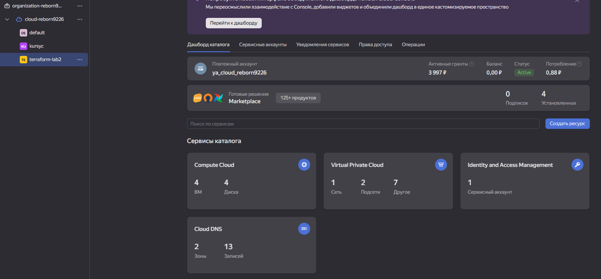
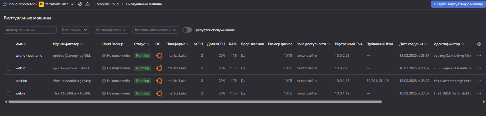
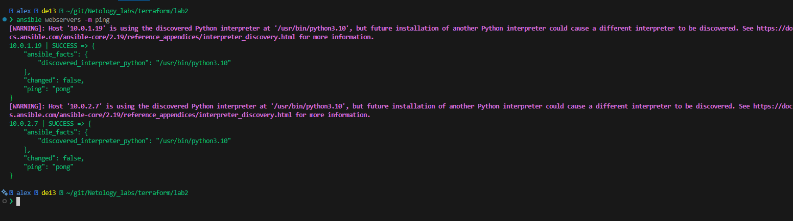
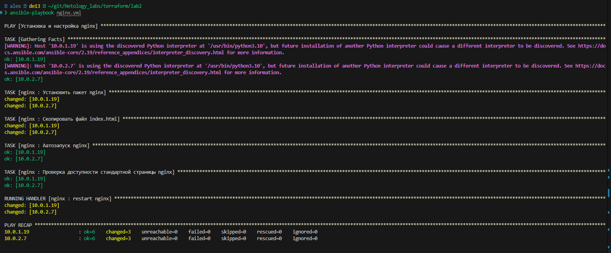
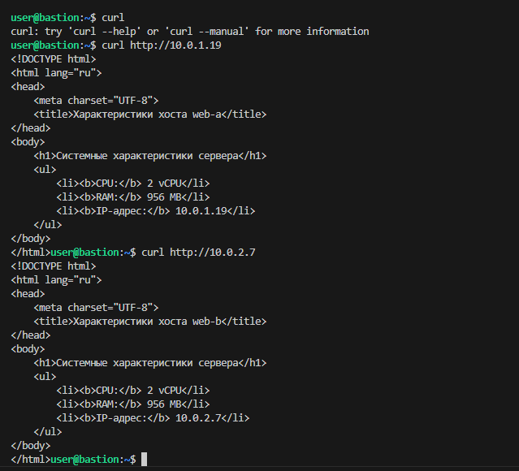
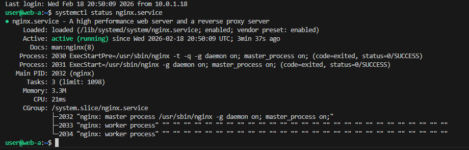
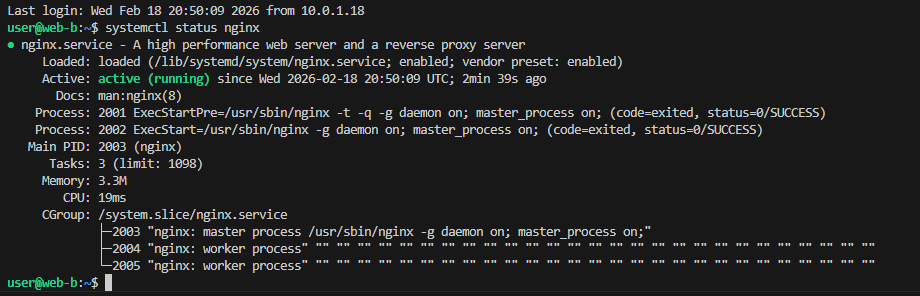
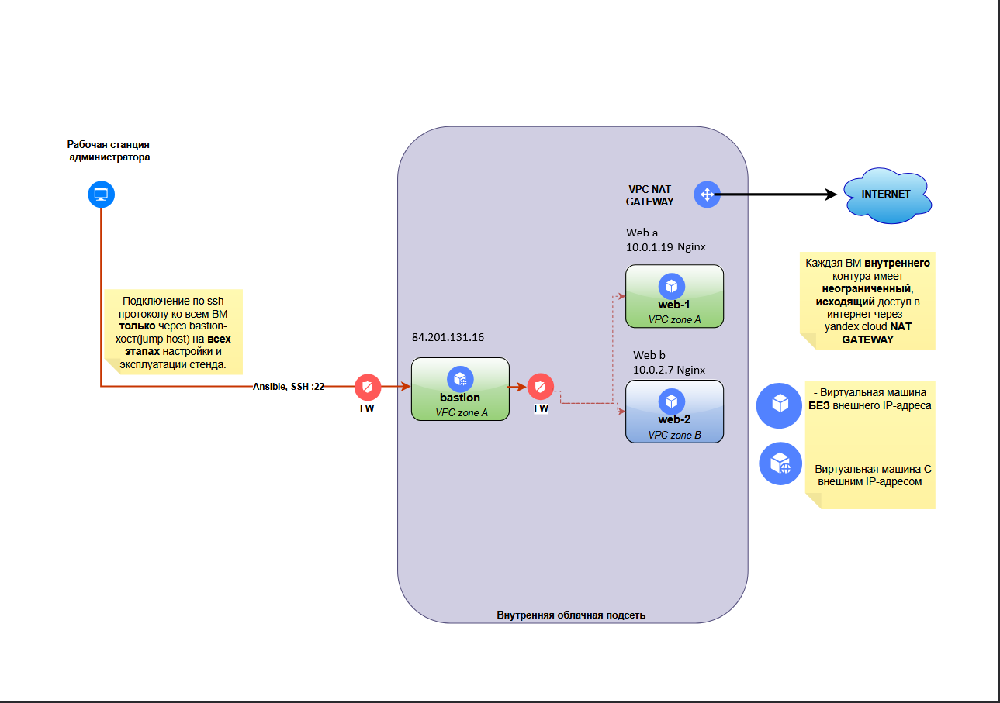

### Задание 1

[](https://github.com/netology-code/sdvps-homeworks/blob/main/7-03.md#%D0%B7%D0%B0%D0%B4%D0%B0%D0%BD%D0%B8%D0%B5-1)

Повторить демонстрацию лекции(развернуть vpc, 2 веб сервера, бастион сервер)

---
### Решение 1
Повторил демонстрации лекции.
Скрин облака Яндекс с поднятой инфраструктурой

---


### Задание 2

[](https://github.com/netology-code/sdvps-homeworks/blob/main/7-03.md#%D0%B7%D0%B0%D0%B4%D0%B0%D0%BD%D0%B8%D0%B5-2)

С помощью ansible подключиться к web-a и web-b , установить на них nginx.(написать нужный ansible playbook)

Провести тестирование и приложить скриншоты развернутых в облаке ВМ, успешно отработавшего ansible playbook.

---
### Решение 2
Я написал роль nginx в которой идет установка nginx + служба на автозапуск + замена шаблона стартовой страницы index.html
Структура рабочего каталога
```bash
 alex  de13  ~/git/Netology_labs/terraform/lab2
❯ tree -L 2 ~/git/Netology_labs/terraform/lab2
/home/alex/git/Netology_labs/terraform/lab2
├── ansible.cfg
├── cloud-init.yml
├── hosts.ini
├── network.tf
├── nginx.yml
├── providers.tf
├── roles
│   └── nginx
├── ssh_connect.txt
├── terraform.tfstate
├── terraform.tfstate.backup
├── variables.tf
└── vms.tf
```

Скрин поднятой инфраструктуры после установки роли


Скрин ansible ping поднятых вебсерверов


Скрин выполнено Playbook


Скрин проверки работы nginx через Bastion



Скрин работы nginx web a


Скрин работы nginx web b


Схема

---
## Дополнительные задания* (со звёздочкой)

[](https://github.com/netology-code/sdvps-homeworks/blob/main/7-03.md#%D0%B4%D0%BE%D0%BF%D0%BE%D0%BB%D0%BD%D0%B8%D1%82%D0%B5%D0%BB%D1%8C%D0%BD%D1%8B%D0%B5-%D0%B7%D0%B0%D0%B4%D0%B0%D0%BD%D0%B8%D1%8F-%D1%81%D0%BE-%D0%B7%D0%B2%D1%91%D0%B7%D0%B4%D0%BE%D1%87%D0%BA%D0%BE%D0%B9)

Их выполнение необязательное и не влияет на получение зачёта по домашнему заданию. Можете их решить, если хотите глубже и/или шире разобраться в материале.

---

### Задание 3*

[](https://github.com/netology-code/sdvps-homeworks/blob/main/7-03.md#%D0%B7%D0%B0%D0%B4%D0%B0%D0%BD%D0%B8%D0%B5-3)

**Выполните действия, приложите скриншот скриптов, скриншот выполненного проекта.**

1. Добавить еще одну виртуальную машину.
2. Установить на нее любую базу данных.
3. Выполнить проверку состояния запущенных служб через Ansible.

---

### Задание 4*

[](https://github.com/netology-code/sdvps-homeworks/blob/main/7-03.md#%D0%B7%D0%B0%D0%B4%D0%B0%D0%BD%D0%B8%D0%B5-4)

Изучите [инструкцию](https://cloud.yandex.ru/docs/tutorials/infrastructure-management/terraform-quickstart) yandex для terraform. Добейтесь работы паплайна с безопасной передачей токена от облака в terraform через переменные окружения. Для этого:

1. Настройте профиль для yc tools по инструкции.
2. Удалите из кода строчку "token = var.yandex_cloud_token". Terraform будет считывать значение ENV переменной YC_TOKEN.
3. Выполните команду export YC_TOKEN=$(yc iam create-token) и в том же shell запустите terraform.
4. Для того чтобы вам не нужно было каждый раз выполнять export - добавьте данную команду в самый конец файла ~/.bashrc
